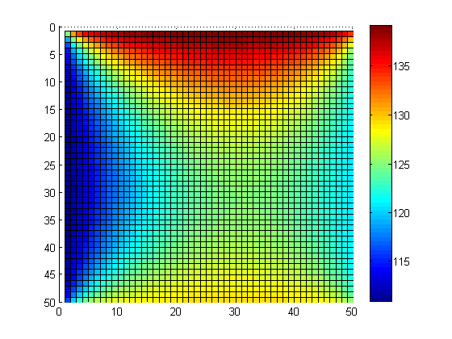

# (PART) L'algèbre matricielle {-}


# Les systèmes d'équations linéaires {#sel}

```{example}
Pourquoi utilisez-vous Google?
  
Les calculs que doivent faire Google pour ordonner les sites de votre requête représente l'un des plus gros problèmes d'algèbre matricielle présentement résolus sur la planète.

Les résultats de l'algorithme de Google après les déplacements du promeneur impartial.

```

```{r, echo=FALSE}
knitr::include_graphics("resources/images/PageRanks-Example.jpg")
```


```{example, name="Où suis-je?"}
Le Global Positioning System (GPS) (en français : « Système mondial de positionnement » [littéralement] ou « Géo-positionnement par satellite »), originellement connu sous le nom de Navstar GPS, est un système de positionnement par satellites appartenant au gouvernement des États-Unis. Mis en place par le département de la Défense des États-Unis à des fins militaires à partir de 1973, le système avec 24 satellites est totalement opérationnel en 1995 et s'ouvre au civil en 2000.

Le principe de fonctionnement repose sur la trilatération de signaux électromagnétiques synchronisés émis par les satellites. Pour assurer la précision du positionnement, le système GPS utilise des technologies sophistiquées : horloges atomiques embarquées, compensation d'effets relativistes, mise en place de stations d'observation et de synchronisation. Les coordonnées terrestres calculées se réfèrent au système géodésique WGS 84.

Les positions des satellites sont choisies pour que au moins 4 satellites soient visibles de n'importe quel point du globe à tout moment.

```

```{r, echo=FALSE}

```

```{r, echo=FALSE}
knitr::include_graphics("resources/images/GPS24goldenSML.gif")
```


## Une introduction aux équations linéaires {#sec:intro_equation_lineaire}

Dans cette section, nous introduisons les notions d'équation linéaire et de système d'équations linéaires. Nous introduisons la façon de résoudre de petits systèmes d'équations linéaires. En pratique, les systèmes d'équations linéaires sont résolus grâce aux ordinateurs. Ces systèmes contiennent habituellement des centaines, des milliers (même des millions) d'équations et d'inconnues.

Intuitivement, une équation linéaire est une équation où toutes les variables sont affectées de l'exposant $1$ et ne sont pas multipliées entre elles.

```{definition, name="Une équation linéaire"}
Une équation de $n$ variables $x_1$, $x_2$, ... et $x_n$, est dite **linéaire** si elle peut être écrite sous la forme:
\begin{align*}
a_1x_1+a_2x_2+\ldots+a_nx_n &= b
\end{align*}
où $a_1$, $a_2$, ... et $a_n$ sont appelés les **coefficients** de l'équation linéaire et $b$ est le **terme constant** de l'équation.

Les **coefficients** $a_1$, $a_2$, ... et $a_n$ ainsi que le **terme constant** $b$ sont habituellement des nombres réels.

Si $b=0$, nous disons que l'équation linéaire est **homogène**.
```

```{definition, name="La solution d'une équation linéaire"}
Une **solution** d'une équation linéaire de $n$ variables de la forme
\begin{align*}
a_1x_1+a_2x_2+...+a_nx_n=b
\end{align*}
est un $n$-uplet écrit sous la forme $(r_1,r_2,...,r_n)$ (qui veut dire $x_1=r_1$, $x_2=r_2$,... et $x_n=r_n$), qui vérifie l'équation.
```

```{definition, name="L'ensemble solution d'une équation linéaire"}
L'**ensemble solution** d'une équation linéaire est l'ensemble de toutes les solutions possibles de l'équation. Nous le notons par $ES$.
```


```{example}
Pour convertir une température en degrés Celsius, notée $C$, en une température en degrés Fahrenheit, notée $F$, il faut utiliser l'équation:
\begin{align*}
F &= \dfrac{9}{5}C+32
\end{align*}

  a) Est-ce que l'équation précédente est une équation linéaire?
  a) Démontrez que $C=5^{\circ}$ et $F=41^{\circ}$ forment une solution de l'équation linéaire qui permet de convertir une température en degrés Celsius en une température en degrés Fahrenheit.
```

```{r celsius-fahrenheit, echo=FALSE, fig.width=6, fig.cap="L'équation linéaire permettant de convertir des degrés Celsius en degrés Fahrenheit.", fig.align='center', out.width="90%"}
fun.1 <- function(x) 9*x/5+32
ggplot(data = data.frame(x = 0), mapping = aes(x = x))+
  stat_function(fun = fun.1, color = "blue") +
  xlim(-20,40)+
  labs(
    x = "Degrés Celsius",
    y = "Degrés Fahrenheit"
  )+
  geom_point(aes(x = 5, y = 41), color = "red")+
  annotate("text", x = 8.5, y = 41, label = "(5,41)")
```

Dans le cas où nous n'avons qu'une seule équation linéaire, nous verrons qu'il est relativement simple de résoudre ce type d'équations.

```{example}
Résolvez les équations linéaires suivantes:
  
  a. $3x+1=4$
  a. $F=\dfrac{9}{5}C+32$
  a. $2x_1+x_2-3x_3-5=0$
  
```

## Les systèmes d'équations linéaires {#systeme_equation_lineaire}

Il semble donc qu'il soit simple de résoudre une seule équation linéaire, peu importe le nombre de variables. Par contre, en pratique, nous rencontrons la plupart du temps des systèmes d'équations linéaires, c'est-à-dire un ensemble d'équations linéaires.

```{example, chinois, name="Un système d'équations linéaires chinois du troisième siècle avant notre ère"}
Voici un exemple de système d'équations linéaires:
\begin{align*}
\begin{array}{cccccccc}
&3x&+&2y&+&z&=&39\\
&2x&+&3y&+&z&=&34\\
&x&+&2y&+&3z&=&26\\
\end{array}
\end{align*}
Ce système et sa solution se trouvent dans un livre chinois de mathématiques du troisième siècle avant notre ère. Vérifiez que 
\begin{align*}
	x = \frac{37}{4},\quad y = \frac{17}{4},\quad z = \frac{11}{4}
\end{align*}
est une solution du système d'équations linéaires précédent.
```

Comme l'exemple précédent le démontre, il est simple de vérifier qu'un $n$-uplet forme une solution d'un système d'équations linéaires. Il sera par contre plus difficile de le trouver.

```{definition, name="Un système d'équations linéaires"}
Un **système d'équations linéaires** $S$ de $m$ équations et $n$ variables (ou inconnues) $x_1$, $x_2$, ... et $x_n$ est un ensemble de $m$ équations linéaires de la forme:
\begin{align*}
S=\left\{\begin{array}{cccccccccc}
&a_{1,1}x_1&+&a_{1,2}x_2&+&\ldots &+&a_{1,n}x_n&=&b_1 \\
&a_{2,1}x_1&+&a_{2,2}x_2&+&\ldots &+&a_{2,n}x_n&=&b_2 \\
&&&&&&&&\vdots & \\
&a_{m,1}x_1&+&a_{m,2}x_2&+&\ldots &+&a_{m,n}x_n&=&b_m
\end{array}
\right.
\end{align*}
Les nombres $a_{1,1}$, $a_{1,2}$, ..., $a_{1,n}$, $a_{2,1}$, ..., $a_{2,n}$, ..., $a_{m,1}$, ..., $a_{m,n}$ sont les **coefficients** du système et $b_1$, $b_2$, ..., $b_m$ sont les **termes constants**. Si les termes constants sont tous zéros, le système est appelé **homogène**. Le système homogène qui possède les mêmes coefficients que le système ci-haut est dit être **associé** au système ci-haut.
```

```{definition, name="La solution d'un système  d'équations linéaires"}
Une **solution** d'un système  d'équations linéaires de $m$ équations et de $n$ variables 
est un $n$-uplet écrit sous la forme $r_1,r_2,...,r_n$ (qui veut dire $x_1=r_1$, $x_2=r_2$,... et $x_n=r_n$), qui vérifie les $m$ équations du système.
```

```{definition, name="L'ensemble solution d'un système  d'équations linéaires"}
L'**ensemble solution** d'un système  d'équations linéaires est l'ensemble de toutes les solutions possibles du système. Nous le notons par $ES$.
```

Il existe trois types de solutions pour un système d'équations linéaires.

```{theorem, name="Les types de solutions d'un système d'équations linéaires"}
Les types de solutions d'un système d'équations linéaires sont:
  
  - Une solution unique, c'est-à-dire qu'il existe un unique $n$-uplet qui soit solution du système d'équations linéaires.
  - Aucune solution, c'est-à-dire qu'il n'existe aucun $n$-uplet qui soit solution du système d'équations linéaires.
  - Une infinité de solutions, c'est-à-dire qu'il existe une infinité de $n$-uplet qui sont solutions du système d'équations linéaires.

```

```{r , echo=FALSE, fig.show='hold', fig.cap="Les trois types de solutions d'un système d'équations linéaires", fig.align='center', out.width="33%"}
fun.1 <- function(x) -x+3/2
fun.2 <- function(x) x/2+1/2
fun.3 <- function(x) x/2+1/2
fun.4 <- function(x) x/2-1/2
fun.5 <- function(x) x+1/2
gbase <- ggplot(data = data.frame(x = 0), mapping = aes(x = x))+
  xlim(-5,5)
gbase + stat_function(fun = fun.1, color = "blue")+
  stat_function(fun = fun.2, color = "blue")
gbase + stat_function(fun = fun.3, color = "blue")+
  stat_function(fun = fun.4, color = "blue")
gbase + stat_function(fun = fun.5, color = "blue")
```

Il est possible d'abréger l'écriture d'un système d'équations linéaires en ne conservant que les coefficients et les constantes de ce système, en supposant que le nom et l'ordre des variables a été spécifié. Cette façon de représenter un système d'équations linéaires est appelé la matrice augmentée du système.

```{definition, name="La matrice augmentée d'un système d'équations linéaires"}
Soit un système d'équations linéaires de la forme suivante:
\begin{align*}
\begin{array}{cccccccccc}
&a_{1,1}x_1&+&a_{1,2}x_2&+&\ldots &+&a_{1,n}x_n&=&b_1 \\
&a_{2,1}x_1&+&a_{2,2}x_2&+&\ldots &+&a_{2,n}x_n&=&b_2 \\
&&&&&&&&\vdots & \\
&a_{m,1}x_1&+&a_{m,2}x_2&+&\ldots &+&a_{m,n}x_n&=&b_m
\end{array}
\end{align*}
La **matrice augmentée** de ce système est représentée par l'arrangement rectangulaire suivant:
\begin{align*}
\left[\begin{array}{cccc|c}
a_{1,1}&a_{1,2}&\ldots &a_{1,n}&b_1 \\
a_{2,1}&a_{2,2}&\ldots &a_{2,n}&b_2 \\
\vdots &\vdots &&\vdots & \vdots \\
a_{m,1}&a_{m,2}&\ldots &a_{m,n}&b_m
\end{array}\right]
\end{align*}
Les coefficients sont placés en ordre à gauche de la barre verticale et les constantes sont placées à droite de la barre verticale. Cette barre symbolise l'égalité et permet de séparer visuellement les coefficients des constantes.
```

## La résolution de système d'équations linéaires échelonnés {#systeme-equation-lineaire-echelonnee}

Nous savons maintenant comment vérifier si les éléments d'un ensemble forme une solution d'un système d'équations linéaires. Nous ne savons par contre pas comment les trouver.

Par contre, avant d'apprendre des méthodes générales pour résoudre des systèmes d'équations linéaires, nous allons étudier quelques formes particulières de système d'équations linéaires qui se résolvent facilement. Nous en profiterons également pour mettre en lien ces systèmes avec leurs différents types de solutions.

Les systèmes les plus simples à résoudre sont ceux que nous rencontrons sous une forme échelonnée ou une forme échelonnée réduite.

```{definition}
Un système d'équations linéaires est dit être sous la **forme échelonnée** si les conditions suivantes sont remplies:

  - Toutes les lignes non-nulles, c'est-à-dire les lignes qui possèdent au moins un élément différent de zéro, se trouvent au-dessus des lignes nulles, c'est-à-dire des lignes qui ne possèdent que des zéros.
  - Le premier élément non-nul d'une ligne, c'est-à-dire le premier élément différent de zéro en partant de la gauche sur la ligne, est toujours situé à droite du premier élément non-nul de la ligne située au-dessus. Nous disons que le premier élément non-nul d'une ligne est le **pivot** de cette ligne.
  - Tous les éléments de la colonne situés sous un pivot sont composés de zéros.

Un système d'équations linéaires est dit être sous la **forme échelonnée réduite** s'il est déjà sous la forme échelonnée et si les conditions suivantes sont remplies:

  - Le pivot d'une ligne est le seul élément non-nul de la colonne où il se situe.
  - Tous les pivots sont $1$.

```

La présente section présente la façon de résoudre des systèmes d'équations linéaires sous forme échelonnée, c'est-à-dire un système composé de $m$ équations et de $n$ inconnues.
\begin{align*}
\begin{array}{cccccccccc}
a_{1,1}x_1 & +& a_{1,2}x_2 & +&  a_{1,3}x_3 & \ldots & +&  a_{1,n}x_n & =& b_1  \\
        & & a_{2,2}x_2 & +&  a_{2,3}x_3 & \ldots & +& a_{2,n}x_n & =& b_2  \\
        & &         & &    & \ddots & & \vdots & =& \vdots   \\
%         & &         & &          & \ddots & & a_{n-1,n} & =& b_{n-1}\\
       & &         & &          &        & & a_{m,n}x_n & =& b_m
\end{array}
\end{align*}

Un système d'équations linéaires sous la forme échelonnée se résout lui aussi assez facilement à l'aide de la méthode dite de "substitution arrière". La méthode tient son nom du fait que nous commençons à résoudre l'équation située à la dernière ligne. Nous substituons ensuite la valeur trouvée dans l'équation précédente pour résoudre cette équation et nous répétons jusqu'à l'équation située sur la première ligne.

```{example}
Trouvez l'ensemble solution des systèmes d'équations linéaires suivants, présentés sous la forme échelonnée.

  a. \begin{align*}
\begin{array}{cccccccc}
&-10x&+&5y&-&7z&=&40 \\
&&&y&+&z&=&-12 \\
&&&&&3z&=&0
\end{array}
\end{align*}
  a. \begin{align*}
\begin{array}{cccccccccc}
&-x_{1}&-&4x_{2}&-&2x_{3}&-&x_{4}&=&-4\\
&&&&&5x_{3}&+&2x_{4}&=&3\\
&&&&&&&x_{4}&=&-1\\
\end{array}
\end{align*}
  a. \begin{align*}
\left[\begin{array}{ccc|c}
7&-4&-2&-9\\
0&-19&22&-62\\
0&0&196&826\\
0&0&0&133\\
\end{array}\right]
\end{align*}
  
```

## La méthode d'élimination de Gauss {#methode-gauss}

Nous avons vu dans la section précédente comment résoudre des systèmes d'équations linéaires sous forme échelonnée ou sous forme échelonnée réduite. Dans cette section, nous voulons voir de quelle façon il est possible de transformer tout système d'équations linéaires sous l'une de ces deux formes. 

Pour être en mesure de transformer un système d'équations linéaires, nous allons avoir besoin de connaître les opérations qui permettent de modifier des équations linéaires tout en conservant le même ensemble solution.

```{definition, name="Systèmes d'équations linéaires équivalents"}
Deux systèmes d'équations linéaires $S_1$ et $S_2$ sont dits **équivalents** s'ils possèdent le même ensemble solution. Nous notons alors $S_1\sim S_2$.
```

Les opérations élémentaires sur les équations vont permettre de modifier le système d'équations linéaires en un système équivalent, notamment sous la forme d'un système échelonné.

```{definition,name="Opérations élémentaires sur les équations linéaires"}
Soit $L_i$ la ième équation d'un système d'équations linéaires. Les \textbf{opérations élémentaires sur les équations linéaires} sont les suivantes:
  
  - Nous pouvons additionner ou soustraire deux équations: $L_i \pm L_j \rightarrow L_i$
  - Nous pouvons multiplier une équation par une constante non-nulle: $kL_i \rightarrow L_i$
  - Nous pouvons intervertir deux équations: $L_i \leftrightarrow L_j$
  
```

```{theorem}
Les trois opérations élémentaires sur les équations linéaires ne changent pas l'ensemble solution du système d'équations linéaires. 
```

```{proposition}
L'opération 
\begin{align*}
L_i\leftarrow k_1L_i+k_2L_j
\end{align*}
avec $i\neq j$ et $k_1,k_2\in\mathbb{R}\setminus \{0\}$ n'affecte pas l'ensemble solution du système d'équations linéaires.
```

Maintenant, nous voulons utiliser les opérations élémentaires sur les lignes pour transformer la matrice augmentée sous la forme échelonnée. C'est ce que nous nommons **la méthode de Gauss**.

```{example}
Résolvez le système d'équations linéaires de l'exemple \@ref(exm:chinois) à l'aide de la méthode de Gauss.
\begin{align*}
\begin{array}{cccccccc}
&3x&+&2y&+&z&=&39\\
&2x&+&3y&+&z&=&34\\
&x&+&2y&+&3z&=&26\\
\end{array}
\end{align*}
```

```{example}
Résolvez le système d'équations linéaires suivant à l'aide de la méthode de Gauss.
\begin{align*}
\begin{array}{cccccccc}
&3x&-&7y&+&4z&=&34\\
&-6x&-&2y&+&9z&=&49\\
&7x&-&2y&-&5z&=&-21\\
\end{array}
\end{align*}
```
 
Il est parfois possible que nous devions interchanger deux lignes pour obtenir une matrice sous forme échelonnée. L'exemple suivant permettra de montrer comment faire.

```{example}
Résolvez le système d'équations linéaires suivant.
\begin{align*}
\begin{array}{cccccccc}
&&&3y&-&4z&=&-31\\
&2x&-&y&+&2z&=&17\\
&3x&+&2y&-&5z&=&-24\\
\end{array}
\end{align*}
```

Nous obtenons parfois une infinité de solutions à notre système d'équations linéaires.

```{example}
Résolvez le système d'équations linéaires suivant:
\begin{align*}
\begin{array}{cccccccc}
&4x&+&3y&-&8z&=&14\\
&-x&-&y&+&3z&=&-4\\
&5x&-&2y&+&13z&=&6\\
\end{array}
\end{align*}
```

Nous obtenons parfois aucune solution à notre système d'équations linéaires.

```{example}
Résolvez le système d'équations linéaires suivant:
\begin{align*}
\begin{array}{cccccccc}
&-7x&-&4y&-&6z&=&-1\\
&17x&+&8y&+&15z&=&-8\\
&-7x&-&16y&-&3z&=&3\\
\end{array}
\end{align*}
```


## Une application

```{example, plaque2d}
La distribution de la chaleur à long terme dans une plaque de métal de forme carrée dont les côtés sont tenus à une certaine température constante peut être étudiée à l'aide d'une grille où chaque point est à la même distance que ses voisins.  En première approximation, la chaleur à long terme en chaque point de cette grille est donnée par la température moyenne de ses voisins. Déterminez la température en chacun des points de la plaque suivante:
```

```{tikz, echo=FALSE, fig.cap = "Plaque chauffée.", fig.ext = 'png', cache=TRUE, fig.align="center", out.width="75%"}
\begin{tikzpicture}

\draw[thin] (0,0) grid (3,3);

\foreach \i in {1,2}{
	\foreach \j in {1,2}{
		\draw[fill] (\i,\j) circle (2pt) node {};
	}
}

\node[above right] at (1,2) {$x_1$};
\node[above right] at (2,2) {$x_2$};
\node[above right] at (1,1) {$x_3$};
\node[above right] at (2,1) {$x_4$};

% Frontiere gauche
\foreach \j  in {1,2}{
	\draw[fill] (0,\j) circle (2pt) node[left] {110};
}
% Frontiere droite
\foreach \j  in {1,2}{
	\draw[fill] (3,\j) circle (2pt) node[right] {120};
}
% Frontiere bas
\foreach \i  in {1,2}{
	\draw[fill] (\i,0) circle (2pt) node[below] {130};
}
% Frontiere haut
\foreach \i  in {1,2}{
	\draw[fill] (\i,3) circle (2pt) node[above] {140};
}

\end{tikzpicture}
```

Pour obtenir une meilleure précision dans nos calculs, nous pourrions raffiner notre grille, c'est-à-dire lui ajouter des points. Par exemple, si nous prenons une grille $5\times 5$,
nous obtenons le système d'équations linéaires présenté sous la forme d'une matrice augmentée suivant:
$$
\left[
\begin{smallmatrix}
4&-1&0&0&0&-1&0&0&0&0&0&0&0&0&0&0&0&0&0&0&0&0&0&0&0&250\\
-1&4&-1&0&0&0&-1&0&0&0&0&0&0&0&0&0&0&0&0&0&0&0&0&0&0&140\\
0&-1&4&-1&0&0&0&-1&0&0&0&0&0&0&0&0&0&0&0&0&0&0&0&0&0&140\\
0&0&-1&4&-1&0&0&0&-1&0&0&0&0&0&0&0&0&0&0&0&0&0&0&0&0&140\\
0&0&0&-1&4&0&0&0&0&-1&0&0&0&0&0&0&0&0&0&0&0&0&0&0&0&260\\
-1&0&0&0&0&4&-1&0&0&0&-1&0&0&0&0&0&0&0&0&0&0&0&0&0&0&110\\
0&-1&0&0&0&-1&4&-1&0&0&0&-1&0&0&0&0&0&0&0&0&0&0&0&0&0&0\\
0&0&-1&0&0&0&-1&4&-1&0&0&0&-1&0&0&0&0&0&0&0&0&0&0&0&0&0\\
0&0&0&-1&0&0&0&-1&4&-1&0&0&0&-1&0&0&0&0&0&0&0&0&0&0&0&0\\
0&0&0&0&-1&0&0&0&-1&4&0&0&0&0&-1&0&0&0&0&0&0&0&0&0&0&120\\
0&0&0&0&0&-1&0&0&0&0&4&-1&0&0&0&-1&0&0&0&0&0&0&0&0&0&110\\
0&0&0&0&0&0&-1&0&0&0&-1&4&-1&0&0&0&-1&0&0&0&0&0&0&0&0&0\\
0&0&0&0&0&0&0&-1&0&0&0&-1&4&-1&0&0&0&-1&0&0&0&0&0&0&0&0\\
0&0&0&0&0&0&0&0&-1&0&0&0&-1&4&-1&0&0&0&-1&0&0&0&0&0&0&0\\
0&0&0&0&0&0&0&0&0&-1&0&0&0&-1&4&0&0&0&0&-1&0&0&0&0&0&120\\
0&0&0&0&0&0&0&0&0&0&-1&0&0&0&0&4&-1&0&0&0&-1&0&0&0&0&110\\
0&0&0&0&0&0&0&0&0&0&0&-1&0&0&0&-1&4&-1&0&0&0&-1&0&0&0&0\\
0&0&0&0&0&0&0&0&0&0&0&0&-1&0&0&0&-1&4&-1&0&0&0&-1&0&0&0\\
0&0&0&0&0&0&0&0&0&0&0&0&0&-1&0&0&0&-1&4&-1&0&0&0&-1&0&0\\
0&0&0&0&0&0&0&0&0&0&0&0&0&0&-1&0&0&0&-1&4&0&0&0&0&-1&120\\
0&0&0&0&0&0&0&0&0&0&0&0&0&0&0&-1&0&0&0&0&4&-1&0&0&0&240\\
0&0&0&0&0&0&0&0&0&0&0&0&0&0&0&0&-1&0&0&0&-1&4&-1&0&0&130\\
0&0&0&0&0&0&0&0&0&0&0&0&0&0&0&0&0&-1&0&0&0&-1&4&-1&0&130\\
0&0&0&0&0&0&0&0&0&0&0&0&0&0&0&0&0&0&-1&0&0&0&-1&4&-1&130\\
0&0&0&0&0&0&0&0&0&0&0&0&0&0&0&0&0&0&0&-1&0&0&0&-1&4&250\\
\end{smallmatrix}
\right]
$$
Comme nous pouvons le constater, le système d'équations linéaires devient rapidement beaucoup trop grand pour le résoudre "à la main". Nous allons donc utiliser un logiciel de calcul pour le résoudre.

```{tikz, echo=FALSE, fig.cap = "Plaque chauffée.", fig.ext = 'png', cache=TRUE, fig.align="center", out.width="75%"}
\begin{tikzpicture}

\draw[thin] (1,1) grid (7,7);

\foreach \i in {2,3,4,5,6}{
	\foreach \j in {2,3,4,5,6}{
		\draw[fill] (\i,\j) circle (2pt) node {};
	}
}

\node[above right] at (2,6) {\tiny $125$};
\node[above right] at (3,6) {\tiny $130.66$};
\node[above right] at (4,6) {\tiny $132.66$};
\node[above right] at (5,6) {\tiny $132.40$};
\node[above right] at (6,6) {\tiny $129.37$};
\node[above right] at (2,5) {\tiny $119.34$};
\node[above right] at (3,5) {\tiny $125$};
\node[above right] at (4,5) {\tiny $127.56$};
\node[above right] at (5,5) {\tiny $127.58$};
\node[above right] at (6,5) {\tiny $125.09$};
\node[above right] at (2,4) {\tiny $117.34$};
\node[above right] at (3,4) {\tiny $122.44$};
\node[above right] at (4,4) {\tiny $125$};
\node[above right] at (5,4) {\tiny $125.25$};
\node[above right] at (6,4) {\tiny $123.43$};
\node[above right] at (2,3) {\tiny $117.60$};
\node[above right] at (3,3) {\tiny $122.42$};
\node[above right] at (4,3) {\tiny $124.75$};
\node[above right] at (5,3) {\tiny $125$};
\node[above right] at (6,3) {\tiny $123.36$};
\node[above right] at (2,2) {\tiny $120.63$};
\node[above right] at (3,2) {\tiny $124.91$};
\node[above right] at (4,2) {\tiny $126.58$};
\node[above right] at (5,2) {\tiny $126.64$};

% Frontiere gauche
\foreach \j  in {2,3,4,5,6}{
	\draw[fill] (1,\j) circle (2pt) node[left] {110};
}
% Frontiere droite
\foreach \j  in {2,3,4,5,6}{
	\draw[fill] (7,\j) circle (2pt) node[right] {120};
}
% Frontiere bas
\foreach \i  in {2,3,4,5,6}{
	\draw[fill] (\i,1) circle (2pt) node[below] {130};
}
% Frontiere haut
\foreach \i  in {2,3,4,5,6}{
	\draw[fill] (\i,7) circle (2pt) node[above] {140};
}
\end{tikzpicture}
```

La figure suivante présente le même problème étudié précédemment, mais sur une grille $50\times 50$.

```{r, echo=FALSE}

```
