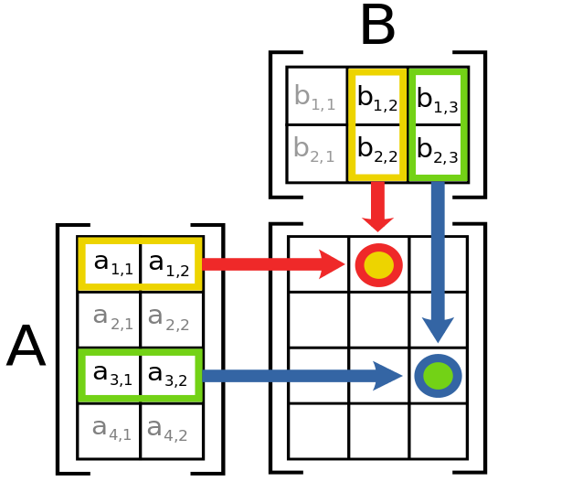

# Les matrices {#matrices}

```{example, name="Les photos numériques"}
Les écrans de nos téléphones intelligents sont formés de pixels rouge, vert et bleu.

Rouge, vert, bleu, abrégé en RVB ou en RGB (de l'anglais « red, green, blue ») est un système de codage informatique des couleurs, le plus proche du matériel. Les écrans d'ordinateurs reconstituent une couleur par synthèse additive à partir de trois couleurs primaires, un rouge, un vert et un bleu, formant sur l'écran une mosaïque trop petite pour être aperçue. Le codage RVB indique une valeur pour chacune de ces couleurs primaires.
```

```{r, echo=FALSE, fig.align='center',fig.cap="Quelques exemples de pixels agrandis."}

```

Voici un exemple du principe d'utilisation des pixels rouge, vert et bleu: [une feuille de calcul pas comme les autres](https://docs.google.com/spreadsheets/d/e/2PACX-1vQlMpjcuG6vAjO40W1oMXe3J40wmDczGQEHzdvz1aHF_HadCymBE_OS-f197cYWvoGnnmqERiR7aKkw/pubhtml).

## La définition d'une matrice

Débutons en introduisant la définition d'une matrice. Nous avons déjà rencontré une matrice que nous avions nommé la matrice augmentée lors de la résolution de système d'équations linéaires.

```{definition, name="Une matrice"}
Une matrice $A$ de dimension $m \times n$ où $m$ et $n$ sont des entiers positifs est un arrangement de $m\cdot n$ nombres sous la forme de $m$ lignes horizontales et de $n$ colonnes verticales. Nous notons habituellement une matrice à l'aide d'une lettre majuscule et nous encadrons les nombres formant la matrice à l'aide de crochets. Nous avons donc:
\begin{align*}
A = \begin{bmatrix}
a_{1,1}&a_{1,2}&\ldots &a_{1,n} \\
a_{2,1}&a_{2,2}&\ldots &a_{2,n}\\
\vdots &\vdots & \ddots &\vdots \\
a_{m,1}&a_{m,2}&\ldots &a_{m,n}
\end{bmatrix}
\end{align*}

Le nombre $a_{i,j}$ correspond à l'entrée $(i,j)$ de la matrice $A$, c'est-à-dire au nombre situé à l'intersection de la ième ligne et de la jième colonne. Remarquons que nous utilisons une lettre minuscule pour indiquer un nombre de la matrice.

La *ième* ligne et la *jième* colonne de la matrice $A$ sont respectivement:
\begin{align*}
\begin{bmatrix}
a_{i,1} & a_{i,2} & \ldots & a_{i,n}
\end{bmatrix}
\quad 
\text{et}
\quad
\begin{bmatrix}
a_{1,j} \\
a_{2,j} \\
\vdots \\
a_{m,j}
\end{bmatrix}
\end{align*}

En particulier, nous disons qu'une matrice $A$ de dimension $1\times n$ est une matrice ligne et qu'une matrice $A$ de dimension $m\times 1$ est une matrice colonne.
```

```{remark}
Nous pouvons noter la dimension d'une matrice en utilisant des indices séparés par une virgule. Par exemple, si la matrice $A$ est de dimension $m \times n$, nous pouvons l'écrire des deux façons suivantes:
\begin{align*}
	A_{m\times n} \qquad \text{ou} \qquad [a_{i,j}]_{m\times n}
\end{align*}
```

```{remark}
Nous pouvons utiliser de grandes parenthèses comme notation lors de l'écriture d'une matrice, c'est-à-dire qu'une matrice $A$ de dimension $m \times n$ peut s'écrire:
\begin{align*}
A = \begin{pmatrix}
a_{1,1}&a_{1,2}&\ldots &a_{1,n} \\
a_{2,1}&a_{2,2}&\ldots &a_{2,n}\\
\vdots &\vdots & \ddots &\vdots \\
a_{m,1}&a_{m,2}&\ldots &a_{m,n}
\end{pmatrix}
\end{align*}
Par contre, dans ce manuel, nous utiliserons uniquement les crochets.
```

```{example}
Indiquez la dimension des matrices suivantes.

  a. $A = \begin{bmatrix}
          10&10&6\\
          10&10&-8\\
          -7&0&-2\\
          \end{bmatrix}$
  a. $B = \begin{bmatrix}
          9\\
          6\\
          10\\
          3\\
          -10\\
          \end{bmatrix}$
  a. $C = \begin{bmatrix}
          7&9&4&5\\
          \end{bmatrix}$
  a. $D = \begin{bmatrix}
          7\\
        \end{bmatrix}$
  a. $E = \begin{bmatrix}
          9&3&1&-7&0\\
          -8&-8&10&10&6\\
          9&-5&10&10&-8\\
          \end{bmatrix}$


```

```{example}
Soit la matrice suivante:
\begin{align*}
A = \begin{bmatrix}
-2&-10&5&-10\\
9&7&-2&-5\\
6&9&3&-10\\
10&4&-7&-8\\
3&5&4&7\\
\end{bmatrix}
\end{align*}
Répondez aux questions suivantes.

  a. Déterminez la valeur de l'élément $a_{1,2}$.
  a. Déterminez la valeur de l'élément $a_{2,1}$.
  a. Déterminez la valeur de l'élément $a_{3,3}$.
  a. Déterminez la valeur de l'élément $a_{4,5}$.


```

### Les matrices particulières {#sec:matrice-particuliere}

```{definition, name="Une matrice carrée"}
Soit $A$ une matrice. Nous disons que $A$ est une matrice carrée si elle possède le même nombre de lignes que de colonnes, c'est-à-dire que nous pouvons écrire $A_{m \times m}$.

En particulier, nous disons que les entrées $[a_{i,i}]_{m \times m}$ de la matrice forment la diagonale principale de la matrice. Par exemple, si nous avons la matrice $A_{4\times 4}$ suivante:
\begin{align*}
A = \begin{bmatrix}
\fbox{$a_{1,1}$} & a_{1,2} & a_{1,3} & a_{1,4} \\
a_{2,1} & \fbox{$a_{2,2}$} & a_{2,3} & a_{2,4} \\
a_{3,1} & a_{3,2} & \fbox{$a_{3,3}$} & a_{3,4} \\
a_{4,1} & a_{4,2} & a_{4,3} & \fbox{$a_{4,4}$} \\
\end{bmatrix}
\end{align*}
les éléments encadrés, qui correspondent aux éléments appartenant à la ième ligne et à la ième colonne, sont les éléments de la diagonale principale.

Il existe également dans une matrice carrée, une diagonale secondaire. Nous disons que les entrées $[a_{m-i+1,i}]_{m \times m}$ (nous aurions aussi pu utiliser la notation $[a_{i,m-i+1}]_{m \times m}$) de la matrice forment la diagonale secondaire de la matrice. Par exemple, si nous avons la matrice $A_{4\times 4}$ suivante:
\begin{align*}
A = \begin{bmatrix}
a_{1,1} & a_{1,2} & a_{1,3} & \fbox{$a_{1,4}$} \\
a_{2,1} & a_{2,2} & \fbox{$a_{2,3}$} & a_{2,4} \\
a_{3,1} & \fbox{$a_{3,2}$} & a_{3,3} & a_{3,4} \\
\fbox{$a_{4,1}$} & a_{4,2} & a_{4,3} & a_{4,4} \\
\end{bmatrix}
\end{align*}
```

```{definition, name="Les matrices carrées usuelles", label="matrice-usuelle"}
Voici quelques matrices carrées usuelles:

  - La matrice identité, noté $I_n$, est la matrice ne contenant que des uns sur sa diagonale principale et des zéros partout ailleurs. Par exemple, voici la matrice identité de format $5 \times 5$:
\begin{align*}
I_5 &= \begin{bmatrix}
1&0&0&0&0\\
0&1&0&0&0\\
0&0&1&0&0\\
0&0&0&1&0\\
0&0&0&0&1\\
\end{bmatrix}
\end{align*}
  - Une matrice diagonale est une matrice ne contenant que des zéros sauf sur la diagonale principale ou elle peut contenir des nombres différents de zéros. Par exemple, voici une matrice diagonale:
\begin{align*}
A = \begin{bmatrix}
7&0&0&0\\
0&9&0&0\\
0&0&-8&0\\
0&0&0&9\\
\end{bmatrix}
\end{align*}
La matrice $I_n$ est une matrice diagonale.
  - Une matrice triangulaire inférieure, notée $L_n$, est une matrice telle que toutes les entrées au-dessus de la diagonale principale sont nulles. Mathématiquement, nous pouvons écrire:
\begin{align*}
[l_{i,j}]_n = \begin{cases}
l_{i,j} & \text{si } i \geq j \\
0 & \text{si } i < j
\end{cases} 
\end{align*}
Nous pouvons représenter la matrice $L_n$ de la façon suivante:
\begin{align*}
L_n &= \begin{bmatrix}
l_{1,1} & & & & 0 \\
l_{2,1} & l_{2,2} & & & \\
l_{3,1} & l_{3,2} & \ddots & & \\
\vdots & \vdots & \ddots & \ddots & \\
l_{n,1} & l_{n,2} & \ldots & l_{n,n-1} & l_{n,n} 
\end{bmatrix}
\end{align*}
  - Une matrice triangulaire supérieure, notée $U_n$, est une matrice telle que toutes les entrées au-dessous de la diagonale principale sont nulles. Mathématiquement, nous pouvons écrire:
\begin{align*}
[u_{i,j}]_n = \begin{cases}
u_{i,j} & \text{si } i \leq j \\
0 & \text{si } i > j
\end{cases} 
\end{align*}
Nous pouvons représenter la matrice $U_n$ de la façon suivante:
\begin{align*}
U_n &= \begin{bmatrix}
u_{1,1} & u_{1,2} & u_{1,3} & \ldots & u_{1,n} \\
& u_{2,2} & u_{2,3} & \ldots & u_{2,n} \\
& & \ddots & \ddots & \vdots \\
& & & \ddots & u_{n-1,n} \\
0 & & & & u_{n,n}
\end{bmatrix}
\end{align*}
Notons qu'une matrice sous forme échelonnée est une matrice triangulaire supérieure.
  - Une matrice symétrique est une matrice telle que $a_{i,j}=a_{j,i}$ pour toutes les valeurs de $i$ et de $j$. Par exemple, les matrices suivantes sont symétriques:
\begin{align*}
A = \begin{bmatrix}
a & b & c & d & e \\
b & f & g & h & i \\
c & g & j & k & l \\
d & h & k & m & n \\
e & i & l & n & o
\end{bmatrix}
\qquad
B = \begin{bmatrix}
2 & 4 & -5 \\
4 & 0 & 3 \\
-5 & 3 & 1
\end{bmatrix}
\end{align*}
  - Une matrice anti-symétrique est une matrice telle que $a_{i,j}=-a_{j,i}$ pour toutes les valeurs de $i$ et de $j$. Par exemple, les matrices suivantes sont anti-symétriques:
\begin{align*}
A = \begin{bmatrix}
0 & b & c & d & e \\
-b & 0 & g & h & i \\
-c & -g & 0 & k & l \\
-d & -h & -k & 0 & n \\
-e & -i & -l & -n & 0
\end{bmatrix}
\qquad
B = \begin{bmatrix}
0 & 4 & -5 \\
-4 & 0 & 3 \\
5 & -3 & 0
\end{bmatrix}
\end{align*}


```

```{remark}
La diagonale principale d'une matrice anti-symétrique n'est composée que de zéros.
```

La dernière matrice que nous introduirons n'est pas une matrice carrée mais elle nous sera néanmoins très utile.

```{definition, name="La matrice nulle"}
La matrice nulle, notée $O_{m\times n}$ est une matrice composée uniquement de zéros. Par exemple, les matrices suivantes sont des matrices nulles:
\begin{align*}
O_{2\times 2} = \begin{bmatrix}
0&0\\
0&0\\
\end{bmatrix}
\qquad 
O_{3,5} = \begin{bmatrix}
0&0&0&0&0\\
0&0&0&0&0\\
0&0&0&0&0\\
\end{bmatrix}
\end{align*}
```

Les matrices que nous venons de décrire sont celles que nous utiliserons le plus régulièrement. Il existe par contre un très grand nombre de matrices particulières.

## Les opérations matricielles

Dans cette section, nous allons introduire les opérations que nous pouvons effectuer sur les matrices.

Avant d'introduire les opérations matricielles, nous débuterons par indiquer les conditions que deux matrices doivent remplir pour être égales.

```{definition, name="L'égalité entre deux matrices"}
Nous disons que deux matrices $A=[a_{i,j}]_{m \times n}$ et $B=[b_{i,j}]_{p \times q}$ sont égales si: 

  - $A$ et $B$ ont la même dimension, c'est-à-dire $m=p$ et $n=q$;
  - tous les éléments correspondants sont égaux, c'est-à-dire $a_{i,j}=b_{i,j}$ pour tout $i$ et $j$. 


```

```{example}
Déterminez si les matrices suivantes sont égales.
 \begin{align*}
A = \begin{bmatrix}
0&0&0&0&0\\
0&0&0&0&0\\
0&0&0&0&0\\
\end{bmatrix}
\quad \text{et} \quad
B = \begin{bmatrix}
0&0&0\\
0&0&0\\
0&0&0\\
0&0&0\\
0&0&0\\
\end{bmatrix}
\end{align*}
```

```{example}
Déterminez si les matrices suivantes sont égales.
\begin{align*}
\begin{bmatrix}
\cos\left(\frac{\pi}{2}\right)&0&3\\
3&4\cdot\frac{3}{8}&5\\
\end{bmatrix}
\quad \text{et} \quad
B = \begin{bmatrix}
0&0&\sqrt{9}\\
-(-3)&\frac{3}{2}&5\\
\end{bmatrix}
\end{align*}
```

### L'addition et la soustraction de matrices

```{definition, name="L'addition et soustraction de matrices"}
Soit les matrices $A_{m\times n}$ et $B_{m\times n}$. Pour être en mesure d'additionner ou de soustraire deux matrices, leur format doit être égal.

Si nous posons $C=A+B$, alors la matrice $C$ aura le format $m\times n$ et l'élément $c_{i,j}$ sera égal à $[a_{i,j}+b_{i,j}]_{m\times n}$. Nous pouvons donc représenter l'addition de deux matrices de la façon suivante:
\begin{align*}
A + B & = 
\begin{bmatrix}
a_{1,1}&a_{1,2}&\ldots &a_{1,n} \\
a_{2,1}&a_{2,2}&\ldots &a_{2,n}\\
\vdots &\vdots & \ddots &\vdots \\
a_{m,1}&a_{m,2}&\ldots &a_{m,n}
\end{bmatrix}
+
\begin{bmatrix}
b_{1,1}&b_{1,2}&\ldots &b_{1,n} \\
b_{2,1}&b_{2,2}&\ldots &b_{2,n}\\
\vdots &\vdots & \ddots &\vdots \\
b_{m,1}&b_{m,2}&\ldots &b_{m,n}
\end{bmatrix} \\
&=
\begin{bmatrix}
a_{1,1}+b_{1,1}&a_{1,2}+b_{1,2}&\ldots &a_{1,n}+b_{1,n} \\
a_{2,1}+b_{2,1}&a_{2,2}+b_{2,2}&\ldots &a_{2,n}+b_{2,n}\\
\vdots &\vdots & \ddots &\vdots \\
a_{m,1}+b_{m,1}&a_{m,2}+b_{m,1}&\ldots &a_{m,n}+b_{m,n}
\end{bmatrix}
\end{align*}

D'une manière similaire, si nous posons $C=A-B$, alors la matrice $C$ aura le format $m\times n$ et l'élément $c_{i,j}$ sera égal à $[a_{i,j}-b_{i,j}]_{m\times n}$. 
\begin{align*}
A - B & = 
\begin{bmatrix}
a_{1,1}&a_{1,2}&\ldots &a_{1,n} \\
a_{2,1}&a_{2,2}&\ldots &a_{2,n}\\
\vdots &\vdots & \ddots &\vdots \\
a_{m,1}&a_{m,2}&\ldots &a_{m,n}
\end{bmatrix}
-
\begin{bmatrix}
b_{1,1}&b_{1,2}&\ldots &b_{1,n} \\
b_{2,1}&b_{2,2}&\ldots &b_{2,n}\\
\vdots &\vdots & \ddots &\vdots \\
b_{m,1}&b_{m,2}&\ldots &b_{m,n}
\end{bmatrix} \\
&=
\begin{bmatrix}
a_{1,1}-b_{1,1}&a_{1,2}-b_{1,2}&\ldots &a_{1,n}-b_{1,n} \\
a_{2,1}-b_{2,1}&a_{2,2}-b_{2,2}&\ldots &a_{2,n}-b_{2,n}\\
\vdots &\vdots & \ddots &\vdots \\
a_{m,1}-b_{m,1}&a_{m,2}-b_{m,1}&\ldots &a_{m,n}-b_{m,n}
\end{bmatrix}
\end{align*}

```

```{example}
Soit les matrices suivantes:
\begin{align*}
A = \begin{bmatrix}
-10&-8&-4\\
-5&7&9\\
-10&4&-10\\
\end{bmatrix}
,\quad 
B = \begin{bmatrix}
-1&6&-1\\
-2&-7&3\\
6&0&4\\
\end{bmatrix}
\quad \text{et} \quad
C = \begin{bmatrix}
5&-7\\
-5&-8\\
4&0\\
3&10\\
\end{bmatrix}
\end{align*}
Pour les opérations suivantes, dites si l'opération est définie et si oui, trouvez le résultat de l'opération.
 
  a. A+B
  a. B-A
  a. A+C
  a. A-A


```

### La multiplication d'une matrice par un scalaire

```{definition, name="La multiplication d'une matrice par un scalaire"}
Soit une matrice $A_{m\times n}$ et un scalaire $k\in\mathbb{R}$. La multiplication de la matrice
$A$ par le scalaire $k$ donne une matrice $B=kA$ dont les éléments sont définis comme suit $[b_{i,j}]_{m\times n}=[ka_{i,j}]_{m\times n}$. Nous pouvons donc représenter la multiplication d'une matrice par un scalaire de la façon suivante:
\begin{align*}
kA &=
k
\begin{bmatrix}
a_{1,1}&a_{1,2}&\ldots &a_{1,n} \\
a_{2,1}&a_{2,2}&\ldots &a_{2,n}\\
\vdots &\vdots & \ddots &\vdots \\
a_{m,1}&a_{m,2}&\ldots &a_{m,n}
\end{bmatrix}\\
&=
\begin{bmatrix}
ka_{1,1}&ka_{1,2}&\ldots &ka_{1,n} \\
ka_{2,1}&ka_{2,2}&\ldots &ka_{2,n}\\
\vdots &\vdots & \ddots &\vdots \\
ka_{m,1}&ka_{m,2}&\ldots &ka_{m,n}
\end{bmatrix}
\end{align*}
```

```{example}
Soit les matrices suivantes:
\begin{align*}
A = 
\begin{bmatrix}
-3&5&4\\
2&-5&8\\
-6&0&10\\
\end{bmatrix}
\quad \text{et} \quad
B = 
\begin{bmatrix}
1&-5\\
-8&7\\
-7&-5\\
-5&9\\
7&-3\\
\end{bmatrix}
\end{align*}
Effectuez les opérations suivantes:

  a. $2A$
  a. $-3B$
  a. $\pi$ $A$
  a. $0B$ 


```

### La transposition de matrices

```{definition, name="La transposition de matrices"}
Soit une matrice $A_{m\times n}$. Alors, la transposition de la matrice $A$, notée $A^T$, est la matrice dont les lignes correspondent aux colonnes de $A$. Ainsi, la dimension de $A^T$ est $n\times m$. De plus, les éléments de la matrice transposée de $A$ seront $[a_{j,i}]_{n \times m}$. Nous pouvons représenter la transposée de la matrice de la façon suivante:

\begin{align*}
A^T &= 
\begin{bmatrix}
a_{1,1}&a_{1,2}&\ldots &a_{1,n} \\
a_{2,1}&a_{2,2}&\ldots &a_{2,n}\\
\vdots &\vdots & \ddots &\vdots \\
a_{m,1}&a_{m,2}&\ldots &a_{m,n}
\end{bmatrix}^T \\
&= 
\begin{bmatrix}
a_{1,1}&a_{2,1}&\ldots &a_{m,1} \\
a_{1,2}&a_{2,2}&\ldots &a_{m,2}\\
\vdots &\vdots & \ddots &\vdots \\
a_{1,n}&a_{2,n}&\ldots &a_{m,n}
\end{bmatrix}
\end{align*}
```

```{example}
Soit les matrices suivantes:
  \begin{align*}
A=
\begin{bmatrix}
-6&-1&2\\
-5&-3&1\\
2&7&9\\
\end{bmatrix}
,\quad 
B=
\begin{bmatrix}
1&-9&6\\
-9&1&9\\
\end{bmatrix}
\quad \text{et} \quad
C=
\begin{bmatrix}
-8&0&0&0\\
0&1&0&0\\
0&0&-1&0\\
0&0&0&-10\\
\end{bmatrix}
\end{align*}
Trouvez les matrices suivantes:
 
  a. $A^T$
  a. $B^T$
  a. $C^T$


```

Nous avons vu à la définition \@ref(def:matrice-usuelle) de la section \@ref(sec:matrice-particuliere) la définition de matrices symétriques et antisymétriques. Nous pouvons maintenant utiliser la définition de la transposée pour exprimer cet état de fait. En effet, nous savons qu'une matrice est symétrique si nous avons que ses éléments sont de la forme $a_{i,j}=a_{j,i}$ pour toutes les valeurs de $i$ et de $j$. Mais ceci correspond exactement à la définition d'une matrice symétrique. Nous avons donc:
\begin{align*}
A \text{ est symétrique } \Longleftrightarrow  A=A^T
\end{align*}
D'une manière similaire, nous pouvons conclure que:
\begin{align*}
A \text{ est antisymétrique } \Longleftrightarrow  A=-A^T
\end{align*}

```{example}
Soit la matrice suivante:
\begin{align*}
A = \begin{bmatrix}
1 & 2 & 3 \\
4 & 5 & 6 \\
7 & 8 & 9
\end{bmatrix}
\end{align*}

  a. Trouvez la matrice $B=\dfrac{1}{2}(A+A^T)$.
  a. Montrez que la matrice $B$ est symétrique.
  a. Trouvez la matrice $C=\dfrac{1}{2}(A-A^T)$.
  a. Montrez que la matrice $C$ est antisymétrique.
  a. Montrez que $A=B+C$.


```

### Les propriétés des opérations sur les matrices

L'addition, la soustraction, la multiplication par  un scalaire et la transposition possèdent des propriétés que nous devons connaître afin
de bien manipuler les matrices.

```{theorem, name="Les propriétés des matrices"}
Soit les matrices $A_{m\times n}$, $B_{m\times n}$ et $C_{m\times n}$ ainsi que les scalaires $k_1,k_2\in\mathbb{R}$. Nous avons alors:

  - $A_{m\times n}+B_{m\times n}=B_{m\times n}+A_{m\times n}$
  - $A_{m\times n}+(B_{m\times n}+C_{m\times n})=(A_{m\times n}+B_{m\times n})+C_{m\times n}$
  - $A_{m\times n}+0_{m\times n}=0_{m\times n}+A_{m\times n}=A_{m\times n}$
  - $A_{m\times n}+(-A_{m\times n})=(-A_{m\times n})+A_{m\times n}=0_{m\times n}$
  - $(k_1k_2)A_{m\times n}=k_1(k_2A_{m\times n})$
  - $(k_1+k_2)A_{m\times n}=k_1A_{m\times n}+k_2A_{m\times n}$
  - $k_1(A_{m\times n}+B_{m\times n})=k_1A_{m\times n}+k_1B_{m\times n}$
  - $(A_{m\times n}^T)^T=A_{m\times n}$
  - $(A_{m\times n}+B_{m\times n})^T=A_{m\times n}^T+B_{m\times n}^T$


```

### Le produit de deux matrices

```{definition}
Soit une matrice $A_{m\times p}$ et une matrice $B_{p\times n}$. La matrice $C_{m\times n}$ est dite être le produit matriciel de $A$ avec $B$, noté $AB$ ou $A\cdot B$, si l'élément $[c_{i,j}]_{m\times n}$ est donné par:
\begin{align*}
c_{i,j}=a_{i,1}b_{1,j}+a_{i,2}b_{2,j}+a_{i,3}b_{3,j}+...+a_{i,p}b_{p,j}=\sum_{k=1}^pa_{i,k}b_{k,j}
\end{align*}
pour tout $i$ allant de $1,2, \ldots , m$ et $j$ allant de $1,2,\ldots , n$.

Nous pouvons représenter le produit matriciel comme à la figure \@ref(fig:matrix-multiplication).

En d'autre termes, nous obtenons le terme $c_{i,j}$ de la matrice $C=AB$ en multipliant terme à terme la *ième* **ligne** de $A$ avec la *jième* **colonne** de $B$.
```

```{r, echo=FALSE,fig.align='center', fig.cap="Un moyen mnémotechnique pour le produit matriciel.", label="matrix-multiplication"}

```

```{remark}
Pour que le produit matriciel $AB$ soit défini, il faut absolument que le nombre de colonnes de $A$ soit le même que le nombre de lignes de $B$. De plus, le nombre de lignes de $C$ correspond au nombre de lignes de $A$ et le nombre de colonnes de $C$ correspond au nombre de colonnes de $B$. Nous avons donc:
\begin{align*}
C_{m\times n} = A_{m\times \fbox{$p$}}B_{\fbox{$p$} \times n}
\end{align*}
```

```{example}
Soit les matrices suivantes:
\begin{align*}
A_{3\times 2} \qquad B_{2\times 3} \qquad C_{3\times 3} \qquad D_{1\times 3}
\end{align*}
Indiquez si les produits matriciels suivants sont définis et si oui, indiquez la dimension de la matrice résultante.

  a. $A_{3\times 2}B_{2\times 3}$
  a. $B_{2\times 3}A_{3\times 2}$
  a. $A_{3\times 2}C_{3\times 3}$
  a. $C_{3\times 3}A_{3\times 2}$
  a. $B_{2\times 3}D_{1\times 3}$
  a. $D_{1\times 3}B_{2\times 3}$


```

```{example}
Soit les matrices suivantes:
\begin{align*}
A=\begin{bmatrix}
3 & 5 & 6 \\
2 & -1 & 0
\end{bmatrix}
\qquad 
B=\begin{bmatrix}
1 & 2 & 3 \\
-9 & 4 & 1 \\
0 & 1 & 0
\end{bmatrix}
\end{align*}

  a. Trouvez, si possible, le produit $AB$.
  a. Trouvez, si possible, le produit $BA$.


```

```{remark}
Le produit matriciel n'est pas commutatif,c'est-à-dire que $AB\neq BA$. Dans l'exemple précédent, nous ne pouvions pas faire $BA$, car le nombre de colonnes de $B$, ici 3, n'est pas le même que le nombre de lignes de $A$, ici 2. Même dans les cas où les dimensions des deux matrices sont compatibles, il est très rare de voir la commutativité du produit matriciel.
```

```{theorem, name="Le produit matriciel n'est pas commutatif"}
Soit $A_{m\times n}$ et $B_{n\times m}$ deux matrices. En général, nous avons:
\begin{align*}
A_{m\times n}B_{n\times m} \neq B_{n\times m}A_{m\times n}
\end{align*}
```

```{definition, name="Les puissances d'une matrice"}
Soit $A_n$ une matrice carrée. Le produit $A_nA_n$ est noté $A_n^2$. De la même façon, le produit $A_nA_nA_n=A_n^3$ et $\underbrace{A_nA_n\ldots A_n}_{k \text{ fois}} = A_n^k$. Nous disons que $A_n^1=A_n$. Si $A_n$ est une matrice non-nulle, nous pouvons écrire $A_n^0=I_n$.
```

```{theorem, name="Les propriétés des puissances de matrices"}
Soit $A_p$ une matrice carrée, $n,m\in\mathbb{N}$ et $k$ une constante. Les propriétés suivantes sont vérifiées:

  - $A_p^{n}A_p^m=A_p^{n+m}$
  - $(A_p^n)^m=A_p^{nm}$
  - $(kA_p)^n=k^nA_p^n$


```

À l'aide du produit matriciel et des puissances de matrices, il nous est possible de définir un certain nombre de matrices particulières qui nous seront utiles.

```{definition, name="Quelques matrice particulières"}
Voici quelques matrices  particulières:
  
  - Une matrice idempotente est une matrice carrée $A_{n}$ telle que $A_n\cdot A_n = A_n$.
  - Une matrice nilpotente d'ordre $k$ est une matrice carrée $A_{n}$ telle que $A_n^k=0_n$.


```

```{example}
Soit la matrice suivante:
\begin{align*}
A=\begin{bmatrix}
5 & -2 \\
10 & -4
\end{bmatrix}
\end{align*}
Démontrez que $A$ est une matrice idempotente.
```

```{example}
Soit la matrice suivante:
\begin{align*}
A=\begin{bmatrix}
5&-3&2\\
15&-9&6\\
10&-6&4\\
\end{bmatrix}
\end{align*}
Montrez que $A$ est une matrice nilpotente et trouvez son ordre de nilpotence.
```

### Les propriétés du produit matriciel

Voici les propriétés du produit matriciel.

```{theorem, name="Les propriétés du produit matriciel"}
Soit les matrices $A$, $B$ et $C$ ayant des dimensions compatibles pour les opérations, ainsi que les scalaires $k_1,k_2\in\mathbb{R}$. De plus, soit $I$ la matrice identité et $0$ la matrice nulle. Nous avons alors:
  
  - $A_{m\times n}(B_{n\times o}C_{o\times p})=(A_{m\times n}B_{n\times o})C_{o\times p}$
  - $(k_1A_{m\times n})(k_2B_{n\times o})=(k_1k_2)(A_{m\times n}B_{n\times o})$
  - $A_{m\times n}(B_{n\times o}+C_{n\times o})=A_{m\times n}B_{n\times o}+A_{m\times n}C_{n\times o}$
  - $(A_{m\times n}+B_{m\times n})C_{n\times o}=A_{m\times n}C_{n\times o}+B_{m\times n}C_{n\times o}$
  - $(A_{m\times n}B_{n\times o})^T=B_{o\times n}^TA_{n\times m}^T$
  - $A_{m\times n}I_n = A_{m\times n}$ et $I_nB_{n\times o} = B_{n\times o}$
  - $A_{m\times n}0_{n\times o} = 0_{m\times o}$ et $0_{n\times o}B_{o\times p}=0_{n\times p}$


```

## La matrice inverse

Nous introduirons dans cette section un nouveau type de matrice, la matrice inverse. Comme vous avez pu le constater, nous n'avons pas introduit d'opération de division matricielle, pour la bonne raison qu'une telle opération n'existe pas. Plutôt que de parler de division matricielle, nous parlerons plutôt de multiplication par l'inverse d'une matrice. Il est à noter que la théorie de cette section ne s'applique qu'aux matrices carrées, c'est-à-dire à celles qui ont le même nombre de lignes et de colonnes.

```{definition, name="La matrice inverse"}
Soit $A_{n}$ une matrice carrée. Nous disons que $A$ possède une matrice inverse, notée $A^{-1}_n$ si:
\begin{align*}
A_n A^{-1}_n = I_n = A^{-1}_n A_n
\end{align*}
```

```{remark}
Les matrices carrées ne possèdent pas toutes une matrice inverse.
```

```{theorem, name="L'unicité de la matrice inverse"}
Soit $A_{n}$ une matrice carrée. Si $A_n$ possède une matrice inverse, notée $A^{-1}_n$, alors celle-ci est unique.
```

```{theorem, name="Les propriétés de la matrice inverse"}
À FAIRE...
```

```{example}
Trouvez l'inverse de la matrice suivante:
\begin{align*}
A=\begin{bmatrix}
1&2\\
3&4
\end{bmatrix}
\end{align*}

```

Nous remarquons que $A^{-1}$ correspond à la partie de droite de la matrice augmentée. Ainsi, pour trouver l'inverse d'une matrice $A$, il faut créer la matrice augmentée $[A|I]$ et, à l'aide de la méthode de Gauss avec substitution arrière, retrouver la matrice identité dans la partie de gauche. À ce moment, $A^{-1}$ sera la matrice représentée dans la partie de droite. 

```{example}
Trouvez l'inverse de la matrice suivante:
\begin{align*}
A=
\begin{bmatrix}
1&1&1\\
-1&2&-1\\
0&0&3
\end{bmatrix}
\end{align*}

```

Avant d'aller plus loin, nous pouvons définir quelques matrices spéciales, à l'aide de la matrice inverse.

```{definition, name="La matrice orthogonale"}
Nous disons qu'une matrice est orthogonale lorsque sa transposée est égale à sa matrice inverse, c'est-à-dire $A^T=A^{-1}$. Plus précisément, nous avons:
\begin{align*}
A^TA=I \text{ et } AA^T=I
\end{align*}
```
 
```{example}
Démontrez que la matrice suivante est orthogonale:
\begin{align*}
A=\begin{bmatrix}
\cos(\theta) & -\sin(\theta) \\
\sin(\theta) & \cos(\theta)
\end{bmatrix}
\end{align*}
```

Lorsque nous connaissons la matrice inverse d'une matrice $A$, nous pouvons facilement résoudre un système d'équations linéaires de la forme:
\begin{align*}
AX=B 
\end{align*}
Pour ce faire, il suffit de multiplier à gauche par la matrice inverse de $A$, c'est-à-dire:
\begin{align*}
AX&=B\\
(A^{-1}A)X&=A^{-1}B\\
IX&=A^{-1}B\\
X&=A^{-1}B
\end{align*}
Ainsi, la solution du système d'équations linéaires est $X=A^{-1}B$.

```{example}
Trouvez la solution des système d'équations linéaires suivants à l'aide de la matrice inverse.

  a. \begin{align*}
\begin{bmatrix}
1&1&1\\
-1&2&-1\\
0&0&3\\
\end{bmatrix}
\begin{bmatrix}
x \\y \\z
\end{bmatrix}
=
\begin{bmatrix}
7\\
9\\
-8\\
\end{bmatrix}
\end{align*}
  a. \begin{align*}
\begin{bmatrix}
1&1&1\\
-1&2&-1\\
0&0&3\\
\end{bmatrix}
\begin{bmatrix}
x \\y \\z
\end{bmatrix}
=
\begin{bmatrix}
9\\
3\\
-8\\
\end{bmatrix}
\end{align*}
  a. \begin{align*}
\begin{bmatrix}
1&1&1\\
-1&2&-1\\
0&0&3\\
\end{bmatrix}
\begin{bmatrix}
x \\y \\z
\end{bmatrix}
=
\begin{bmatrix}
-5\\
1\\
10\\
\end{bmatrix}
\end{align*}


```

L'exemple précédent montre qu'il devient très rapide de trouver la solution de systèmes d'équations linéaires qui possède la même matrice $A$ lorsque nous connaissons la matrice inverse $A^{-1}$. Nous n'avons pas à refaire la méthode de Gauss à chaque résolution de système d'équations linéaires.

Ce ne sont pas toutes les matrices carrées qui possèdent une matrice inverse, comme le démontrera l'exemple suivant.

```{example}
Trouvez, si possible, la matrice inverse de la matrice suivante:
\begin{align*}
A=\begin{bmatrix}
7&3&-3\\
-16&-4&-6\\
-6&-2&0\\
\end{bmatrix}
\end{align*}

```


