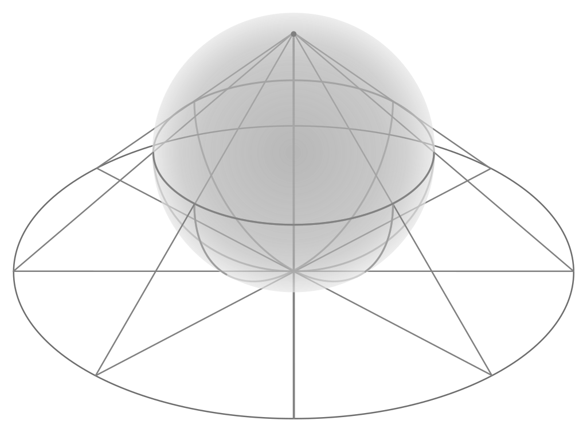
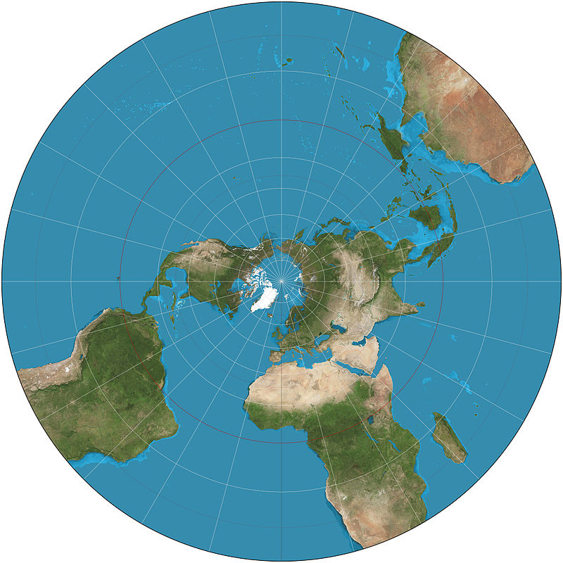
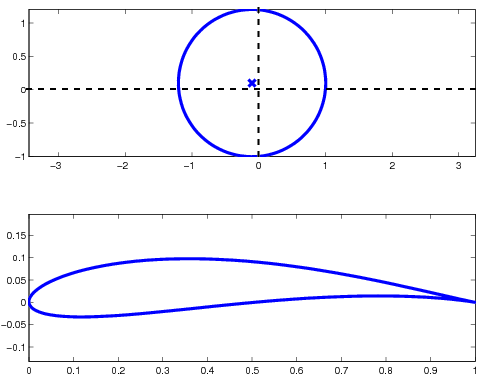

# Les nombres complexes {#nombres-complexes}

La plupart des diverses sphères des mathématiques, de la physique et même de l'ingénierie utilisent les nombres complexes. Ces nombres complexes ont été découvert par Cardano et nous en voyons la première apparition dans le livre _Ars Magna_ publié en $1545$. Par contre, ce fut Gauss qui utilisa le premier ces nombres complexes d'une façon véritablement scientifique. Dans ce chapitre, nous introduisons ce que sont les nombres complexes, les opérations que nous pouvons faire avec ces nombres, leur lien avec l'algèbre linéaire et un certain nombre d'applications.

## Le nombre imaginaire $i$

Pour pouvoir introduire les nombres complexes, nous devons définir une nouvelle unité, que nous nommerons le nombre imaginaire.

```{definition, name="Le nombre imaginaire $i$"}
Nous définissons le nombre imaginaire, noté $i$, par la propriété suivante:
$$ i^2 = -1 $$
```

Clairement, le nombre imaginaire $i$ n'est pas un nombre réel, car il n'existe aucun nombre réel tel que son carré est égal à $-1$. Nous avons donc affaire à une nouvelle classe de nombres. En particulier, le nombre imaginaire $i$ possède la propriété suivante, que nous introduirons dans l'exemple qui suit.

```{example, label="i-power"}
Trouvez les puissances de $i$ suivantes:

  a. $i^3$
  a. $i^4$
  a. $i^5$


```

```{example}
Utilisez l'exemple \@ref(exm:i-power) pour calculer $i^{1246}$.
```

Par l'exemple précédent, nous pouvons déduire que les puissances de $i$ obéissent aux règles suivantes.

```{theorem, name="Les puissances de $i$", label="i-puissance"}
Soit $i^n$ où $n\in\mathbb{N}$. La puissance $n$ peut nécessairement s'écrire sous une des quatres formes suivantes:

  - $n=4k$ où $k\in\mathbb{N}$, c'est-à-dire que $n$ est un multiple de $4$
  - $n=4k+1$ où $k\in\mathbb{N}$, c'est-à-dire que si $n$ est divisé par $4$, le reste de la division est $1$
  - $n=4k+2$ où $k\in\mathbb{N}$, c'est-à-dire que si $n$ est divisé par $4$, le reste de la division est $2$
  - $n=4k+3$ où $k\in\mathbb{N}$, c'est-à-dire que si $n$ est divisé par $4$, le reste de la division est $3$

Nous avons donc:
\begin{align*}
i^n &= \begin{cases}
1 & \text{si } n=4k \\
i & \text{si } n=4k+1 \\
-1 & \text{si } n=4k+2 \\
-i & \text{si } n=4k+3 \\
\end{cases}
\end{align*}

```

```{remark}
Le théorème \@ref(thm:i-puissance) permet de trouver un moyen facile de calculer des puissances de $i$. Si vous devez trouver $i^n$, vous commencez par calculer $\frac{n}{4}$. Vous obtiendrez un nombre décimal qui se terminera d'une des quatres façons suivantes:

  - Si $\frac{n}{4}=$ \text{--} $,0$ \text{, alors } $i^n=1$
  - Si $\frac{n}{4}=$ \text{--} $,25$ \text{, alors } $i^n=i$
  - Si $\frac{n}{4}=$ \text{--} $,5$ \text{, alors } $i^n=-1$
  - Si $\frac{n}{4}=$ \text{--} $,75$ \text{, alors } $i^n=-i$


```

```{example}
Calculez $i^{5476}$.
```

Nous pouvons maintenant définir les nombres complexes.

```{definition, name="Les nombres complexes"}
Soit $a,b\in\mathbb{R}$. Le nombre complexe $z$ est un nombre que nous pouvons exprimer sous la forme:
\begin{align*}
z=a+bi
\end{align*}
Nous disons que la partie réelle de $z=a+bi$, notée $\text{RE}(z)$, est $a$. Nous disons que la partie imaginaire de $z=a+bi$, notée $\text{IM}(z)$, est $b$. En particulier, si $\text{IM}(z)=0$ alors $z$ est un nombre réel et si $\text{RE}(z)=0$ alors $z$ est un nombre imaginaire.

L'ensemble de tous les nombres complexes est noté par:
\begin{align*}
\mathbb{C} &= \left{a+bi \mid a,b\in\mathbb{R} \ \text{et} \ i^2=-1\right}
\end{align*}
```

```{example}
Trouvez les parties réelles et imaginaires des nombres complexes suivants:
  
  a. $2+3i$
  a. $-5i+12$
  a. $3i$
  a. $\pi$

```

```{definition}
Nous disons que deux nombres complexes sont égaux si leur parties réelles sont égales et si leur parties imaginaires sont égales.
```

## Les opérations sur les nombres complexes

Il est possible d'effectuer plusieurs opérations sur les nombres complexes.

```{definition, name="La somme et la différence de deux nombres complexes"}
Soit $w=a+bi$ et $z=c+di$ deux nombres complexes. La somme et la différence de deux nombres complexes donnent des nombres complexes.

Nous définissons la somme (respectivement la différence) de $w$ et de $z$, notée $w+z$ (respectivement $w-z$) de la façon suivante:
\begin{align*}
w+z &= (a+bi)+(c+di) = (a+c)+(b+d)i \\
w-z &= (a+bi)-(c+di) = (a-c)+(b-d)i
\end{align*}
Pour effectuer la somme (respectivement la différence) de deux nombres complexes, nous faisons la somme (respectivement la différence) des parties réelles et la somme (respectivement la différence) des parties imaginaires.
```

```{remark}
Lorsque nous effectuons des opérations sur les nombres complexes, il faut évaluer toutes les puissances de $i$ et regrouper les termes restants sous la forme $a+bi$ où $a,b\in\mathbb{R}$.
```

```{example}
FAIRE DES ADDITIONS ET DES SOUSTRACTIONS DE NOMBRES COMPLEXES...
```

```{definition, name="le produit de deux nombres complexes"}
Soit $w=a+bi$ et $z=c+di$ deux nombres complexes. Le produit de deux nombres complexes donne un nombre complexe.

Nous définissons le produit de $w$ et de $z$, noté $wz$ de la façon suivante:
\begin{align*}
wz &= (a+bi)(c+di) \\
&= ac +adi+bci+bdi^2 \\
&= ac+bd(-1)+(ad-bc)i \qquad\text{(car $i^2=-1$)}\\
&= (ac-bd)+(ad-bc)i
\end{align*}
Pour effectuer le produit de deux nombres complexes, nous effectuons le produit terme à terme, nous évaluons les puissances de $i$ et nous regroupons les termes restants sous la forme $a+bi$ où $a,b\in\mathbb{R}$.
```

```{example}
FAIRE DES EXEMPLES DE PRODUITS...
```

Avant de pouvoir définir le quotient de deux nombres complexes, nous devons définir une notion supplémentaire.

```{definition, name="Le conjugué complexe de $z$"}
Soit $z=a+bi$ un nombre complexe. Nous définissons le conjugué complexe de $z$, noté $\overline{z}$, de la façon suivante:
\begin{align*}
\overline{z} &= \overline{a+bi} \\
&= a-bi
\end{align*}

Le conjugué complexe de $z$ change le signe de la partie imaginaire de $z$.
```

```{example}
FAIRE DES EXEMPLES DE CONJUGUÉ COMPLEXE...
```

```{definition, name="La valeur absolue d'un nombre complexe"}
Soit $z=a+bi$ un nombre complexe. Nous définissons la valeur absolue, ou module, de $z$, notée $\vert z\vert$, le nombre réel positif donné par:
\begin{align*}
\vert z\vert = \vert a+bi\vert = \sqrt{a^2+b^2}
\end{align*}
```

```{example}
FAIRE DES EXEMPLES DE VALEUR ABSOLUE...
```

```{theorem}
Soit $z=a+bi$ un nombre complexe. Nous avons:
\begin{align*}
z\overline{z} = \vert z\vert^2
\end{align*}
```

Nous pouvons maintenant définir le quotient de deux nombres complexes.

```{definition}
Soit $w=a+bi$ et $z=c+di$ deux nombres complexes avec $z\neq 0$. Le quotient de deux nombres complexes donne un nombre complexe.

Nous définissons le quotient de $w$ et de $z$, noté $\frac{z}{w}$ de la façon suivante:
\begin{align*}
\dfrac{z}{w} &= \dfrac{z}{w}\cdot \dfrac{\overline{w}}{\overline{w}} \\
&= \dfrac{z\overline{w}}{w\overline{w}} \\
&= \dfrac{(a+bi)(c-di)}{\vert w\vert^2}  \\
&= \dfrac{ac-adi+bci-bdi^2}{c^2+d^2} \\
&= \dfrac{ac+bd}{c^2+d^2} + \dfrac{bc-ad}{c^2+d^2}i
\end{align*}
Pour effectuer le quotient de deux nombres complexes, nous multiplions au numérateur et au dénominateur par le conjugué complexe du dénominateur. Nous effectuons ensuite le produit résultant et nous regroupons les termes restants sous la forme $a+bi$ où $a,b\in\mathbb{R}$.
```

```{example}
FAIRE DES EXEMPLES DE QUOTIENTS...
```

## Les propriétés des opérations sur les nombres complexes

Voici les propriétés des opérations sur les nombres complexes.

```{theorem}
ÉNUMÉRER LES PROPRIÉTÉS DES NOMBRES COMPLEXES, COMMUTATIVITÉ, ETC
```

```{example}
Soit $z\in\mathbb{C}$. Démontrez les identités suivantes.

  a. $\text{RE}(z)=\dfrac{z+\overline{z}}{2}$
  a. $\text{IM}(z)i=\dfrac{z-\overline{z}}{2}$

  
```

Le conjugué complexe possède plusieurs propriétés en lien avec les opérations sur les nombres complexes.

```{theorem}
Soit $w,z\in\mathbb{C}$. Les propriétés suivantes sont vérifiées:

  - $\overline{w+z}=\overline{w}+\overline{z}$
  - $\overline{w-z}=\overline{w}-\overline{z}$
  - $\overline{wz}=\overline{w}\ \overline{z}$
  - $\overline{\left(\dfrac{w}{z}\right)}=\dfrac{\overline{w}}{\overline{z}}$

```

## La représentation géométrique des nombres complexes

Il est possible de donner une représentation géométrique des nombres complexes. Cette représentation est très semblable à celle que nous avons utilisé pour les vecteurs de $\mathbb{R}^2$. En effet, tous les nombres complexes $a+bi$ peuvent être représentés par le vecteur $[a,b]$ dans le plan. Dans ce contexte, l'axe des $x$ est nommé l'axe des réels et l'axe des $y$ est nommé l'axe des imaginaires. Nous obtenons donc la représentation suivante:

```{tikz, echo=FALSE, fig.cap = "La représentation géométrique d'un nombre complexe.", fig.ext = 'png', cache=TRUE, fig.align="center", out.width="75%", label="nombre-complexe-geo"}
\begin{tikzpicture}

\draw[very thick,->,>=stealth] (-1,0) -- (4,0) node[below,shift={(0,-0.25)}] {Re};
\draw[very thick,->,>=stealth] (0,-1) -- (0,3) node[left,shift={(-0.25,0)}] {Im};
\draw[very thick,->,>=stealth,blue] (0,0) -- (3,2) node[midway, above left,black] {$r$};

\node[above right] at (3,2) {$z=a+bi$};

\draw[dashed,thick] (3,0)--(3,2)--(0,2);

\draw (3,0.1)--(3,-0.1)  node[below] {$a$};
\draw (0.1,2)--(-0.1,2)  node[left] {$b$};

\draw (1cm,0) arc (0:33.69:1cm) node[midway,right] {$\theta$};

\end{tikzpicture}
```

En représentant les nombres complexes à l'aide des vecteurs, nous remarquons que l'addition de deux nombres complexes correspond à l'addition de deux vecteurs de $\mathbb{R^2}$ et la multiplication d'un nombre complexe par un nombre **réel** correspond à la multiplication d'un vecteur de $\mathbb{R^2}$ par un scalaire.

En observant le graphique \@ref(fig:nombre-complexe-geo), nous pouvons déduire une nouvelle représentation des nombres complexes.

```{definition, name="La représentation polaire des nombres complexes"}
Soit $z\in\mathbb{C}$. Nous avons:
\begin{align*}
a = r\cos(\theta), \quad b = r\sin(\theta)
\end{align*}
Nous avons donc:
\begin{align*}
z &= r(\cos(\theta) + i\sin(\theta))
\end{align*}
où $r=\vert z\vert$ est appelé le module de $z$ et $\theta$ est l'argument de $z$, noté $\text{arg}(z)$.
```

```{example}
TROUVER DES REPRÉSENTATIONS POLAIRES DE NOMBRES COMPLEXES...
```

La représentation polaire de nombres complexes est particulièrement utile lorsque nous aurons à effectuer des multiplications ou des divisions de nombres complexes. Le théorème suivant en donnera l'explication.

```{theorem, name="La formule d'Euler"}
La formule d'Euler indique que pour tout $x\in\mathbb{R}$, l'identité suivante est vérifiée:
\begin{align*}
e^{ix} &= \cos(x)+i\sin(x)
\end{align*}
```

Le théorème précédent nous indique qu'il est possible d'écrire un nombre complexe sous la forme:
\begin{align*}
z = r(\cos(\theta) + i\sin(\theta)), \qquad z = re^{i\theta}
\end{align*}
où $r$ correspond au module de $z$ et $\theta$ est l'argument de $z$.

L'avantage de cette représentation est que nous pouvons utiliser les propriétés de l'exponentielle pour simplifier certains calculs.

```{theorem, name="Le produit et la division de nombres complexes sous forme polaire"}
Soit $w=r(\cos(\theta) + i\sin(\theta))$ et $z=l(\cos(\phi) + i\sin(\phi))$ deux nombres complexes. Nous avons:
\begin{align*}
wz &= rl(\cos(\theta+\phi) + i\sin(\theta+\phi)) = rle^{i(\theta+\phi)} \\
\frac{w}{z} &= \frac{r}{l}(\cos(\theta-\phi) + i\sin(\theta-\phi)) = \frac{r}{l}e^{i(\theta-\phi)}
\end{align*}
```

```{theorem, name="Les puissances de nombres complexes sous forme polaire"}
Soit $z=r(\cos(\theta) + i\sin(\theta))$ un nombre complexe et $n\in\mathbb{N}$. La puissance enième de $z$ est donnée par:
\begin{align*}
z^n &= r^n(\cos(n\theta) + i\sin(n\theta)) = r^ne^{in\theta}
\end{align*}
```

```{example}
FAIRE DES EXEMPLES DE PUISSANCES, DE PRODUIT ET DE DIVISION DE NOMBRES COMPLEXES...
```

Nous pouvons utiliser la formule du théorème précédent pour trouver les racines enièmes de nombres complexes.

```{theorem, name="Les racines enièmes de nombres complexes"}
Soit $z=r(\cos(\theta)+i\sin(\theta))$. Les $n$ racines enièmes de $z$, notées $z^{\tfrac{1}{n}}$ avec $n\in\mathbb{N}$ sont données par:
\begin{align*}
z^{\tfrac{1}{n}} &= r^{\tfrac{1}{n}}\left(\cos\left(\dfrac{\theta+2\pi k}{n}\right)+i\sin\left(\dfrac{\theta+2\pi k}{n}\right)\right)
\end{align*}
où $k\in\{0,1,\ldots, n-1\}$.
```

## Des applications

```{example, name="La projection stéréographique"}
En géométrie et en cartographie, la projection stéréographique est une projection cartographique azimutale permettant de représenter une sphère privée d'un point sur un plan. On convient souvent que le point dont on prive la sphère sera un des pôles de celle-ci ; le plan de projection peut être celui qui sépare les deux hémisphères, nord et sud, de la sphère, qu'on appelle plan équatorial. On peut également faire une projection stéréographique sur n'importe quel plan parallèle au plan équatorial pourvu qu'il ne contienne pas le point dont on a privé la sphère.

Nous pouvons utiliser les nombres complexes pour paramétriser cette projection.

Vous trouverez davantage d'information sur [Wikipédia](https://en.wikipedia.org/wiki/Stereographic_projection).
```

```{r, echo=FALSE, out.width="75%", fig.align='center'}

```

```{r, echo=FALSE, out.width="75%", fig.align='center'}

```

```{example, name="La transformée de Joukowsky"}
La transformée de Joukovsky est donnée par:
\begin{align*}
z &= \zeta +\dfrac{1}{\zeta}
\end{align*}
où $z=x+iy$ et $\zeta=\chi +i\eta $. Cette transformée est très utilisée pour étudier l'écoulement de l'air autour d'un profil d'aile d'avion. Elle permet de transformer un cercle (il est très simple d'étudier l'écoulement autour d'un cercle) en un profil d'aile d'avion (il est difficile d'étudier l'écoulement autour d'une forme complexe).

  a. Si vous connaissez $\zeta=\chi +i\eta$, trouvez le résultat de la transformée de Joukovsky sous la forme $x+iy$.
  a. Si $\zeta$ correspond à un cercle de rayon $1$ centré à l'origine, trouvez à quoi correspond sa transformation de Joukovsky.

```

```{r, echo=FALSE, out.width="75%", fig.align='center'}

```

```{example, name="L'ensemble de Mandelbrot"}
En mathématiques, l'ensemble de Mandelbrot est une fractale définie comme l'ensemble des points $c$ du plan complexe pour lesquels la suite de nombres complexes définie par récurrence par :
\begin{align*}
\begin{cases}
z_0 &= 0 \\
z_{n+1} &= z_n^2+c
\end{cases}
\end{align*}

Pour plus d'information, je vous invite à visiter [Wikipédia](https://fr.wikipedia.org/wiki/Ensemble_de_Mandelbrot).
```

```{r, echo=FALSE, fig.align='center'}
 if (knitr:::is_html_output()){
   knitr::include_graphics("resources/images/220px-Mandelbrot_sequence_new.gif")
 }
```
