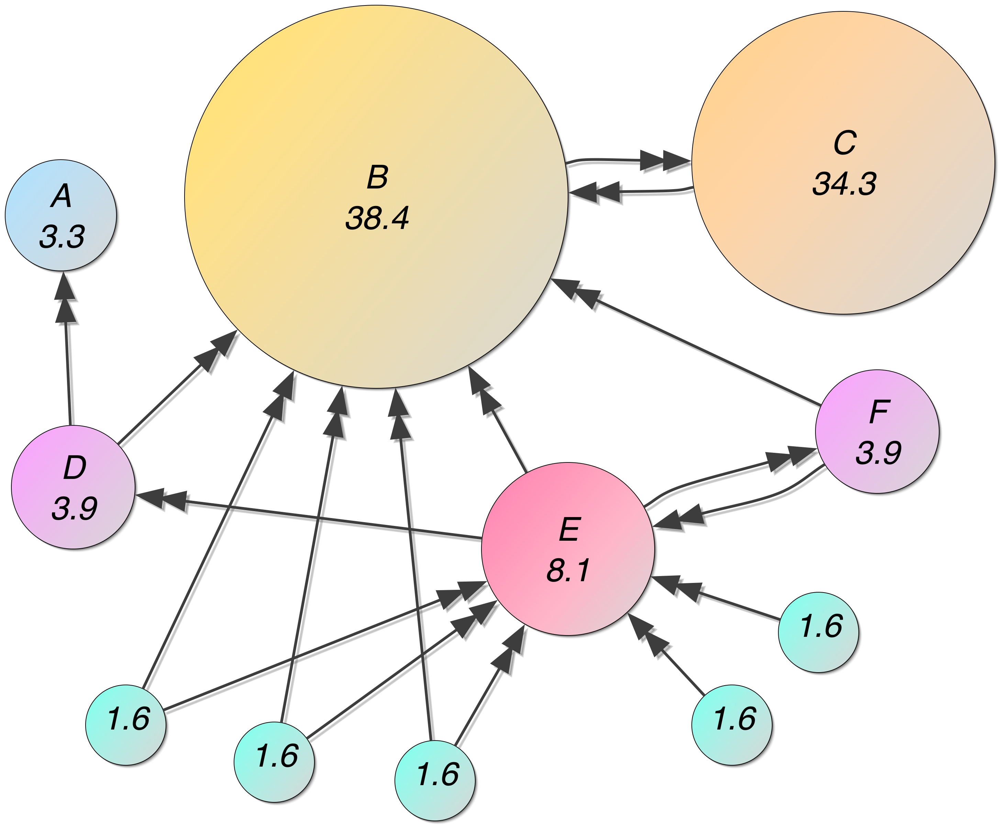
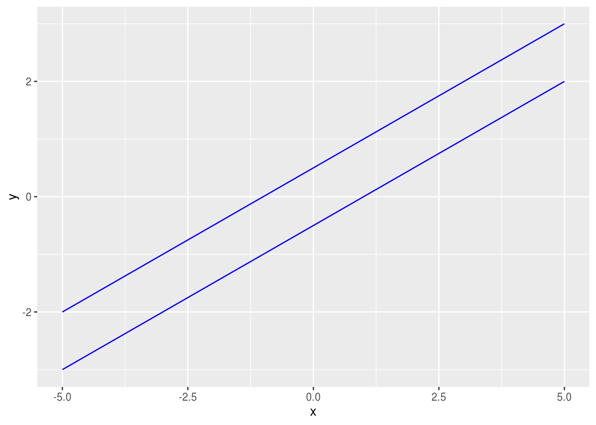
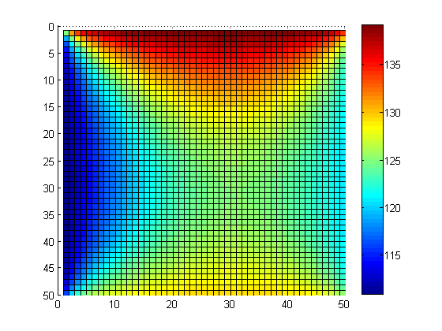
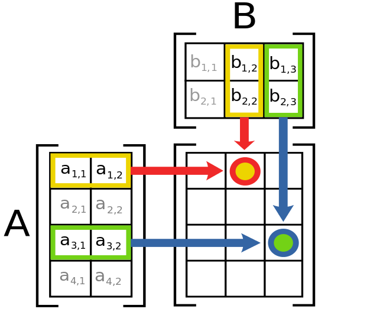
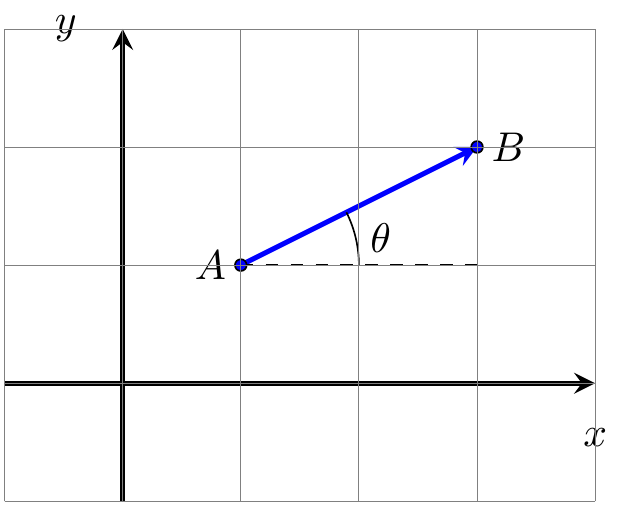
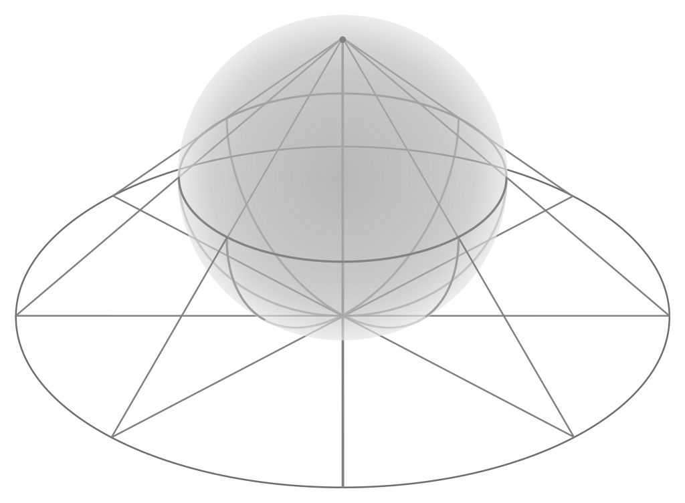
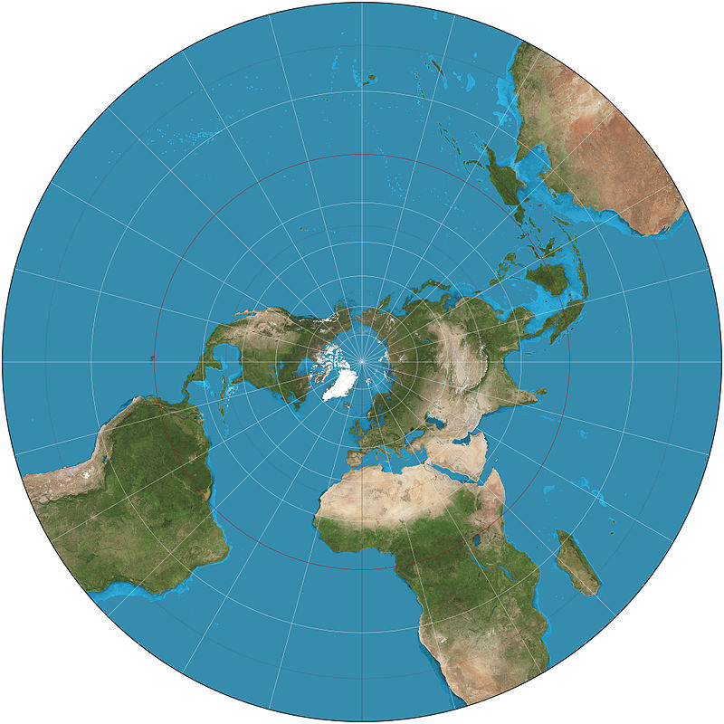
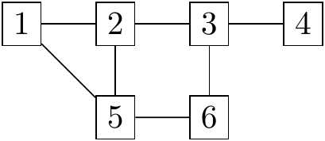

--- 
title: "Algèbre linéaire et géométrie vectorielle"
author: "Marc-André Désautels"
date: "2019-05-28"
site: bookdown::bookdown_site
output: bookdown::gitbook
documentclass: book
bibliography: ["book.bib", "packages.bib"]
biblio-style: "apalike"
link-citations: yes
github-repo: desautm/algebre1
description: "Un livre sur l'algèbre linéaire et géométrie vectorielle."
---

# Introduction {-}

## À propos de ce document {-}

### Remerciements {-}

Ce document est généré par l'excellente extension [bookdown](https://bookdown.org/) de [Yihui Xie](https://yihui.name/).

### License {-}

Ce document est mis à disposition selon les termes de la [Licence Creative Commons Attribution - Pas d’Utilisation Commerciale - Partage dans les Mêmes Conditions 4.0 International](http://creativecommons.org/licenses/by-nc-sa/4.0/).

<!--chapter:end:index.Rmd-->

# (PART) L'algèbre matricielle {-}

# Les systèmes d'équations linéaires {#sel}

\BeginKnitrBlock{example}
<strong>(\#exm:unnamed-chunk-1) </strong>Pourquoi utilisez-vous Google?
  
Les calculs que doivent faire Google pour ordonner les sites de votre requête représente l'un des plus gros problèmes d'algèbre matricielle présentement résolus sur la planète.

Les résultats de l'algorithme de Google après les déplacements du promeneur impartial.

\EndKnitrBlock{example}

<!-- -->

\BeginKnitrBlock{example}\iffalse{-91-79-249-32-115-117-105-115-45-106-101-63-93-}\fi{}
<strong>(\#exm:unnamed-chunk-3)  \iffalse (Où suis-je?) \fi{} </strong>Le Global Positioning System (GPS) (en français : « Système mondial de positionnement » [littéralement] ou « Géo-positionnement par satellite »), originellement connu sous le nom de Navstar GPS, est un système de positionnement par satellites appartenant au gouvernement des États-Unis. Mis en place par le département de la Défense des États-Unis à des fins militaires à partir de 1973, le système avec 24 satellites est totalement opérationnel en 1995 et s'ouvre au civil en 2000.

Le principe de fonctionnement repose sur la trilatération de signaux électromagnétiques synchronisés émis par les satellites. Pour assurer la précision du positionnement, le système GPS utilise des technologies sophistiquées : horloges atomiques embarquées, compensation d'effets relativistes, mise en place de stations d'observation et de synchronisation. Les coordonnées terrestres calculées se réfèrent au système géodésique WGS 84.

Les positions des satellites sont choisies pour que au moins 4 satellites soient visibles de n'importe quel point du globe à tout moment.

\EndKnitrBlock{example}

## Une introduction aux équations linéaires {#sec:intro_equation_lineaire}

Dans cette section, nous introduisons les notions d'équation linéaire et de système d'équations linéaires. Nous introduisons la façon de résoudre de petits systèmes d'équations linéaires. En pratique, les systèmes d'équations linéaires sont résolus grâce aux ordinateurs. Ces systèmes contiennent habituellement des centaines, des milliers (même des millions) d'équations et d'inconnues.

Intuitivement, une équation linéaire est une équation où toutes les variables sont affectées de l'exposant $1$ et ne sont pas multipliées entre elles.

\BeginKnitrBlock{definition}\iffalse{-91-85-110-101-32-233-113-117-97-116-105-111-110-32-108-105-110-233-97-105-114-101-93-}\fi{}
<strong>(\#def:unnamed-chunk-6)  \iffalse (Une équation linéaire) \fi{} </strong>Une équation de $n$ variables $x_1$, $x_2$, ... et $x_n$, est dite **linéaire** si elle peut être écrite sous la forme:
\begin{align*}
a_1x_1+a_2x_2+\ldots+a_nx_n &= b
\end{align*}
où $a_1$, $a_2$, ... et $a_n$ sont appelés les **coefficients** de l'équation linéaire et $b$ est le **terme constant** de l'équation.

Les **coefficients** $a_1$, $a_2$, ... et $a_n$ ainsi que le **terme constant** $b$ sont habituellement des nombres réels.

Si $b=0$, nous disons que l'équation linéaire est **homogène**.
\EndKnitrBlock{definition}

\BeginKnitrBlock{definition}\iffalse{-91-76-97-32-115-111-108-117-116-105-111-110-32-100-39-117-110-101-32-233-113-117-97-116-105-111-110-32-108-105-110-233-97-105-114-101-93-}\fi{}
<strong>(\#def:unnamed-chunk-7)  \iffalse (La solution d'une équation linéaire) \fi{} </strong>Une **solution** d'une équation linéaire de $n$ variables de la forme
\begin{align*}
a_1x_1+a_2x_2+...+a_nx_n=b
\end{align*}
est un $n$-uplet écrit sous la forme $(r_1,r_2,...,r_n)$ (qui veut dire $x_1=r_1$, $x_2=r_2$,... et $x_n=r_n$), qui vérifie l'équation.
\EndKnitrBlock{definition}

\BeginKnitrBlock{definition}\iffalse{-91-76-39-101-110-115-101-109-98-108-101-32-115-111-108-117-116-105-111-110-32-100-39-117-110-101-32-233-113-117-97-116-105-111-110-32-108-105-110-233-97-105-114-101-93-}\fi{}
<strong>(\#def:unnamed-chunk-8)  \iffalse (L'ensemble solution d'une équation linéaire) \fi{} </strong>L'**ensemble solution** d'une équation linéaire est l'ensemble de toutes les solutions possibles de l'équation. Nous le notons par $ES$.
\EndKnitrBlock{definition}

\BeginKnitrBlock{example}
<strong>(\#exm:unnamed-chunk-9) </strong>Pour convertir une température en degrés Celsius, notée $C$, en une température en degrés Fahrenheit, notée $F$, il faut utiliser l'équation:
\begin{align*}
F &= \dfrac{9}{5}C+32
\end{align*}

  a. Est-ce que l'équation précédente est une équation linéaire?
  a. Démontrez que $C=5^{\circ}$ et $F=41^{\circ}$ forment une solution de l'équation linéaire qui permet de convertir une température en degrés Celsius en une température en degrés Fahrenheit.

\EndKnitrBlock{example}

(\#fig:celsius-fahrenheit)L'équation linéaire permettant de convertir des degrés Celsius en degrés Fahrenheit.

Dans le cas où nous n'avons qu'une seule équation linéaire, nous verrons qu'il est relativement simple de résoudre ce type d'équations.

\BeginKnitrBlock{example}
<strong>(\#exm:unnamed-chunk-10) </strong>Résolvez les équations linéaires suivantes:
  
  a. $3x+1=4$
  a. $F=\dfrac{9}{5}C+32$
  a. $2x_1+x_2-3x_3-5=0$
  
  
\EndKnitrBlock{example}

## Les systèmes d'équations linéaires {#systeme_equation_lineaire}

Il semble donc qu'il soit simple de résoudre une seule équation linéaire, peu importe le nombre de variables. Par contre, en pratique, nous rencontrons la plupart du temps des systèmes d'équations linéaires, c'est-à-dire un ensemble d'équations linéaires.

\BeginKnitrBlock{example}\iffalse{-91-85-110-32-115-121-115-116-232-109-101-32-100-39-233-113-117-97-116-105-111-110-115-32-108-105-110-233-97-105-114-101-115-32-99-104-105-110-111-105-115-32-100-117-32-116-114-111-105-115-105-232-109-101-32-115-105-232-99-108-101-32-97-118-97-110-116-32-110-111-116-114-101-32-232-114-101-93-}\fi{}
<strong>(\#exm:chinois)  \iffalse (Un système d'équations linéaires chinois du troisième siècle avant notre ère) \fi{} </strong>Voici un exemple de système d'équations linéaires:
\begin{align*}
\begin{array}{cccccccc}
&3x&+&2y&+&z&=&39\\
&2x&+&3y&+&z&=&34\\
&x&+&2y&+&3z&=&26\\
\end{array}
\end{align*}
Ce système et sa solution se trouvent dans un livre chinois de mathématiques du troisième siècle avant notre ère. Vérifiez que 
\begin{align*}
	x = \frac{37}{4},\quad y = \frac{17}{4},\quad z = \frac{11}{4}
\end{align*}
est une solution du système d'équations linéaires précédent.
\EndKnitrBlock{example}

Comme l'exemple précédent le démontre, il est simple de vérifier qu'un $n$-uplet forme une solution d'un système d'équations linéaires. Il sera par contre plus difficile de le trouver.

\BeginKnitrBlock{definition}\iffalse{-91-85-110-32-115-121-115-116-232-109-101-32-100-39-233-113-117-97-116-105-111-110-115-32-108-105-110-233-97-105-114-101-115-93-}\fi{}
<strong>(\#def:unnamed-chunk-11)  \iffalse (Un système d'équations linéaires) \fi{} </strong>Un **système d'équations linéaires** $S$ de $m$ équations et $n$ variables (ou inconnues) $x_1$, $x_2$, ... et $x_n$ est un ensemble de $m$ équations linéaires de la forme:
\begin{align*}
S=\left\{\begin{array}{cccccccccc}
&a_{1,1}x_1&+&a_{1,2}x_2&+&\ldots &+&a_{1,n}x_n&=&b_1 \\
&a_{2,1}x_1&+&a_{2,2}x_2&+&\ldots &+&a_{2,n}x_n&=&b_2 \\
&&&&&&&&\vdots & \\
&a_{m,1}x_1&+&a_{m,2}x_2&+&\ldots &+&a_{m,n}x_n&=&b_m
\end{array}
\right.
\end{align*}
Les nombres $a_{1,1}$, $a_{1,2}$, ..., $a_{1,n}$, $a_{2,1}$, ..., $a_{2,n}$, ..., $a_{m,1}$, ..., $a_{m,n}$ sont les **coefficients** du système et $b_1$, $b_2$, ..., $b_m$ sont les **termes constants**. Si les termes constants sont tous zéros, le système est appelé **homogène**. Le système homogène qui possède les mêmes coefficients que le système ci-haut est dit être **associé** au système ci-haut.
\EndKnitrBlock{definition}

\BeginKnitrBlock{definition}\iffalse{-91-76-97-32-115-111-108-117-116-105-111-110-32-100-39-117-110-32-115-121-115-116-232-109-101-32-32-100-39-233-113-117-97-116-105-111-110-115-32-108-105-110-233-97-105-114-101-115-93-}\fi{}
<strong>(\#def:unnamed-chunk-12)  \iffalse (La solution d'un système  d'équations linéaires) \fi{} </strong>Une **solution** d'un système  d'équations linéaires de $m$ équations et de $n$ variables 
est un $n$-uplet écrit sous la forme $r_1,r_2,...,r_n$ (qui veut dire $x_1=r_1$, $x_2=r_2$,... et $x_n=r_n$), qui vérifie les $m$ équations du système.
\EndKnitrBlock{definition}

\BeginKnitrBlock{definition}\iffalse{-91-76-39-101-110-115-101-109-98-108-101-32-115-111-108-117-116-105-111-110-32-100-39-117-110-32-115-121-115-116-232-109-101-32-32-100-39-233-113-117-97-116-105-111-110-115-32-108-105-110-233-97-105-114-101-115-93-}\fi{}
<strong>(\#def:unnamed-chunk-13)  \iffalse (L'ensemble solution d'un système  d'équations linéaires) \fi{} </strong>L'**ensemble solution** d'un système  d'équations linéaires est l'ensemble de toutes les solutions possibles du système. Nous le notons par $ES$.
\EndKnitrBlock{definition}

Il existe trois types de solutions pour un système d'équations linéaires.

\BeginKnitrBlock{theorem}\iffalse{-91-76-101-115-32-116-121-112-101-115-32-100-101-32-115-111-108-117-116-105-111-110-115-32-100-39-117-110-32-115-121-115-116-232-109-101-32-100-39-233-113-117-97-116-105-111-110-115-32-108-105-110-233-97-105-114-101-115-93-}\fi{}
<strong>(\#thm:unnamed-chunk-14)  \iffalse (Les types de solutions d'un système d'équations linéaires) \fi{} </strong>Les types de solutions d'un système d'équations linéaires sont:
  
  - Une solution unique, c'est-à-dire qu'il existe un unique $n$-uplet qui soit solution du système d'équations linéaires.
  - Aucune solution, c'est-à-dire qu'il n'existe aucun $n$-uplet qui soit solution du système d'équations linéaires.
  - Une infinité de solutions, c'est-à-dire qu'il existe une infinité de $n$-uplet qui sont solutions du système d'équations linéaires.

\EndKnitrBlock{theorem}

(\#fig:unnamed-chunk-15)Les trois types de solutions d'un système d'équations linéaires

Il est possible d'abréger l'écriture d'un système d'équations linéaires en ne conservant que les coefficients et les constantes de ce système, en supposant que le nom et l'ordre des variables a été spécifié. Cette façon de représenter un système d'équations linéaires est appelé la matrice augmentée du système.

\BeginKnitrBlock{definition}\iffalse{-91-76-97-32-109-97-116-114-105-99-101-32-97-117-103-109-101-110-116-233-101-32-100-39-117-110-32-115-121-115-116-232-109-101-32-100-39-233-113-117-97-116-105-111-110-115-32-108-105-110-233-97-105-114-101-115-93-}\fi{}
<strong>(\#def:unnamed-chunk-16)  \iffalse (La matrice augmentée d'un système d'équations linéaires) \fi{} </strong>Soit un système d'équations linéaires de la forme suivante:
\begin{align*}
\begin{array}{cccccccccc}
&a_{1,1}x_1&+&a_{1,2}x_2&+&\ldots &+&a_{1,n}x_n&=&b_1 \\
&a_{2,1}x_1&+&a_{2,2}x_2&+&\ldots &+&a_{2,n}x_n&=&b_2 \\
&&&&&&&&\vdots & \\
&a_{m,1}x_1&+&a_{m,2}x_2&+&\ldots &+&a_{m,n}x_n&=&b_m
\end{array}
\end{align*}
La **matrice augmentée** de ce système est représentée par l'arrangement rectangulaire suivant:
\begin{align*}
\left[\begin{array}{cccc|c}
a_{1,1}&a_{1,2}&\ldots &a_{1,n}&b_1 \\
a_{2,1}&a_{2,2}&\ldots &a_{2,n}&b_2 \\
\vdots &\vdots &&\vdots & \vdots \\
a_{m,1}&a_{m,2}&\ldots &a_{m,n}&b_m
\end{array}\right]
\end{align*}
Les coefficients sont placés en ordre à gauche de la barre verticale et les constantes sont placées à droite de la barre verticale. Cette barre symbolise l'égalité et permet de séparer visuellement les coefficients des constantes.
\EndKnitrBlock{definition}

## La résolution de système d'équations linéaires échelonnés {#systeme-equation-lineaire-echelonnee}

Nous savons maintenant comment vérifier si les éléments d'un ensemble forme une solution d'un système d'équations linéaires. Nous ne savons par contre pas comment les trouver.

Par contre, avant d'apprendre des méthodes générales pour résoudre des systèmes d'équations linéaires, nous allons étudier quelques formes particulières de système d'équations linéaires qui se résolvent facilement. Nous en profiterons également pour mettre en lien ces systèmes avec leurs différents types de solutions.

Les systèmes les plus simples à résoudre sont ceux que nous rencontrons sous une forme échelonnée ou une forme échelonnée réduite.

\BeginKnitrBlock{definition}
<strong>(\#def:unnamed-chunk-17) </strong>Un système d'équations linéaires est dit être sous la **forme échelonnée** si les conditions suivantes sont remplies:

  - Toutes les lignes non-nulles, c'est-à-dire les lignes qui possèdent au moins un élément différent de zéro, se trouvent au-dessus des lignes nulles, c'est-à-dire des lignes qui ne possèdent que des zéros.
  - Le premier élément non-nul d'une ligne, c'est-à-dire le premier élément différent de zéro en partant de la gauche sur la ligne, est toujours situé à droite du premier élément non-nul de la ligne située au-dessus. Nous disons que le premier élément non-nul d'une ligne est le **pivot** de cette ligne.
  - Tous les éléments de la colonne situés sous un pivot sont composés de zéros.

Un système d'équations linéaires est dit être sous la **forme échelonnée réduite** s'il est déjà sous la forme échelonnée et si les conditions suivantes sont remplies:

  - Le pivot d'une ligne est le seul élément non-nul de la colonne où il se situe.
  - Tous les pivots sont $1$.

\EndKnitrBlock{definition}

La présente section présente la façon de résoudre des systèmes d'équations linéaires sous forme échelonnée, c'est-à-dire un système composé de $m$ équations et de $n$ inconnues.
\begin{align*}
\begin{array}{cccccccccc}
a_{1,1}x_1 & +& a_{1,2}x_2 & +&  a_{1,3}x_3 & \ldots & +&  a_{1,n}x_n & =& b_1  \\
        & & a_{2,2}x_2 & +&  a_{2,3}x_3 & \ldots & +& a_{2,n}x_n & =& b_2  \\
        & &         & &    & \ddots & & \vdots & =& \vdots   \\
%         & &         & &          & \ddots & & a_{n-1,n} & =& b_{n-1}\\
       & &         & &          &        & & a_{m,n}x_n & =& b_m
\end{array}
\end{align*}

Un système d'équations linéaires sous la forme échelonnée se résout lui aussi assez facilement à l'aide de la méthode dite de "substitution arrière". La méthode tient son nom du fait que nous commençons à résoudre l'équation située à la dernière ligne. Nous substituons ensuite la valeur trouvée dans l'équation précédente pour résoudre cette équation et nous répétons jusqu'à l'équation située sur la première ligne.

\BeginKnitrBlock{example}
<strong>(\#exm:unnamed-chunk-18) </strong>Trouvez l'ensemble solution des systèmes d'équations linéaires suivants, présentés sous la forme échelonnée.

  a. \begin{align*}
\begin{array}{cccccccc}
&-10x&+&5y&-&7z&=&40 \\
&&&y&+&z&=&-12 \\
&&&&&3z&=&0
\end{array}
\end{align*}
  a. \begin{align*}
\begin{array}{cccccccccc}
&-x_{1}&-&4x_{2}&-&2x_{3}&-&x_{4}&=&-4\\
&&&&&5x_{3}&+&2x_{4}&=&3\\
&&&&&&&x_{4}&=&-1\\
\end{array}
\end{align*}
  a. \begin{align*}
\left[\begin{array}{ccc|c}
7&-4&-2&-9\\
0&-19&22&-62\\
0&0&196&826\\
0&0&0&133\\
\end{array}\right]
\end{align*}

\EndKnitrBlock{example}

## La méthode d'élimination de Gauss {#methode-gauss}

Nous avons vu dans la section précédente comment résoudre des systèmes d'équations linéaires sous forme échelonnée ou sous forme échelonnée réduite. Dans cette section, nous voulons voir de quelle façon il est possible de transformer tout système d'équations linéaires sous l'une de ces deux formes. 

Pour être en mesure de transformer un système d'équations linéaires, nous allons avoir besoin de connaître les opérations qui permettent de modifier des équations linéaires tout en conservant le même ensemble solution.

\BeginKnitrBlock{definition}\iffalse{-91-83-121-115-116-232-109-101-115-32-100-39-233-113-117-97-116-105-111-110-115-32-108-105-110-233-97-105-114-101-115-32-233-113-117-105-118-97-108-101-110-116-115-93-}\fi{}
<strong>(\#def:unnamed-chunk-19)  \iffalse (Systèmes d'équations linéaires équivalents) \fi{} </strong>Deux systèmes d'équations linéaires $S_1$ et $S_2$ sont dits **équivalents** s'ils possèdent le même ensemble solution. Nous notons alors $S_1\sim S_2$.
\EndKnitrBlock{definition}

Les opérations élémentaires sur les équations vont permettre de modifier le système d'équations linéaires en un système équivalent, notamment sous la forme d'un système échelonné.

\BeginKnitrBlock{definition}\iffalse{-91-79-112-233-114-97-116-105-111-110-115-32-233-108-233-109-101-110-116-97-105-114-101-115-32-115-117-114-32-108-101-115-32-233-113-117-97-116-105-111-110-115-32-108-105-110-233-97-105-114-101-115-93-}\fi{}
<strong>(\#def:unnamed-chunk-20)  \iffalse (Opérations élémentaires sur les équations linéaires) \fi{} </strong>Soit $L_i$ la ième équation d'un système d'équations linéaires. Les \textbf{opérations élémentaires sur les équations linéaires} sont les suivantes:
  
  - Nous pouvons additionner ou soustraire deux équations: $L_i \pm L_j \rightarrow L_i$
  - Nous pouvons multiplier une équation par une constante non-nulle: $kL_i \rightarrow L_i$
  - Nous pouvons intervertir deux équations: $L_i \leftrightarrow L_j$

\EndKnitrBlock{definition}

\BeginKnitrBlock{theorem}
<strong>(\#thm:unnamed-chunk-21) </strong>Les trois opérations élémentaires sur les équations linéaires ne changent pas l'ensemble solution du système d'équations linéaires. 
\EndKnitrBlock{theorem}

\BeginKnitrBlock{proposition}
<strong>(\#prp:unnamed-chunk-22) </strong>L'opération 
\begin{align*}
L_i\leftarrow k_1L_i+k_2L_j
\end{align*}
avec $i\neq j$ et $k_1,k_2\in\mathbb{R}\setminus \{0\}$ n'affecte pas l'ensemble solution du système d'équations linéaires.
\EndKnitrBlock{proposition}

Maintenant, nous voulons utiliser les opérations élémentaires sur les lignes pour transformer la matrice augmentée sous la forme échelonnée. C'est ce que nous nommons **la méthode de Gauss**.

\BeginKnitrBlock{example}
<strong>(\#exm:unnamed-chunk-23) </strong>Résolvez le système d'équations linéaires de l'exemple \@ref(exm:chinois) à l'aide de la méthode de Gauss.
\begin{align*}
\begin{array}{cccccccc}
&3x&+&2y&+&z&=&39\\
&2x&+&3y&+&z&=&34\\
&x&+&2y&+&3z&=&26\\
\end{array}
\end{align*}
\EndKnitrBlock{example}

\BeginKnitrBlock{example}
<strong>(\#exm:unnamed-chunk-24) </strong>Résolvez le système d'équations linéaires suivant à l'aide de la méthode de Gauss.
\begin{align*}
\begin{array}{cccccccc}
&3x&-&7y&+&4z&=&34\\
&-6x&-&2y&+&9z&=&49\\
&7x&-&2y&-&5z&=&-21\\
\end{array}
\end{align*}
\EndKnitrBlock{example}
 
Il est parfois possible que nous devions interchanger deux lignes pour obtenir une matrice sous forme échelonnée. L'exemple suivant permettra de montrer comment faire.

\BeginKnitrBlock{example}
<strong>(\#exm:unnamed-chunk-25) </strong>Résolvez le système d'équations linéaires suivant.
\begin{align*}
\begin{array}{cccccccc}
&&&3y&-&4z&=&-31\\
&2x&-&y&+&2z&=&17\\
&3x&+&2y&-&5z&=&-24\\
\end{array}
\end{align*}
\EndKnitrBlock{example}

Nous obtenons parfois une infinité de solutions à notre système d'équations linéaires.

\BeginKnitrBlock{example}
<strong>(\#exm:unnamed-chunk-26) </strong>Résolvez le système d'équations linéaires suivant:
\begin{align*}
\begin{array}{cccccccc}
&4x&+&3y&-&8z&=&14\\
&-x&-&y&+&3z&=&-4\\
&5x&-&2y&+&13z&=&6\\
\end{array}
\end{align*}
\EndKnitrBlock{example}

Nous obtenons parfois aucune solution à notre système d'équations linéaires.

\BeginKnitrBlock{example}
<strong>(\#exm:unnamed-chunk-27) </strong>Résolvez le système d'équations linéaires suivant:
\begin{align*}
\begin{array}{cccccccc}
&-7x&-&4y&-&6z&=&-1\\
&17x&+&8y&+&15z&=&-8\\
&-7x&-&16y&-&3z&=&3\\
\end{array}
\end{align*}
\EndKnitrBlock{example}

### Une application

\BeginKnitrBlock{example}
<strong>(\#exm:plaque2d) </strong>La distribution de la chaleur à long terme dans une plaque de métal de forme carrée dont les côtés sont tenus à une certaine température constante peut être étudiée à l'aide d'une grille où chaque point est à la même distance que ses voisins.  En première approximation, la chaleur à long terme en chaque point de cette grille est donnée par la température moyenne de ses voisins. Déterminez la température en chacun des points de la plaque suivante:
\EndKnitrBlock{example}

(\#fig:unnamed-chunk-28)Plaque chauffée.

Pour obtenir une meilleure précision dans nos calculs, nous pourrions raffiner notre grille, c'est-à-dire lui ajouter des points. Par exemple, si nous prenons une grille $5\times 5$,
nous obtenons le système d'équations linéaires présenté sous la forme d'une matrice augmentée suivant:
$$
\left[
\begin{smallmatrix}
4&-1&0&0&0&-1&0&0&0&0&0&0&0&0&0&0&0&0&0&0&0&0&0&0&0&250\\
-1&4&-1&0&0&0&-1&0&0&0&0&0&0&0&0&0&0&0&0&0&0&0&0&0&0&140\\
0&-1&4&-1&0&0&0&-1&0&0&0&0&0&0&0&0&0&0&0&0&0&0&0&0&0&140\\
0&0&-1&4&-1&0&0&0&-1&0&0&0&0&0&0&0&0&0&0&0&0&0&0&0&0&140\\
0&0&0&-1&4&0&0&0&0&-1&0&0&0&0&0&0&0&0&0&0&0&0&0&0&0&260\\
-1&0&0&0&0&4&-1&0&0&0&-1&0&0&0&0&0&0&0&0&0&0&0&0&0&0&110\\
0&-1&0&0&0&-1&4&-1&0&0&0&-1&0&0&0&0&0&0&0&0&0&0&0&0&0&0\\
0&0&-1&0&0&0&-1&4&-1&0&0&0&-1&0&0&0&0&0&0&0&0&0&0&0&0&0\\
0&0&0&-1&0&0&0&-1&4&-1&0&0&0&-1&0&0&0&0&0&0&0&0&0&0&0&0\\
0&0&0&0&-1&0&0&0&-1&4&0&0&0&0&-1&0&0&0&0&0&0&0&0&0&0&120\\
0&0&0&0&0&-1&0&0&0&0&4&-1&0&0&0&-1&0&0&0&0&0&0&0&0&0&110\\
0&0&0&0&0&0&-1&0&0&0&-1&4&-1&0&0&0&-1&0&0&0&0&0&0&0&0&0\\
0&0&0&0&0&0&0&-1&0&0&0&-1&4&-1&0&0&0&-1&0&0&0&0&0&0&0&0\\
0&0&0&0&0&0&0&0&-1&0&0&0&-1&4&-1&0&0&0&-1&0&0&0&0&0&0&0\\
0&0&0&0&0&0&0&0&0&-1&0&0&0&-1&4&0&0&0&0&-1&0&0&0&0&0&120\\
0&0&0&0&0&0&0&0&0&0&-1&0&0&0&0&4&-1&0&0&0&-1&0&0&0&0&110\\
0&0&0&0&0&0&0&0&0&0&0&-1&0&0&0&-1&4&-1&0&0&0&-1&0&0&0&0\\
0&0&0&0&0&0&0&0&0&0&0&0&-1&0&0&0&-1&4&-1&0&0&0&-1&0&0&0\\
0&0&0&0&0&0&0&0&0&0&0&0&0&-1&0&0&0&-1&4&-1&0&0&0&-1&0&0\\
0&0&0&0&0&0&0&0&0&0&0&0&0&0&-1&0&0&0&-1&4&0&0&0&0&-1&120\\
0&0&0&0&0&0&0&0&0&0&0&0&0&0&0&-1&0&0&0&0&4&-1&0&0&0&240\\
0&0&0&0&0&0&0&0&0&0&0&0&0&0&0&0&-1&0&0&0&-1&4&-1&0&0&130\\
0&0&0&0&0&0&0&0&0&0&0&0&0&0&0&0&0&-1&0&0&0&-1&4&-1&0&130\\
0&0&0&0&0&0&0&0&0&0&0&0&0&0&0&0&0&0&-1&0&0&0&-1&4&-1&130\\
0&0&0&0&0&0&0&0&0&0&0&0&0&0&0&0&0&0&0&-1&0&0&0&-1&4&250\\
\end{smallmatrix}
\right]
$$
Comme nous pouvons le constater, le système d'équations linéaires devient rapidement beaucoup trop grand pour le résoudre "à la main". Nous allons donc utiliser un logiciel de calcul pour le résoudre.

(\#fig:unnamed-chunk-29)Plaque chauffée.

La figure suivante présente le même problème étudié précédemment, mais sur une grille $50\times 50$.

## Les systèmes d'équations linéaires homogènes

Les systèmes d'équations linéaires homogènes sont une classe particulière de systèmes d'équations linéaires. Ceux-ci ont la particularité de toujours posséder au moins une solution. Il est impossible qu'un tel système ne possède aucune solution.

\BeginKnitrBlock{definition}\iffalse{-91-85-110-32-115-121-115-116-232-109-101-32-100-39-233-113-117-97-116-105-111-110-115-32-108-105-110-233-97-105-114-101-115-32-104-111-109-111-103-232-110-101-93-}\fi{}
<strong>(\#def:unnamed-chunk-31)  \iffalse (Un système d'équations linéaires homogène) \fi{} </strong>Un **système d'équations linéaires homogène** de $m$ équations et $n$ variables (ou inconnues) $x_1$, $x_2$, ... et $x_n$ est un ensemble de $m$ équations linéaires de la forme:
\begin{align*}
\begin{array}{cccccccccc}
&a_{1,1}x_1&+&a_{1,2}x_2&+&\ldots &+&a_{1,n}x_n&=&0 \\
&a_{2,1}x_1&+&a_{2,2}x_2&+&\ldots &+&a_{2,n}x_n&=&0 \\
&&&&&&&&\vdots & \\
&a_{m,1}x_1&+&a_{m,2}x_2&+&\ldots &+&a_{m,n}x_n&=&0
\end{array}
\end{align*}
La matrice augmentée d'un tel système est:
\begin{align*}
\left[\begin{array}{cccc|c}
a_{1,1}&a_{1,2}&\ldots &a_{1,n}&0 \\
a_{2,1}&a_{2,2}&\ldots &a_{2,n}&0 \\
\vdots &\vdots &&\vdots & \vdots \\
a_{m,1}&a_{m,2}&\ldots &a_{m,n}&0
\end{array}\right]
\end{align*}
\EndKnitrBlock{definition}

Un système d'équations linéaires homogène possède toujours une solution. En effet, la solution triviale $x_1=x_2=\ldots=x_n=0$ forme toujours une solution d'un système. Puisqu'il est impossible que le système ne possède aucune solution, il possède soit une solution unique (la solution triviale) soit une infinité de solutions.

\BeginKnitrBlock{example}
<strong>(\#exm:unnamed-chunk-32) </strong>Déterminez les valeurs de $a$, $b$, $c$ et $d$ qui équilibrent l'équation chimique suivante:
\begin{align*}
aC_2H_6+bO_2 \rightarrow cCO_2+dH_2O
\end{align*}
\EndKnitrBlock{example}

### Des applications

\BeginKnitrBlock{example}
<strong>(\#exm:unnamed-chunk-33) </strong>La loi des leviers d'Archimède stipule que deux masses sont en équilibre sur une balance si leurs poids sont inversement proportionnels à leur distance par rapport au point d'appui. En d'autres mots, pour que deux masses $m_1$ et $m_2$ situées respectivement à des distances $d_1$ et $d_2$ du point d'appui soient en équilibre, il faut que:
\begin{align*}
	m_1d_1 &= m_2d_2
\end{align*}
Trouvez les masses $m_1$, $m_2$, $m_3$ et $m_4$ pour que le système suivant soit en équilibre.
\EndKnitrBlock{example}

(\#fig:unnamed-chunk-34)La loi des leviers d'Archimède.

## La méthode de Gauss avec substitution arrière

La section précédente nous a permis d'introduire la méthode d'élimination de Gauss. Celle-ci permettait d'obtenir une matrice sous forme échelonnée. Une fois cette matrice obtenue, il nous était possible d'utiliser la méthode de substitution arrière pour trouver l'ensemble solution du système d'équations linéaires. Dans cette section, nous introduirons la méthode d'élimination de Gauss avec substitution arrière, c'est-à-dire que nous obtiendrons une matrice échelonnée réduite en effectuant la méthode de Gauss et ensuite la méthode de substitution arrière directement sur la matrice augmentée.

\BeginKnitrBlock{example}
<strong>(\#exm:unnamed-chunk-35) </strong>Résolvez le système d'équations linéaires suivant à l'aide de la méthode de Gauss avec substitution arrière.
\begin{align*}
\begin{array}{cccccccc}
&-4x&+&5y&+&z&=&9\\
&3x&&&+&5z&=&-19\\
&3x&+&5y&-&4z&=&98\\
&4x&-&5y&+&5z&=&-57\\
\end{array}
\end{align*}
\EndKnitrBlock{example}

\BeginKnitrBlock{example}
<strong>(\#exm:unnamed-chunk-36) </strong>Résolvez le système d'équations linéaires suivant:
\begin{align*}
\begin{array}{cccccccccc}
&-2w&-&3x&+&5y&-&2z&=&0\\
&4w&+&2x&-&3y&-&2z&=&4\\
&14w&+&x&&&-&16z&=&10\\
\end{array}
\end{align*}
\EndKnitrBlock{example}

\BeginKnitrBlock{example}
<strong>(\#exm:unnamed-chunk-37) </strong>Résolvez le système d'équations linéaires suivant:
\begin{align*}
\begin{array}{cccccccccc}
&-2x_{1}&-&3x_{2}&+&4x_{3}&-&20x_{4}&=&15\\
&x_{1}&-&3x_{2}&-&2x_{3}&-&8x_{4}&=&6\\
&x_{1}&&&-&2x_{3}&+&4x_{4}&=&-3\\
\end{array}
\end{align*}
\EndKnitrBlock{example}

### Une application

\BeginKnitrBlock{example}
<strong>(\#exm:unnamed-chunk-38) </strong>Trouvez l'équation de la parabole passant par les points $P(1,6)$, $Q(-3,34)$ et $R(2,9)$.
\EndKnitrBlock{example}

<!--chapter:end:01-systeme-equation-lineaire.Rmd-->

# Les matrices {#matrices}

\BeginKnitrBlock{example}\iffalse{-91-76-101-115-32-112-104-111-116-111-115-32-110-117-109-233-114-105-113-117-101-115-93-}\fi{}
<strong>(\#exm:unnamed-chunk-39)  \iffalse (Les photos numériques) \fi{} </strong>Les écrans de nos téléphones intelligents sont formés de pixels rouge, vert et bleu.

Rouge, vert, bleu, abrégé en RVB ou en RGB (de l'anglais « red, green, blue ») est un système de codage informatique des couleurs, le plus proche du matériel. Les écrans d'ordinateurs reconstituent une couleur par synthèse additive à partir de trois couleurs primaires, un rouge, un vert et un bleu, formant sur l'écran une mosaïque trop petite pour être aperçue. Le codage RVB indique une valeur pour chacune de ces couleurs primaires.
\EndKnitrBlock{example}

(\#fig:unnamed-chunk-40)Quelques exemples de pixels agrandis.

Voici un exemple du principe d'utilisation des pixels rouge, vert et bleu: [une feuille de calcul pas comme les autres](https://docs.google.com/spreadsheets/d/e/2PACX-1vQlMpjcuG6vAjO40W1oMXe3J40wmDczGQEHzdvz1aHF_HadCymBE_OS-f197cYWvoGnnmqERiR7aKkw/pubhtml).

## La définition d'une matrice

Débutons en introduisant la définition d'une matrice. Nous avons déjà rencontré une matrice que nous avions nommé la matrice augmentée lors de la résolution de système d'équations linéaires.

\BeginKnitrBlock{definition}\iffalse{-91-85-110-101-32-109-97-116-114-105-99-101-93-}\fi{}
<strong>(\#def:unnamed-chunk-41)  \iffalse (Une matrice) \fi{} </strong>Une matrice $A$ de dimension $m \times n$ où $m$ et $n$ sont des entiers positifs est un arrangement de $m\cdot n$ nombres sous la forme de $m$ lignes horizontales et de $n$ colonnes verticales. Nous notons habituellement une matrice à l'aide d'une lettre majuscule et nous encadrons les nombres formant la matrice à l'aide de crochets. Nous avons donc:
\begin{align*}
A = \begin{bmatrix}
a_{1,1}&a_{1,2}&\ldots &a_{1,n} \\
a_{2,1}&a_{2,2}&\ldots &a_{2,n}\\
\vdots &\vdots & \ddots &\vdots \\
a_{m,1}&a_{m,2}&\ldots &a_{m,n}
\end{bmatrix}
\end{align*}

Le nombre $a_{i,j}$ correspond à l'entrée $(i,j)$ de la matrice $A$, c'est-à-dire au nombre situé à l'intersection de la ième ligne et de la jième colonne. Remarquons que nous utilisons une lettre minuscule pour indiquer un nombre de la matrice.

La *ième* ligne et la *jième* colonne de la matrice $A$ sont respectivement:
\begin{align*}
\begin{bmatrix}
a_{i,1} & a_{i,2} & \ldots & a_{i,n}
\end{bmatrix}
\quad 
\text{et}
\quad
\begin{bmatrix}
a_{1,j} \\
a_{2,j} \\
\vdots \\
a_{m,j}
\end{bmatrix}
\end{align*}

En particulier, nous disons qu'une matrice $A$ de dimension $1\times n$ est une matrice ligne et qu'une matrice $A$ de dimension $m\times 1$ est une matrice colonne.
\EndKnitrBlock{definition}

\BeginKnitrBlock{remark}
\iffalse{} <em>Remarque. </em>  \fi{}Nous pouvons noter la dimension d'une matrice en utilisant des indices séparés par une virgule. Par exemple, si la matrice $A$ est de dimension $m \times n$, nous pouvons l'écrire des deux façons suivantes:
\begin{align*}
	A_{m\times n} \qquad \text{ou} \qquad [a_{i,j}]_{m\times n}
\end{align*}
\EndKnitrBlock{remark}

\BeginKnitrBlock{remark}
\iffalse{} <em>Remarque. </em>  \fi{}Nous pouvons utiliser de grandes parenthèses comme notation lors de l'écriture d'une matrice, c'est-à-dire qu'une matrice $A$ de dimension $m \times n$ peut s'écrire:
\begin{align*}
A = \begin{pmatrix}
a_{1,1}&a_{1,2}&\ldots &a_{1,n} \\
a_{2,1}&a_{2,2}&\ldots &a_{2,n}\\
\vdots &\vdots & \ddots &\vdots \\
a_{m,1}&a_{m,2}&\ldots &a_{m,n}
\end{pmatrix}
\end{align*}
Par contre, dans ce manuel, nous utiliserons uniquement les crochets.
\EndKnitrBlock{remark}

\BeginKnitrBlock{example}
<strong>(\#exm:unnamed-chunk-44) </strong>Indiquez la dimension des matrices suivantes.

  a. $A = \begin{bmatrix}
          10&10&6\\
          10&10&-8\\
          -7&0&-2\\
          \end{bmatrix}$
  a. $B = \begin{bmatrix}
          9\\
          6\\
          10\\
          3\\
          -10\\
          \end{bmatrix}$
  a. $C = \begin{bmatrix}
          7&9&4&5\\
          \end{bmatrix}$
  a. $D = \begin{bmatrix}
          7\\
        \end{bmatrix}$
  a. $E = \begin{bmatrix}
          9&3&1&-7&0\\
          -8&-8&10&10&6\\
          9&-5&10&10&-8\\
          \end{bmatrix}$

\EndKnitrBlock{example}

\BeginKnitrBlock{example}
<strong>(\#exm:unnamed-chunk-45) </strong>Soit la matrice suivante:
\begin{align*}
A = \begin{bmatrix}
-2&-10&5&-10\\
9&7&-2&-5\\
6&9&3&-10\\
10&4&-7&-8\\
3&5&4&7\\
\end{bmatrix}
\end{align*}
Répondez aux questions suivantes.

  a. Déterminez la valeur de l'élément $a_{1,2}$.
  a. Déterminez la valeur de l'élément $a_{2,1}$.
  a. Déterminez la valeur de l'élément $a_{3,3}$.
  a. Déterminez la valeur de l'élément $a_{4,5}$.

\EndKnitrBlock{example}

### Les matrices particulières {#sec:matrice-particuliere}

\BeginKnitrBlock{definition}\iffalse{-91-85-110-101-32-109-97-116-114-105-99-101-32-99-97-114-114-233-101-93-}\fi{}
<strong>(\#def:unnamed-chunk-46)  \iffalse (Une matrice carrée) \fi{} </strong>Soit $A$ une matrice. Nous disons que $A$ est une matrice carrée si elle possède le même nombre de lignes que de colonnes, c'est-à-dire que nous pouvons écrire $A_{m \times m}$.

En particulier, nous disons que les entrées $[a_{i,i}]_{m \times m}$ de la matrice forment la diagonale principale de la matrice. Par exemple, si nous avons la matrice $A_{4\times 4}$ suivante:
\begin{align*}
A = \begin{bmatrix}
\fbox{$a_{1,1}$} & a_{1,2} & a_{1,3} & a_{1,4} \\
a_{2,1} & \fbox{$a_{2,2}$} & a_{2,3} & a_{2,4} \\
a_{3,1} & a_{3,2} & \fbox{$a_{3,3}$} & a_{3,4} \\
a_{4,1} & a_{4,2} & a_{4,3} & \fbox{$a_{4,4}$} \\
\end{bmatrix}
\end{align*}
les éléments encadrés, qui correspondent aux éléments appartenant à la ième ligne et à la ième colonne, sont les éléments de la diagonale principale.

Il existe également dans une matrice carrée, une diagonale secondaire. Nous disons que les entrées $[a_{m-i+1,i}]_{m \times m}$ (nous aurions aussi pu utiliser la notation $[a_{i,m-i+1}]_{m \times m}$) de la matrice forment la diagonale secondaire de la matrice. Par exemple, si nous avons la matrice $A_{4\times 4}$ suivante:
\begin{align*}
A = \begin{bmatrix}
a_{1,1} & a_{1,2} & a_{1,3} & \fbox{$a_{1,4}$} \\
a_{2,1} & a_{2,2} & \fbox{$a_{2,3}$} & a_{2,4} \\
a_{3,1} & \fbox{$a_{3,2}$} & a_{3,3} & a_{3,4} \\
\fbox{$a_{4,1}$} & a_{4,2} & a_{4,3} & a_{4,4} \\
\end{bmatrix}
\end{align*}
\EndKnitrBlock{definition}

\BeginKnitrBlock{definition}\iffalse{-91-76-101-115-32-109-97-116-114-105-99-101-115-32-99-97-114-114-233-101-115-32-117-115-117-101-108-108-101-115-93-}\fi{}
<strong>(\#def:matrice-usuelle)  \iffalse (Les matrices carrées usuelles) \fi{} </strong>Voici quelques matrices carrées usuelles:

  - La matrice identité, noté $I_n$, est la matrice ne contenant que des uns sur sa diagonale principale et des zéros partout ailleurs. Par exemple, voici la matrice identité de format $5 \times 5$:
\begin{align*}
I_5 &= \begin{bmatrix}
1&0&0&0&0\\
0&1&0&0&0\\
0&0&1&0&0\\
0&0&0&1&0\\
0&0&0&0&1\\
\end{bmatrix}
\end{align*}
  - Une matrice diagonale est une matrice ne contenant que des zéros sauf sur la diagonale principale ou elle peut contenir des nombres différents de zéros. Par exemple, voici une matrice diagonale:
\begin{align*}
A = \begin{bmatrix}
7&0&0&0\\
0&9&0&0\\
0&0&-8&0\\
0&0&0&9\\
\end{bmatrix}
\end{align*}
La matrice $I_n$ est une matrice diagonale.
  - Une matrice triangulaire inférieure, notée $L_n$, est une matrice telle que toutes les entrées au-dessus de la diagonale principale sont nulles. Mathématiquement, nous pouvons écrire:
\begin{align*}
[l_{i,j}]_n = \begin{cases}
l_{i,j} & \text{si } i \geq j \\
0 & \text{si } i < j
\end{cases} 
\end{align*}
Nous pouvons représenter la matrice $L_n$ de la façon suivante:
\begin{align*}
L_n &= \begin{bmatrix}
l_{1,1} & & & & 0 \\
l_{2,1} & l_{2,2} & & & \\
l_{3,1} & l_{3,2} & \ddots & & \\
\vdots & \vdots & \ddots & \ddots & \\
l_{n,1} & l_{n,2} & \ldots & l_{n,n-1} & l_{n,n} 
\end{bmatrix}
\end{align*}
  - Une matrice triangulaire supérieure, notée $U_n$, est une matrice telle que toutes les entrées au-dessous de la diagonale principale sont nulles. Mathématiquement, nous pouvons écrire:
\begin{align*}
[u_{i,j}]_n = \begin{cases}
u_{i,j} & \text{si } i \leq j \\
0 & \text{si } i > j
\end{cases} 
\end{align*}
Nous pouvons représenter la matrice $U_n$ de la façon suivante:
\begin{align*}
U_n &= \begin{bmatrix}
u_{1,1} & u_{1,2} & u_{1,3} & \ldots & u_{1,n} \\
& u_{2,2} & u_{2,3} & \ldots & u_{2,n} \\
& & \ddots & \ddots & \vdots \\
& & & \ddots & u_{n-1,n} \\
0 & & & & u_{n,n}
\end{bmatrix}
\end{align*}
Notons qu'une matrice sous forme échelonnée est une matrice triangulaire supérieure.
  - Une matrice symétrique est une matrice telle que $a_{i,j}=a_{j,i}$ pour toutes les valeurs de $i$ et de $j$. Par exemple, les matrices suivantes sont symétriques:
\begin{align*}
A = \begin{bmatrix}
a & b & c & d & e \\
b & f & g & h & i \\
c & g & j & k & l \\
d & h & k & m & n \\
e & i & l & n & o
\end{bmatrix}
\qquad
B = \begin{bmatrix}
2 & 4 & -5 \\
4 & 0 & 3 \\
-5 & 3 & 1
\end{bmatrix}
\end{align*}
  - Une matrice anti-symétrique est une matrice telle que $a_{i,j}=-a_{j,i}$ pour toutes les valeurs de $i$ et de $j$. Par exemple, les matrices suivantes sont anti-symétriques:
\begin{align*}
A = \begin{bmatrix}
0 & b & c & d & e \\
-b & 0 & g & h & i \\
-c & -g & 0 & k & l \\
-d & -h & -k & 0 & n \\
-e & -i & -l & -n & 0
\end{bmatrix}
\qquad
B = \begin{bmatrix}
0 & 4 & -5 \\
-4 & 0 & 3 \\
5 & -3 & 0
\end{bmatrix}
\end{align*}

\EndKnitrBlock{definition}

\BeginKnitrBlock{remark}
\iffalse{} <em>Remarque. </em>  \fi{}La diagonale principale d'une matrice anti-symétrique n'est composée que de zéros.
\EndKnitrBlock{remark}

La dernière matrice que nous introduirons n'est pas une matrice carrée mais elle nous sera néanmoins très utile.

\BeginKnitrBlock{definition}\iffalse{-91-76-97-32-109-97-116-114-105-99-101-32-110-117-108-108-101-93-}\fi{}
<strong>(\#def:unnamed-chunk-48)  \iffalse (La matrice nulle) \fi{} </strong>La matrice nulle, notée $O_{m\times n}$ est une matrice composée uniquement de zéros. Par exemple, les matrices suivantes sont des matrices nulles:
\begin{align*}
O_{2\times 2} = \begin{bmatrix}
0&0\\
0&0\\
\end{bmatrix}
\qquad 
O_{3,5} = \begin{bmatrix}
0&0&0&0&0\\
0&0&0&0&0\\
0&0&0&0&0\\
\end{bmatrix}
\end{align*}
\EndKnitrBlock{definition}

Les matrices que nous venons de décrire sont celles que nous utiliserons le plus régulièrement. Il existe par contre un très grand nombre de matrices particulières.

## Les opérations matricielles

Dans cette section, nous allons introduire les opérations que nous pouvons effectuer sur les matrices.

Avant d'introduire les opérations matricielles, nous débuterons par indiquer les conditions que deux matrices doivent remplir pour être égales.

\BeginKnitrBlock{definition}\iffalse{-91-76-39-233-103-97-108-105-116-233-32-101-110-116-114-101-32-100-101-117-120-32-109-97-116-114-105-99-101-115-93-}\fi{}
<strong>(\#def:unnamed-chunk-49)  \iffalse (L'égalité entre deux matrices) \fi{} </strong>Nous disons que deux matrices $A=[a_{i,j}]_{m \times n}$ et $B=[b_{i,j}]_{p \times q}$ sont égales si: 

  - $A$ et $B$ ont la même dimension, c'est-à-dire $m=p$ et $n=q$;
  - tous les éléments correspondants sont égaux, c'est-à-dire $a_{i,j}=b_{i,j}$ pour tout $i$ et $j$. 

\EndKnitrBlock{definition}

\BeginKnitrBlock{example}
<strong>(\#exm:unnamed-chunk-50) </strong>Déterminez si les matrices suivantes sont égales.
 \begin{align*}
A = \begin{bmatrix}
0&0&0&0&0\\
0&0&0&0&0\\
0&0&0&0&0\\
\end{bmatrix}
\quad \text{et} \quad
B = \begin{bmatrix}
0&0&0\\
0&0&0\\
0&0&0\\
0&0&0\\
0&0&0\\
\end{bmatrix}
\end{align*}
\EndKnitrBlock{example}

\BeginKnitrBlock{example}
<strong>(\#exm:unnamed-chunk-51) </strong>Déterminez si les matrices suivantes sont égales.
\begin{align*}
\begin{bmatrix}
\cos\left(\frac{\pi}{2}\right)&0&3\\
3&4\cdot\frac{3}{8}&5\\
\end{bmatrix}
\quad \text{et} \quad
B = \begin{bmatrix}
0&0&\sqrt{9}\\
-(-3)&\frac{3}{2}&5\\
\end{bmatrix}
\end{align*}
\EndKnitrBlock{example}

### L'addition et la soustraction de matrices

\BeginKnitrBlock{definition}\iffalse{-91-76-39-97-100-100-105-116-105-111-110-32-101-116-32-115-111-117-115-116-114-97-99-116-105-111-110-32-100-101-32-109-97-116-114-105-99-101-115-93-}\fi{}
<strong>(\#def:unnamed-chunk-52)  \iffalse (L'addition et soustraction de matrices) \fi{} </strong>Soit les matrices $A_{m\times n}$ et $B_{m\times n}$. Pour être en mesure d'additionner ou de soustraire deux matrices, leur format doit être égal.

Si nous posons $C=A+B$, alors la matrice $C$ aura le format $m\times n$ et l'élément $c_{i,j}$ sera égal à $[a_{i,j}+b_{i,j}]_{m\times n}$. Nous pouvons donc représenter l'addition de deux matrices de la façon suivante:
\begin{align*}
A + B & = 
\begin{bmatrix}
a_{1,1}&a_{1,2}&\ldots &a_{1,n} \\
a_{2,1}&a_{2,2}&\ldots &a_{2,n}\\
\vdots &\vdots & \ddots &\vdots \\
a_{m,1}&a_{m,2}&\ldots &a_{m,n}
\end{bmatrix}
+
\begin{bmatrix}
b_{1,1}&b_{1,2}&\ldots &b_{1,n} \\
b_{2,1}&b_{2,2}&\ldots &b_{2,n}\\
\vdots &\vdots & \ddots &\vdots \\
b_{m,1}&b_{m,2}&\ldots &b_{m,n}
\end{bmatrix} \\
&=
\begin{bmatrix}
a_{1,1}+b_{1,1}&a_{1,2}+b_{1,2}&\ldots &a_{1,n}+b_{1,n} \\
a_{2,1}+b_{2,1}&a_{2,2}+b_{2,2}&\ldots &a_{2,n}+b_{2,n}\\
\vdots &\vdots & \ddots &\vdots \\
a_{m,1}+b_{m,1}&a_{m,2}+b_{m,1}&\ldots &a_{m,n}+b_{m,n}
\end{bmatrix}
\end{align*}

D'une manière similaire, si nous posons $C=A-B$, alors la matrice $C$ aura le format $m\times n$ et l'élément $c_{i,j}$ sera égal à $[a_{i,j}-b_{i,j}]_{m\times n}$. 
\begin{align*}
A - B & = 
\begin{bmatrix}
a_{1,1}&a_{1,2}&\ldots &a_{1,n} \\
a_{2,1}&a_{2,2}&\ldots &a_{2,n}\\
\vdots &\vdots & \ddots &\vdots \\
a_{m,1}&a_{m,2}&\ldots &a_{m,n}
\end{bmatrix}
-
\begin{bmatrix}
b_{1,1}&b_{1,2}&\ldots &b_{1,n} \\
b_{2,1}&b_{2,2}&\ldots &b_{2,n}\\
\vdots &\vdots & \ddots &\vdots \\
b_{m,1}&b_{m,2}&\ldots &b_{m,n}
\end{bmatrix} \\
&=
\begin{bmatrix}
a_{1,1}-b_{1,1}&a_{1,2}-b_{1,2}&\ldots &a_{1,n}-b_{1,n} \\
a_{2,1}-b_{2,1}&a_{2,2}-b_{2,2}&\ldots &a_{2,n}-b_{2,n}\\
\vdots &\vdots & \ddots &\vdots \\
a_{m,1}-b_{m,1}&a_{m,2}-b_{m,1}&\ldots &a_{m,n}-b_{m,n}
\end{bmatrix}
\end{align*}

\EndKnitrBlock{definition}

\BeginKnitrBlock{example}
<strong>(\#exm:unnamed-chunk-53) </strong>Soit les matrices suivantes:
\begin{align*}
A = \begin{bmatrix}
-10&-8&-4\\
-5&7&9\\
-10&4&-10\\
\end{bmatrix}
,\quad 
B = \begin{bmatrix}
-1&6&-1\\
-2&-7&3\\
6&0&4\\
\end{bmatrix}
\quad \text{et} \quad
C = \begin{bmatrix}
5&-7\\
-5&-8\\
4&0\\
3&10\\
\end{bmatrix}
\end{align*}
Pour les opérations suivantes, dites si l'opération est définie et si oui, trouvez le résultat de l'opération.
 
  a. A+B
  a. B-A
  a. A+C
  a. A-A

\EndKnitrBlock{example}

### La multiplication d'une matrice par un scalaire

\BeginKnitrBlock{definition}\iffalse{-91-76-97-32-109-117-108-116-105-112-108-105-99-97-116-105-111-110-32-100-39-117-110-101-32-109-97-116-114-105-99-101-32-112-97-114-32-117-110-32-115-99-97-108-97-105-114-101-93-}\fi{}
<strong>(\#def:unnamed-chunk-54)  \iffalse (La multiplication d'une matrice par un scalaire) \fi{} </strong>Soit une matrice $A_{m\times n}$ et un scalaire $k\in\mathbb{R}$. La multiplication de la matrice
$A$ par le scalaire $k$ donne une matrice $B=kA$ dont les éléments sont définis comme suit $[b_{i,j}]_{m\times n}=[ka_{i,j}]_{m\times n}$. Nous pouvons donc représenter la multiplication d'une matrice par un scalaire de la façon suivante:
\begin{align*}
kA &=
k
\begin{bmatrix}
a_{1,1}&a_{1,2}&\ldots &a_{1,n} \\
a_{2,1}&a_{2,2}&\ldots &a_{2,n}\\
\vdots &\vdots & \ddots &\vdots \\
a_{m,1}&a_{m,2}&\ldots &a_{m,n}
\end{bmatrix}\\
&=
\begin{bmatrix}
ka_{1,1}&ka_{1,2}&\ldots &ka_{1,n} \\
ka_{2,1}&ka_{2,2}&\ldots &ka_{2,n}\\
\vdots &\vdots & \ddots &\vdots \\
ka_{m,1}&ka_{m,2}&\ldots &ka_{m,n}
\end{bmatrix}
\end{align*}
\EndKnitrBlock{definition}

\BeginKnitrBlock{example}
<strong>(\#exm:unnamed-chunk-55) </strong>Soit les matrices suivantes:
\begin{align*}
A = 
\begin{bmatrix}
-3&5&4\\
2&-5&8\\
-6&0&10\\
\end{bmatrix}
\quad \text{et} \quad
B = 
\begin{bmatrix}
1&-5\\
-8&7\\
-7&-5\\
-5&9\\
7&-3\\
\end{bmatrix}
\end{align*}
Effectuez les opérations suivantes:

  a. $2A$
  a. $-3B$
  a. $\pi$ $A$
  a. $0B$ 

\EndKnitrBlock{example}

### La transposition de matrices

\BeginKnitrBlock{definition}\iffalse{-91-76-97-32-116-114-97-110-115-112-111-115-105-116-105-111-110-32-100-101-32-109-97-116-114-105-99-101-115-93-}\fi{}
<strong>(\#def:unnamed-chunk-56)  \iffalse (La transposition de matrices) \fi{} </strong>Soit une matrice $A_{m\times n}$. Alors, la transposition de la matrice $A$, notée $A^T$, est la matrice dont les lignes correspondent aux colonnes de $A$. Ainsi, la dimension de $A^T$ est $n\times m$. De plus, les éléments de la matrice transposée de $A$ seront $[a_{j,i}]_{n \times m}$. Nous pouvons représenter la transposée de la matrice de la façon suivante:

\begin{align*}
A^T &= 
\begin{bmatrix}
a_{1,1}&a_{1,2}&\ldots &a_{1,n} \\
a_{2,1}&a_{2,2}&\ldots &a_{2,n}\\
\vdots &\vdots & \ddots &\vdots \\
a_{m,1}&a_{m,2}&\ldots &a_{m,n}
\end{bmatrix}^T \\
&= 
\begin{bmatrix}
a_{1,1}&a_{2,1}&\ldots &a_{m,1} \\
a_{1,2}&a_{2,2}&\ldots &a_{m,2}\\
\vdots &\vdots & \ddots &\vdots \\
a_{1,n}&a_{2,n}&\ldots &a_{m,n}
\end{bmatrix}
\end{align*}
\EndKnitrBlock{definition}

\BeginKnitrBlock{example}
<strong>(\#exm:unnamed-chunk-57) </strong>Soit les matrices suivantes:
  \begin{align*}
A=
\begin{bmatrix}
-6&-1&2\\
-5&-3&1\\
2&7&9\\
\end{bmatrix}
,\quad 
B=
\begin{bmatrix}
1&-9&6\\
-9&1&9\\
\end{bmatrix}
\quad \text{et} \quad
C=
\begin{bmatrix}
-8&0&0&0\\
0&1&0&0\\
0&0&-1&0\\
0&0&0&-10\\
\end{bmatrix}
\end{align*}
Trouvez les matrices suivantes:
 
  a. $A^T$
  a. $B^T$
  a. $C^T$

\EndKnitrBlock{example}

Nous avons vu à la définition \@ref(def:matrice-usuelle) de la section \@ref(sec:matrice-particuliere) la définition de matrices symétriques et antisymétriques. Nous pouvons maintenant utiliser la définition de la transposée pour exprimer cet état de fait. En effet, nous savons qu'une matrice est symétrique si nous avons que ses éléments sont de la forme $a_{i,j}=a_{j,i}$ pour toutes les valeurs de $i$ et de $j$. Mais ceci correspond exactement à la définition d'une matrice symétrique. Nous avons donc:
\begin{align*}
A \text{ est symétrique } \Longleftrightarrow  A=A^T
\end{align*}
D'une manière similaire, nous pouvons conclure que:
\begin{align*}
A \text{ est antisymétrique } \Longleftrightarrow  A=-A^T
\end{align*}

\BeginKnitrBlock{example}
<strong>(\#exm:unnamed-chunk-58) </strong>Soit la matrice suivante:
\begin{align*}
A = \begin{bmatrix}
1 & 2 & 3 \\
4 & 5 & 6 \\
7 & 8 & 9
\end{bmatrix}
\end{align*}

  a. Trouvez la matrice $B=\dfrac{1}{2}(A+A^T)$.
  a. Montrez que la matrice $B$ est symétrique.
  a. Trouvez la matrice $C=\dfrac{1}{2}(A-A^T)$.
  a. Montrez que la matrice $C$ est antisymétrique.
  a. Montrez que $A=B+C$.

\EndKnitrBlock{example}

### Les propriétés des opérations sur les matrices

L'addition, la soustraction, la multiplication par  un scalaire et la transposition possèdent des propriétés que nous devons connaître afin
de bien manipuler les matrices.

\BeginKnitrBlock{theorem}\iffalse{-91-76-101-115-32-112-114-111-112-114-105-233-116-233-115-32-100-101-115-32-109-97-116-114-105-99-101-115-93-}\fi{}
<strong>(\#thm:unnamed-chunk-59)  \iffalse (Les propriétés des matrices) \fi{} </strong>Soit les matrices $A_{m\times n}$, $B_{m\times n}$ et $C_{m\times n}$ ainsi que les scalaires $k_1,k_2\in\mathbb{R}$. Nous avons alors:

  - $A_{m\times n}+B_{m\times n}=B_{m\times n}+A_{m\times n}$
  - $A_{m\times n}+(B_{m\times n}+C_{m\times n})=(A_{m\times n}+B_{m\times n})+C_{m\times n}$
  - $A_{m\times n}+0_{m\times n}=0_{m\times n}+A_{m\times n}=A_{m\times n}$
  - $A_{m\times n}+(-A_{m\times n})=(-A_{m\times n})+A_{m\times n}=0_{m\times n}$
  - $(k_1k_2)A_{m\times n}=k_1(k_2A_{m\times n})$
  - $(k_1+k_2)A_{m\times n}=k_1A_{m\times n}+k_2A_{m\times n}$
  - $k_1(A_{m\times n}+B_{m\times n})=k_1A_{m\times n}+k_1B_{m\times n}$
  - $(A_{m\times n}^T)^T=A_{m\times n}$
  - $(A_{m\times n}+B_{m\times n})^T=A_{m\times n}^T+B_{m\times n}^T$

\EndKnitrBlock{theorem}

### Le produit de deux matrices

\BeginKnitrBlock{definition}
<strong>(\#def:unnamed-chunk-60) </strong>Soit une matrice $A_{m\times p}$ et une matrice $B_{p\times n}$. La matrice $C_{m\times n}$ est dite être le produit matriciel de $A$ avec $B$, noté $AB$ ou $A\cdot B$, si l'élément $[c_{i,j}]_{m\times n}$ est donné par:
\begin{align*}
c_{i,j}=a_{i,1}b_{1,j}+a_{i,2}b_{2,j}+a_{i,3}b_{3,j}+...+a_{i,p}b_{p,j}=\sum_{k=1}^pa_{i,k}b_{k,j}
\end{align*}
pour tout $i$ allant de $1,2, \ldots , m$ et $j$ allant de $1,2,\ldots , n$.

Nous pouvons représenter le produit matriciel comme à la figure \@ref(fig:matrix-multiplication).

En d'autre termes, nous obtenons le terme $c_{i,j}$ de la matrice $C=AB$ en multipliant terme à terme la *ième* **ligne** de $A$ avec la *jième* **colonne** de $B$.
\EndKnitrBlock{definition}

(\#fig:matrix-multiplication)Un moyen mnémotechnique pour le produit matriciel.

\BeginKnitrBlock{remark}
\iffalse{} <em>Remarque. </em>  \fi{}Pour que le produit matriciel $AB$ soit défini, il faut absolument que le nombre de colonnes de $A$ soit le même que le nombre de lignes de $B$. De plus, le nombre de lignes de $C$ correspond au nombre de lignes de $A$ et le nombre de colonnes de $C$ correspond au nombre de colonnes de $B$. Nous avons donc:
\begin{align*}
C_{m\times n} = A_{m\times \fbox{$p$}}B_{\fbox{$p$} \times n}
\end{align*}
\EndKnitrBlock{remark}

\BeginKnitrBlock{example}
<strong>(\#exm:unnamed-chunk-62) </strong>Soit les matrices suivantes:
\begin{align*}
A_{3\times 2} \qquad B_{2\times 3} \qquad C_{3\times 3} \qquad D_{1\times 3}
\end{align*}
Indiquez si les produits matriciels suivants sont définis et si oui, indiquez la dimension de la matrice résultante.

  a. $A_{3\times 2}B_{2\times 3}$
  a. $B_{2\times 3}A_{3\times 2}$
  a. $A_{3\times 2}C_{3\times 3}$
  a. $C_{3\times 3}A_{3\times 2}$
  a. $B_{2\times 3}D_{1\times 3}$
  a. $D_{1\times 3}B_{2\times 3}$

\EndKnitrBlock{example}

\BeginKnitrBlock{example}
<strong>(\#exm:unnamed-chunk-63) </strong>Soit les matrices suivantes:
\begin{align*}
A=\begin{bmatrix}
3 & 5 & 6 \\
2 & -1 & 0
\end{bmatrix}
\qquad 
B=\begin{bmatrix}
1 & 2 & 3 \\
-9 & 4 & 1 \\
0 & 1 & 0
\end{bmatrix}
\end{align*}

  a. Trouvez, si possible, le produit $AB$.
  a. Trouvez, si possible, le produit $BA$.

\EndKnitrBlock{example}

\BeginKnitrBlock{remark}
\iffalse{} <em>Remarque. </em>  \fi{}Le produit matriciel n'est pas commutatif,c'est-à-dire que $AB\neq BA$. Dans l'exemple précédent, nous ne pouvions pas faire $BA$, car le nombre de colonnes de $B$, ici 3, n'est pas le même que le nombre de lignes de $A$, ici 2. Même dans les cas où les dimensions des deux matrices sont compatibles, il est très rare de voir la commutativité du produit matriciel.
\EndKnitrBlock{remark}

\BeginKnitrBlock{theorem}\iffalse{-91-76-101-32-112-114-111-100-117-105-116-32-109-97-116-114-105-99-105-101-108-32-110-39-101-115-116-32-112-97-115-32-99-111-109-109-117-116-97-116-105-102-93-}\fi{}
<strong>(\#thm:unnamed-chunk-65)  \iffalse (Le produit matriciel n'est pas commutatif) \fi{} </strong>Soit $A_{m\times n}$ et $B_{n\times m}$ deux matrices. En général, nous avons:
\begin{align*}
A_{m\times n}B_{n\times m} \neq B_{n\times m}A_{m\times n}
\end{align*}
\EndKnitrBlock{theorem}

\BeginKnitrBlock{definition}\iffalse{-91-76-101-115-32-112-117-105-115-115-97-110-99-101-115-32-100-39-117-110-101-32-109-97-116-114-105-99-101-93-}\fi{}
<strong>(\#def:unnamed-chunk-66)  \iffalse (Les puissances d'une matrice) \fi{} </strong>Soit $A_n$ une matrice carrée. Le produit $A_nA_n$ est noté $A_n^2$. De la même façon, le produit $A_nA_nA_n=A_n^3$ et $\underbrace{A_nA_n\ldots A_n}_{k \text{ fois}} = A_n^k$. Nous disons que $A_n^1=A_n$. Si $A_n$ est une matrice non-nulle, nous pouvons écrire $A_n^0=I_n$.
\EndKnitrBlock{definition}

\BeginKnitrBlock{theorem}\iffalse{-91-76-101-115-32-112-114-111-112-114-105-233-116-233-115-32-100-101-115-32-112-117-105-115-115-97-110-99-101-115-32-100-101-32-109-97-116-114-105-99-101-115-93-}\fi{}
<strong>(\#thm:unnamed-chunk-67)  \iffalse (Les propriétés des puissances de matrices) \fi{} </strong>Soit $A_p$ une matrice carrée, $n,m\in\mathbb{N}$ et $k$ une constante. Les propriétés suivantes sont vérifiées:

  - $A_p^{n}A_p^m=A_p^{n+m}$
  - $(A_p^n)^m=A_p^{nm}$
  - $(kA_p)^n=k^nA_p^n$

\EndKnitrBlock{theorem}

À l'aide du produit matriciel et des puissances de matrices, il nous est possible de définir un certain nombre de matrices particulières qui nous seront utiles.

\BeginKnitrBlock{definition}\iffalse{-91-81-117-101-108-113-117-101-115-32-109-97-116-114-105-99-101-32-112-97-114-116-105-99-117-108-105-232-114-101-115-93-}\fi{}
<strong>(\#def:unnamed-chunk-68)  \iffalse (Quelques matrice particulières) \fi{} </strong>Voici quelques matrices  particulières:
  
  - Une matrice idempotente est une matrice carrée $A_{n}$ telle que $A_n\cdot A_n = A_n$.
  - Une matrice nilpotente d'ordre $k$ est une matrice carrée $A_{n}$ telle que $A_n^k=0_n$.

\EndKnitrBlock{definition}

\BeginKnitrBlock{example}
<strong>(\#exm:unnamed-chunk-69) </strong>Soit la matrice suivante:
\begin{align*}
A=\begin{bmatrix}
5 & -2 \\
10 & -4
\end{bmatrix}
\end{align*}
Démontrez que $A$ est une matrice idempotente.
\EndKnitrBlock{example}

\BeginKnitrBlock{example}
<strong>(\#exm:unnamed-chunk-70) </strong>Soit la matrice suivante:
\begin{align*}
A=\begin{bmatrix}
5&-3&2\\
15&-9&6\\
10&-6&4\\
\end{bmatrix}
\end{align*}
Montrez que $A$ est une matrice nilpotente et trouvez son ordre de nilpotence.
\EndKnitrBlock{example}

### Les propriétés du produit matriciel

Voici les propriétés du produit matriciel.

\BeginKnitrBlock{theorem}\iffalse{-91-76-101-115-32-112-114-111-112-114-105-233-116-233-115-32-100-117-32-112-114-111-100-117-105-116-32-109-97-116-114-105-99-105-101-108-93-}\fi{}
<strong>(\#thm:unnamed-chunk-71)  \iffalse (Les propriétés du produit matriciel) \fi{} </strong>Soit les matrices $A$, $B$ et $C$ ayant des dimensions compatibles pour les opérations, ainsi que les scalaires $k_1,k_2\in\mathbb{R}$. De plus, soit $I$ la matrice identité et $0$ la matrice nulle. Nous avons alors:
  
  - $A_{m\times n}(B_{n\times o}C_{o\times p})=(A_{m\times n}B_{n\times o})C_{o\times p}$
  - $(k_1A_{m\times n})(k_2B_{n\times o})=(k_1k_2)(A_{m\times n}B_{n\times o})$
  - $A_{m\times n}(B_{n\times o}+C_{n\times o})=A_{m\times n}B_{n\times o}+A_{m\times n}C_{n\times o}$
  - $(A_{m\times n}+B_{m\times n})C_{n\times o}=A_{m\times n}C_{n\times o}+B_{m\times n}C_{n\times o}$
  - $(A_{m\times n}B_{n\times o})^T=B_{o\times n}^TA_{n\times m}^T$
  - $A_{m\times n}I_n = A_{m\times n}$ et $I_nB_{n\times o} = B_{n\times o}$
  - $A_{m\times n}0_{n\times o} = 0_{m\times o}$ et $0_{n\times o}B_{o\times p}=0_{n\times p}$

\EndKnitrBlock{theorem}

## La matrice inverse

Nous introduirons dans cette section un nouveau type de matrice, la matrice inverse. Comme vous avez pu le constater, nous n'avons pas introduit d'opération de division matricielle, pour la bonne raison qu'une telle opération n'existe pas. Plutôt que de parler de division matricielle, nous parlerons plutôt de multiplication par l'inverse d'une matrice. Il est à noter que la théorie de cette section ne s'applique qu'aux matrices carrées, c'est-à-dire à celles qui ont le même nombre de lignes et de colonnes.

\BeginKnitrBlock{definition}\iffalse{-91-76-97-32-109-97-116-114-105-99-101-32-105-110-118-101-114-115-101-93-}\fi{}
<strong>(\#def:unnamed-chunk-72)  \iffalse (La matrice inverse) \fi{} </strong>Soit $A_{n}$ une matrice carrée. Nous disons que $A$ possède une matrice inverse, notée $A^{-1}_n$ si:
\begin{align*}
A_n A^{-1}_n = I_n = A^{-1}_n A_n
\end{align*}
\EndKnitrBlock{definition}

\BeginKnitrBlock{remark}
\iffalse{} <em>Remarque. </em>  \fi{}Les matrices carrées ne possèdent pas toutes une matrice inverse.
\EndKnitrBlock{remark}

\BeginKnitrBlock{theorem}\iffalse{-91-76-39-117-110-105-99-105-116-233-32-100-101-32-108-97-32-109-97-116-114-105-99-101-32-105-110-118-101-114-115-101-93-}\fi{}
<strong>(\#thm:unnamed-chunk-74)  \iffalse (L'unicité de la matrice inverse) \fi{} </strong>Soit $A_{n}$ une matrice carrée. Si $A_n$ possède une matrice inverse, notée $A^{-1}_n$, alors celle-ci est unique.
\EndKnitrBlock{theorem}

\BeginKnitrBlock{theorem}\iffalse{-91-76-101-115-32-112-114-111-112-114-105-233-116-233-115-32-100-101-32-108-97-32-109-97-116-114-105-99-101-32-105-110-118-101-114-115-101-93-}\fi{}
<strong>(\#thm:unnamed-chunk-75)  \iffalse (Les propriétés de la matrice inverse) \fi{} </strong>À FAIRE...
\EndKnitrBlock{theorem}

\BeginKnitrBlock{example}
<strong>(\#exm:unnamed-chunk-76) </strong>Trouvez l'inverse de la matrice suivante:
\begin{align*}
A=\begin{bmatrix}
1&2\\
3&4
\end{bmatrix}
\end{align*}

\EndKnitrBlock{example}

Nous remarquons que $A^{-1}$ correspond à la partie de droite de la matrice augmentée. Ainsi, pour trouver l'inverse d'une matrice $A$, il faut créer la matrice augmentée $[A|I]$ et, à l'aide de la méthode de Gauss avec substitution arrière, retrouver la matrice identité dans la partie de gauche. À ce moment, $A^{-1}$ sera la matrice représentée dans la partie de droite. 

\BeginKnitrBlock{example}
<strong>(\#exm:unnamed-chunk-77) </strong>Trouvez l'inverse de la matrice suivante:
\begin{align*}
A=
\begin{bmatrix}
1&1&1\\
-1&2&-1\\
0&0&3
\end{bmatrix}
\end{align*}

\EndKnitrBlock{example}

Avant d'aller plus loin, nous pouvons définir quelques matrices spéciales, à l'aide de la matrice inverse.

\BeginKnitrBlock{definition}\iffalse{-91-76-97-32-109-97-116-114-105-99-101-32-111-114-116-104-111-103-111-110-97-108-101-93-}\fi{}
<strong>(\#def:unnamed-chunk-78)  \iffalse (La matrice orthogonale) \fi{} </strong>Nous disons qu'une matrice est orthogonale lorsque sa transposée est égale à sa matrice inverse, c'est-à-dire $A^T=A^{-1}$. Plus précisément, nous avons:
\begin{align*}
A^TA=I \text{ et } AA^T=I
\end{align*}
\EndKnitrBlock{definition}
 
\BeginKnitrBlock{example}
<strong>(\#exm:unnamed-chunk-79) </strong>Démontrez que la matrice suivante est orthogonale:
\begin{align*}
A=\begin{bmatrix}
\cos(\theta) & -\sin(\theta) \\
\sin(\theta) & \cos(\theta)
\end{bmatrix}
\end{align*}
\EndKnitrBlock{example}

Lorsque nous connaissons la matrice inverse d'une matrice $A$, nous pouvons facilement résoudre un système d'équations linéaires de la forme:
\begin{align*}
AX=B 
\end{align*}
Pour ce faire, il suffit de multiplier à gauche par la matrice inverse de $A$, c'est-à-dire:
\begin{align*}
AX&=B\\
(A^{-1}A)X&=A^{-1}B\\
IX&=A^{-1}B\\
X&=A^{-1}B
\end{align*}
Ainsi, la solution du système d'équations linéaires est $X=A^{-1}B$.

\BeginKnitrBlock{example}
<strong>(\#exm:unnamed-chunk-80) </strong>Trouvez la solution des système d'équations linéaires suivants à l'aide de la matrice inverse.

  a. \begin{align*}
\begin{bmatrix}
1&1&1\\
-1&2&-1\\
0&0&3\\
\end{bmatrix}
\begin{bmatrix}
x \\y \\z
\end{bmatrix}
=
\begin{bmatrix}
7\\
9\\
-8\\
\end{bmatrix}
\end{align*}
  a. \begin{align*}
\begin{bmatrix}
1&1&1\\
-1&2&-1\\
0&0&3\\
\end{bmatrix}
\begin{bmatrix}
x \\y \\z
\end{bmatrix}
=
\begin{bmatrix}
9\\
3\\
-8\\
\end{bmatrix}
\end{align*}
  a. \begin{align*}
\begin{bmatrix}
1&1&1\\
-1&2&-1\\
0&0&3\\
\end{bmatrix}
\begin{bmatrix}
x \\y \\z
\end{bmatrix}
=
\begin{bmatrix}
-5\\
1\\
10\\
\end{bmatrix}
\end{align*}

\EndKnitrBlock{example}

L'exemple précédent montre qu'il devient très rapide de trouver la solution de systèmes d'équations linéaires qui possède la même matrice $A$ lorsque nous connaissons la matrice inverse $A^{-1}$. Nous n'avons pas à refaire la méthode de Gauss à chaque résolution de système d'équations linéaires.

Ce ne sont pas toutes les matrices carrées qui possèdent une matrice inverse, comme le démontrera l'exemple suivant.

\BeginKnitrBlock{example}
<strong>(\#exm:unnamed-chunk-81) </strong>Trouvez, si possible, la matrice inverse de la matrice suivante:
\begin{align*}
A=\begin{bmatrix}
7&3&-3\\
-16&-4&-6\\
-6&-2&0\\
\end{bmatrix}
\end{align*}

\EndKnitrBlock{example}

<!--chapter:end:02-algebre-matricielle.Rmd-->

# Les déterminants {#determinants}

## Le calcul d'un déterminant

Dans cette section, nous verrons la façon de calculer des déterminants de matrices $1\times 1$, $2\times 2$, pour ensuite voir une méthode générale pour calculer un déterminant d'une matrice $n\times n$.

\BeginKnitrBlock{definition}\iffalse{-91-76-101-32-100-233-116-101-114-109-105-110-97-110-116-32-100-39-117-110-101-32-109-97-116-114-105-99-101-93-}\fi{}
<strong>(\#def:unnamed-chunk-82)  \iffalse (Le déterminant d'une matrice) \fi{} </strong>Soit une matrice carrée $A$ de dimension $n\times n$. Le déterminant de $A$ est noté $\vert A\vert$ ou $\det (A)$.
\EndKnitrBlock{definition}

### Le calcul d'un déterminant d'une matrice $1 \times 1$

\BeginKnitrBlock{definition}
<strong>(\#def:unnamed-chunk-83) </strong>Soit la matrice $A=[a_{1,1}]$. Le déterminant de $A$ est $\vert A\vert=a_{1,1}$. 
\EndKnitrBlock{definition}

Dans le cas d'une matrice $1\times 1$, le déterminant de $A$ est tout simplement l'élément $a_{1,1}$ de la matrice.

\BeginKnitrBlock{example}
<strong>(\#exm:unnamed-chunk-84) </strong>Trouvez le déterminant des matrices suivantes:
 
  a. $A=\vert 3\vert$
  a. $B=\vert -\pi\vert$

\EndKnitrBlock{example}

### Le calcul d'un déterminant d'une matrice $2\times 2$

\BeginKnitrBlock{definition}
<strong>(\#def:unnamed-chunk-85) </strong>Soit la matrice:
\begin{align*}
A = \begin{bmatrix}
a_{1,1} & a_{1,2} \\
a_{2,1} & a_{2,2}
\end{bmatrix}
\end{align*}
Le déterminant de $A$ est donné par:
\begin{align*}
\vert A\vert &= \begin{vmatrix}
a_{1,1} & a_{1,2} \\
a_{2,1} & a_{2,2}
\end{vmatrix}
=
a_{1,1}\cdot a_{2,2}-a_{1,2}\cdot a_{2,1}
\end{align*}

\EndKnitrBlock{definition}

\BeginKnitrBlock{example}
<strong>(\#exm:unnamed-chunk-86) </strong>Trouvez le déterminant des matrices suivantes:

  a. $\begin{bmatrix}
3&-4\\
4&5\\
\end{bmatrix}$
  a. $\begin{bmatrix}
1&-2\\
-4&1\\
\end{bmatrix}$

\EndKnitrBlock{example}

### Le calcul d'un déterminant d'une matrice $n\times n$

Les deux sous-sections précédentes nous ont permises de constater que la calcul des déterminants de matrices $1\times 1$ ou $2\times 2$ se font de manière assez simple. L'intérêt d'être en mesure de calculer des déterminants de ce type est qu'il est toujours possible d'écrire le déterminant d'une matrice $n\times n$ en utilisant plusieurs déterminants de matrice $2\times 2$. Nous voulons donc maintenant étudier la façon d'écrire le déterminant d'une matrice $n\times n$ en plusieurs déterminants.

\BeginKnitrBlock{definition}\iffalse{-91-76-101-32-109-105-110-101-117-114-32-100-39-117-110-101-32-109-97-116-114-105-99-101-93-}\fi{}
<strong>(\#def:unnamed-chunk-87)  \iffalse (Le mineur d'une matrice) \fi{} </strong>Soit $A$ une matrice de dimension $n \times n$. Le mineur de la _ième_ ligne et de la _jième_ colonne, noté $M_{i,j}$, est le déterminant de la matrice résultante obtenue en enlevant la _ième_ ligne et la _jième_ colonne.
\EndKnitrBlock{definition}

\BeginKnitrBlock{example}
<strong>(\#exm:unnamed-chunk-88) </strong>Répondez aux questions suivantes:
  
  a. Trouvez le mineur $M_{1,2}$ de la matrice $A=\begin{bmatrix}
10&10&6\\
10&10&-8\\
-7&0&-2\\
\end{bmatrix}$.
  a. Trouvez le mineur $M_{2,3}$ de la matrice $B=\begin{bmatrix}
7&9&-5\\
9&3&1\\
-8&-8&10\\
\end{bmatrix}$.
  a. Trouvez le mineur $M_{2,2}$, sans le calculer, de la matrice $C=\begin{bmatrix}
10&0&9&-10\\
-7&6&6&7\\
10&-8&10&9\\
10&-2&3&4\\
\end{bmatrix}$.

\EndKnitrBlock{example}

\BeginKnitrBlock{remark}
\iffalse{} <em>Remarque. </em>  \fi{}Il est important de remarquer que le mineur d'une matrice de dimension $n\times n$ est toujours de dimension $(n-1)\times (n-1)$. Ceci signifie qu'un mineur diminue la dimension du déterminant que nous voulons calculer.
\EndKnitrBlock{remark}

\BeginKnitrBlock{definition}\iffalse{-91-76-101-32-99-111-102-97-99-116-101-117-114-32-100-39-117-110-101-32-109-97-116-114-105-99-101-93-}\fi{}
<strong>(\#def:unnamed-chunk-90)  \iffalse (Le cofacteur d'une matrice) \fi{} </strong>Soit $A$ une matrice de dimension $n \times n$. Le cofacteur de la ième ligne et de la jième colonne, noté $C_{i,j}$, est donné par $(-1)^{i+j}M_{i,j}$, c'est-à-dire que le cofacteur est le mineur multiplié par un signe plus ou un signe moins.
\EndKnitrBlock{definition}

Le terme $(-1)^{i+j}$ dans l'expression du cofacteur peut être soit de valeur $1$, soit de valeur $-1$. La façon la plus facile de se rappeler du signe est de se souvenir de la matrice ci-dessous.
\begin{align*}
\begin{bmatrix}
+ & - & + & \ldots \\
- & + & - & \ldots \\
+ & - & + & \ldots \\
\vdots & \vdots & \vdots & \ddots
\end{bmatrix}
\end{align*}
Nous remarquons que les signes alternent toujours avec un signe positif à l'élément situé à l'intersection de la première ligne et de la première colonne.

\BeginKnitrBlock{example}
<strong>(\#exm:unnamed-chunk-91) </strong>À FAIRE...
\EndKnitrBlock{example}

\BeginKnitrBlock{definition}\iffalse{-91-76-39-101-120-112-97-110-115-105-111-110-32-112-97-114-32-99-111-102-97-99-116-101-117-114-115-32-100-39-117-110-32-100-233-116-101-114-109-105-110-97-110-116-93-}\fi{}
<strong>(\#def:unnamed-chunk-92)  \iffalse (L'expansion par cofacteurs d'un déterminant) \fi{} </strong>Soit $A$ une matrice de dimension $n \times n$. Le déterminant de $A$ est donné par:
  
\begin{align*}
\vert A\vert &= \sum_{k=1}^{n} a_{i,k}C_{i,k} \text{selon la ième ligne}\\
\vert A\vert &= \sum_{k=1}^{n} a_{k,j}C_{k,j} \text{selon la jième colonne}
\end{align*}

Pour être plus précis, l'expansion du déterminant de $A$ par la _ième_ ligne est donnée par:
\begin{align*}
\vert A\vert &= \sum_{k=1}^{n} a_{i,k}C_{i,k} = a_{i,1}C_{i,1}+a_{i,2}C_{i,2}+\ldots + a_{i,n}C_{i,n}
\end{align*}
Quant à elle, l'expansion du déterminant de $A$ par la _jième_ colonne est donnée par:
\begin{align*}
\vert A\vert &= \sum_{k=1}^{n} a_{k,j}C_{k,j} = a_{1,j}C_{1,j}+a_{2,j}C_{2,j}+\ldots + a_{n,j}C_{n,j}
\end{align*}

\EndKnitrBlock{definition}

\BeginKnitrBlock{example}
<strong>(\#exm:unnamed-chunk-93) </strong>Répondez aux questions suivantes:
  
  a. Trouvez le déterminant de la matrice suivante en utilisant l'expansion selon la première ligne.
\begin{align*}
A=\begin{bmatrix}
5&3&-10\\
5&-7&-5\\
-2&4&-10\\
\end{bmatrix}
\end{align*}
  a. Trouvez le déterminant de la matrice précédente en utilisant l'expansion selon la première colonne.

\EndKnitrBlock{example}

Comme le montre l'exemple précédent, nous pouvons calculer un déterminant en utilisant n'importe quelle ligne ou colonne de la matrice. Puisque le calcul du déterminant implique le produit d'un élément de la matrice par son mineur, cela indique que plus une ligne ou une colonne est composée de zéros, plus le calcul sera simple. L'exemple suivant clarifiera le tout.

\BeginKnitrBlock{example}
<strong>(\#exm:unnamed-chunk-94) </strong>Trouvez le déterminant de la matrice suivante:
\begin{align*}
A = \begin{bmatrix}
-9&0&8\\
8&0&-3\\
9&-3&-8\\
\end{bmatrix}
\end{align*}
\EndKnitrBlock{example}

En général, l'expansion d'un déterminant à l'aide des cofacteurs permet de calculer un déterminant d'une matrice $n\times n$ à l'aide de $n$ déterminants de dimension $(n-1)\times (n-1)$. Nous devons ensuite effectuer l'expansion des déterminants de dimension $(n-1)\times (n-1)$ jusqu'à obtenir plusieurs déterminants de dimension $2\times 2$, qui se calculent facilement.

\BeginKnitrBlock{remark}
\iffalse{} <em>Remarque. </em>  \fi{}Pour simplifier le calcul d'un déterminant, il faut toujours en faire l'expansion selon la ligne ou la colonne qui contient le plus de zéros possibles.
\EndKnitrBlock{remark}

\BeginKnitrBlock{example}
<strong>(\#exm:unnamed-chunk-96) </strong>Calculez les déterminants des matrices suivantes:
  
  a. $A=\begin{bmatrix}
4&3&10&5\\
5&-7&-3&-5\\
-5&-8&2&0\\
4&0&-6&0\\
\end{bmatrix}$
  a. $B=\begin{bmatrix}
8&-5&9&-1&-4\\
10&7&-3&0&0\\
1&-5&-6&0&5\\
0&0&-5&0&0\\
-7&-5&2&0&0\\
\end{bmatrix}$

\EndKnitrBlock{example}

\BeginKnitrBlock{remark}
\iffalse{} <em>Remarque. </em>  \fi{}L'expansion d'un déterminant à l'aide des cofacteurs implique que le déterminant de n'importe quelle matrice triangulaire supérieure ou inférieure est le produit des éléments de sa diagonale principale.
\EndKnitrBlock{remark}

\BeginKnitrBlock{example}
<strong>(\#exm:unnamed-chunk-98) </strong>Calculez les déterminants des matrices suivantes.

  a. $A=\begin{bmatrix}
-9&6&1\\
0&9&-1\\
0&0&-10\\
\end{bmatrix}$
  a. $B=\begin{bmatrix}
-3&0&0&0&0&0&0&0\\
-7&4&0&0&0&0&0&0\\
6&5&10&0&0&0&0&0\\
-4&-1&-9&-9&0&0&0&0\\
1&-9&-1&-2&-8&0&0&0\\
-7&-6&-8&-5&8&-2&0&0\\
2&9&10&6&2&-9&9&0\\
-5&-7&-10&-1&1&-5&0&-5\\
\end{bmatrix}$

\EndKnitrBlock{example}

\BeginKnitrBlock{example}
<strong>(\#exm:unnamed-chunk-99) </strong>Démontrez que $\det(I_n)=1$.
\EndKnitrBlock{example}

## Les propriétés des déterminants

Dans cette section, nous comprendrons et appliquerons les propriétés des déterminants et nous utiliserons celles-ci pour simplifier le calcul d'un déterminant.

L'expansion d'un déterminant à l'aide des cofacteurs requiert un grand nombre d'opérations et de temps, sauf si la matrice est relativement petite ou si elle possède un grand nombre de zéros. Il existe une meilleure méthode, basée sur l'élimination de Gauss. Premièrement, nous devons étudier certaines propriétés des déterminants.

### Les opérations élémentaires

\BeginKnitrBlock{theorem}\iffalse{-91-76-101-115-32-112-114-111-112-114-105-233-116-233-115-32-100-101-32-98-97-115-101-32-100-101-115-32-100-233-116-101-114-109-105-110-97-110-116-115-93-}\fi{}
<strong>(\#thm:proprietes-determinants)  \iffalse (Les propriétés de base des déterminants) \fi{} </strong>Les propriétés de base des déterminants sont:
  
  - La matrice $A$ et sa transposée on le même déterminant, c'est-à-dire $\det(A) = \det(A^T)$. Par exemple:
\begin{align*}
\begin{vmatrix}
a_1 & a_2 & a_3 \\
b_1 & b_2 & b_3 \\
c_1 & c_2 & c_3
\end{vmatrix}
=
\begin{vmatrix}
a_1 & b_1 & c_1 \\
a_2 & b_2 & c_2 \\
a_3 & b_3 & c_3
\end{vmatrix}
\end{align*}
  - Soit la matrice $B$ obtenue de la matrice $A$ en multipliant une de ses lignes (ou colonne) par un scalaire non-nul. Nous avons alors $\det(B)=k\det(A)$. Par exemple:
\begin{align*}
\begin{vmatrix}
a_1 & a_2 & a_3 \\
kb_1 & kb_2 & kb_3 \\
c_1 & c_2 & c_3
\end{vmatrix}
=
k\begin{vmatrix}
a_1 & a_2 & a_3 \\
b_1 & b_2 & b_3 \\
c_1 & c_2 & c_3
\end{vmatrix}
&
\phantom{aaa}
&
\begin{vmatrix}
a_1 & a_2 & ka_3 \\
b_1 & b_2 & kb_3 \\
c_1 & c_2 & kc_3
\end{vmatrix}
=k\begin{vmatrix}
a_1 & a_2 & a_3 \\
b_1 & b_2 & b_3 \\
c_1 & c_2 & c_3
\end{vmatrix}
\end{align*}
  - Soit la matrice $B_n$ obtenue de la matrice $A_n$ en faisant $B_n=kA_n$, où $k$ est un scalaire. Nous avons alors $\det(B)=k^n\det(A)$.
  - Soit la matrice $B$ obtenue de la matrice $A$ en interchangeant deux de ses lignes (ou colonnes). Nous avons alors $\det(B)=-\det(A)$. Par exemple:
\begin{align*}
\begin{vmatrix}
a_1 & a_2 & a_3 \\
b_1 & b_2 & b_3 \\
c_1 & c_2 & c_3
\end{vmatrix}
=
-\begin{vmatrix}
b_1 & b_2 & b_3 \\
a_1 & a_2 & a_3 \\
c_1 & c_2 & c_3
\end{vmatrix}
&
\phantom{aaa}
&
\begin{vmatrix}
a_1 & a_2 & a_3 \\
b_1 & b_2 & b_3 \\
c_1 & c_2 & c_3
\end{vmatrix}
=
-\begin{vmatrix}
a_1 & a_3 & a_2 \\
b_1 & b_3 & b_2 \\
c_1 & c_3 & c_2
\end{vmatrix}
\end{align*}
  - Si la matrice $A$ possède une ligne (ou colonne) composée uniquement de zéros, alors $\det(A)=0$. Par exemple:
\begin{align*}
\begin{vmatrix}
a_1 & a_2 & a_3 \\
0 & 0 & 0 \\
c_1 & c_2 & c_3
\end{vmatrix}
=
0
&
\phantom{aaa}
&
\begin{vmatrix}
a_1 & a_2 & 0 \\
b_1 & b_2 & 0 \\
c_1 & c_2 & 0
\end{vmatrix}
=0
\end{align*}
  - Si la matrice $A$ possède deux lignes (ou colonnes) identiques, alors $\det(A)=0$. Par exemple:
\begin{align*}
\begin{vmatrix}
a_1 & a_2 & a_3 \\
a_1 & a_2 & a_3 \\
c_1 & c_2 & c_3
\end{vmatrix}
=
0
&
\phantom{aaa}
&
\begin{vmatrix}
a_1 & a_2 & a_1 \\
b_1 & b_2 & b_1 \\
c_1 & c_2 & c_1
\end{vmatrix}
=0
\end{align*}
  - Soit la matrice $A$ telle que deux lignes (ou colonnes) sont des multiples l'une de l'autre. Nous avons alors $\det(A)=0$. Par exemple:
\begin{align*}
\begin{vmatrix}
a_1 & a_2 & a_3 \\
ka_1 & ka_2 & ka_3 \\
c_1 & c_2 & c_3
\end{vmatrix}
=
0
&
\phantom{aaa}
&
\begin{vmatrix}
a_1 & a_2 & ka_1 \\
b_1 & b_2 & kb_1 \\
c_1 & c_2 & kc_1
\end{vmatrix}
=0
\end{align*}
  - Soit la matrice $B$ obtenue de la matrice $A$ en additionnant un multiple d'une de ses ligne (ou colonne) à une \textbf{autre} ligne (ou colonne). Nous avons alors $\det(B)=\det(A)$. Par exemple:
\begin{align*}
\begin{vmatrix}
a_1 & a_2 & a_3 \\
b_1 & b_2 & b_3 \\
ka_1+c_1 & ka_2+c_2 & ka_3+c_3
\end{vmatrix}
&=
\begin{vmatrix}
a_1 & a_2 & a_3 \\
b_1 & b_2 & b_3 \\
c_1 & c_2 & c_3
\end{vmatrix}
\\
\begin{vmatrix}
a_1+ka_3 & a_2 & a_3 \\
b_1+kb_3 & b_2 & b_3 \\
c_1+kc_3 & c_2 & c_3
\end{vmatrix}
&=
\begin{vmatrix}
a_1 & a_2 & a_3 \\
b_1 & b_2 & b_3 \\
c_1 & c_2 & c_3
\end{vmatrix}
\end{align*}
  - Soit $A_n$ et $B_n$. Nous avons alors $\det(AB)=\det(A)\det(B)$.
  - Si la matrice $A$ possède une matrice inverse, alors $\det(A^{-1})=\dfrac{1}{\det(A)}$.

\EndKnitrBlock{theorem}

Les propriétés précédentes vont nous permettre de simplifier le calcul des déterminants un peu plus loin. Par contre, il n'existe pas de propriété simple pour l'addition de deux matrices.

\BeginKnitrBlock{example}
<strong>(\#exm:unnamed-chunk-100) </strong>Soit les matrices 
$A=\begin{bmatrix}
7&-8\\
9&9\\
\end{bmatrix}$ et
$B=\begin{bmatrix}
3&-5\\
-8&1\\
\end{bmatrix}$.

  a. Calculez $\det(A)$
  a. Calculez $\det(B)$
  a. Calculez $\det(A)+\det(B)$
  a. Calculez $\det(A+B)$

\EndKnitrBlock{example}

L'exemple précédent nous indique que le déterminant d'une somme de matrices n'est pas nécessairement égal à la somme du déterminant de ces matrices.

\BeginKnitrBlock{remark}
\iffalse{} <em>Remarque. </em>  \fi{}En général, $\det(A+B)\neq \det(A)+\det(B)$.
\EndKnitrBlock{remark}

\BeginKnitrBlock{example}
<strong>(\#exm:unnamed-chunk-102) </strong>Soit la matrice suivante:
\begin{align*}
D_n =\begin{bmatrix}
1 & 1 & 1 & 1 & \ldots & 1 \\
1 & 2 & 2 & 2 & \ldots & 2 \\
1 & 2 & 3 & 3 & \ldots & 3 \\
1 & 2 & 3 & 4 & \ldots & 4 \\
\vdots &&&&& \vdots \\
1 & 2 & 3 & 4 & \ldots & n
\end{bmatrix}
\end{align*}

  a. Trouvez $\vert D_1\vert$.
  a. Trouvez $\vert D_2\vert$.
  a. Trouvez $\vert D_3\vert$.
  a. Trouvez $\vert D_n\vert$.

\EndKnitrBlock{example}

### Le calcul d'un déterminant à l'aide de la méthode de Gauss

À l'aide du théorème \@ref(thm:proprietes-determinants), nous pouvons remarquer que lors de l'élimination de Gauss, une opération du type:
\begin{align*}
	L_i + kL_j \rightarrow L_i 
\end{align*}
n'affecte pas le déterminant (en raison de la propriété $8$). Par contre, une opération du type:
\begin{align*}
	k_1L_i + k_2L_j \rightarrow L_i 
\end{align*}
multiplie le déterminant par $k_1$ (en raison de la propriété $2$). Nous allons utiliser ces connaissances pour simplifier le calcul d'un déterminant. En effet, nous avons vus que calculer le déterminant d'une matrice triangulaire supérieure consiste à multiplier tous les éléments de sa diagonale principale. De plus, la méthode d'élimination de Gauss permet de transformer une matrice en une matrice triangulaire supérieure. Nous allons utiliser ces deux éléments en conjonction.

\BeginKnitrBlock{example}
<strong>(\#exm:unnamed-chunk-103) </strong>Trouvez le déterminant de la matrice suivante en effectuant la méthode d'élimination de Gauss.
\begin{align*}
A=\begin{bmatrix}
-8&10&-6\\
-8&2&-3\\
9&-9&7\\
\end{bmatrix}
\end{align*}
\EndKnitrBlock{example}

\BeginKnitrBlock{example}
<strong>(\#exm:unnamed-chunk-104) </strong>Calculez les déterminants des matrices suivantes.

  a. $A=\begin{bmatrix}
7&9&-5\\
9&3&1\\
-8&-8&10\\
\end{bmatrix}$
  a. $B=\begin{bmatrix}
6&5&4&-3\\
-6&-5&-1&-5\\
4&-1&5&-5\\
4&-3&-4&5\\
\end{bmatrix}$

\EndKnitrBlock{example}

### Quelques preuves sur les déterminants

\BeginKnitrBlock{example}
<strong>(\#exm:unnamed-chunk-105) </strong>Démontrez que $|A^k| = |A|^k$, où $k\in\mathbb{N}$.
\EndKnitrBlock{example}

\BeginKnitrBlock{example}
<strong>(\#exm:unnamed-chunk-106) </strong>Démontrez que si $A$ est une matrice nilpotente d'ordre $2$, alors $\det(A)=0$.
\EndKnitrBlock{example}

\BeginKnitrBlock{example}
<strong>(\#exm:unnamed-chunk-107) </strong>Démontrez que si $A$ est une matrice idempotente, alors $\det(A)=\{0,1\}$.
\EndKnitrBlock{example}

## La méthode de la matrice adjointe

Dans cette section, nous verrons une méthode permettant de trouver la matrice inverse d'une matrice à l'aide des déterminants.

\BeginKnitrBlock{definition}\iffalse{-91-76-39-97-100-106-111-105-110-116-101-32-100-101-32-108-97-32-109-97-116-114-105-99-101-32-36-65-36-93-}\fi{}
<strong>(\#def:unnamed-chunk-108)  \iffalse (L'adjointe de la matrice $A$) \fi{} </strong>Soit $A$ une matrice carrée de dimension $n \times n$. La matrice des cofacteurs est la matrice telle que l'entrée $(i,j)$ est le cofacteur $C_{i,j}$ de $A$. La transposée de la matrice des cofacteurs est nommée **l'adjointe** de $A$, notée $\text{Adj}(A)$ et est représentée par:
\begin{align*}
\text{Adj}(A) &= \begin{bmatrix}
C_{1,1} & C_{2,1} & \ldots & C_{n,1} \\
C_{1,2} & C_{2,2} & \ldots & C_{n,2} \\
\vdots & \vdots & \ddots & \vdots \\
C_{1,n} & C_{2,n} & \ldots & C_{n,n}
\end{bmatrix}
\end{align*}

\EndKnitrBlock{definition}

\BeginKnitrBlock{example}
<strong>(\#exm:unnamed-chunk-109) </strong>Trouvez la matrice des cofacteurs et la matrice adjointe de la matrice suivante:
\begin{align*}
A=\begin{bmatrix}
2&-1&2\\
3&2&-5\\
3&-4&-2\\
\end{bmatrix}
\end{align*}
\EndKnitrBlock{example}

\BeginKnitrBlock{theorem}
<strong>(\#thm:unnamed-chunk-110) </strong>Soit $A$ une matrice carrée de dimension $n \times n$. Nous avons alors:
\begin{align*}
	A\text{Adj}(A) = \det(A)I_n = \text{Adj}(A)A
\end{align*}
\EndKnitrBlock{theorem}

\BeginKnitrBlock{theorem}
<strong>(\#thm:adj-inverse) </strong>Soit $A$ une matrice possédant une matrice inverse. Nous avons alors:
\begin{align*}
A^{-1} = \dfrac{1}{\det(A)}\text{Adj}(A)
\end{align*}
\EndKnitrBlock{theorem}

\BeginKnitrBlock{example}
<strong>(\#exm:unnamed-chunk-111) </strong>Trouvez la matrice inverse de la matrice $A$ suivante à l'aide du théorème \@ref(thm:adj-inverse):
\begin{align*}
A=\begin{bmatrix}
2&-1&2\\
3&2&-5\\
3&-4&-2\\
\end{bmatrix}
\end{align*}
\EndKnitrBlock{example}

## La méthode de Cramer

La méthode de Cramer permet de résoudre un système d'équations linéaires qui possède une solution unique et dont la matrice des coefficients est carrée. Elle permet également de ne trouver qu'une ou plusieurs des variables inconnues. Par contre, elle se base sur le calcul de plusieurs déterminants et en pratique, cette méthode est rarement utilisée. On lui préfère l'algorithme de Gauss, beaucoup plus rapide et efficace.

Soit un système d'équations linéaires de la forme $Ax=b$, où la matrice $A$ est carrée, avec:
\begin{align*}
A=\begin{bmatrix}
a_{1,1} & \ldots & a_{1,n} \\
\vdots & \ddots & \vdots \\
a_{n,1} & \ldots & a_{n,n}
\end{bmatrix}
\qquad
x=\begin{bmatrix}
x_1 \\
\vdots \\
x_n
\end{bmatrix}
\qquad
b=\begin{bmatrix}
b_1 \\
\vdots \\
b_n
\end{bmatrix}
\end{align*}

Soit $A_i$ la matrice obtenue de la matrice $A$ en remplaçant la colonne $i$ de la matrice $A$ par $b$, c'est-à-dire:
\begin{align*}
A_i=\begin{bmatrix}
a_{1,1} & \ldots & a_{1,i-1} & b_1 & a_{1,i+1} & \ldots & a_{1,n} \\
\vdots & \vdots & \vdots & \vdots & \vdots & \vdots & \vdots \\
a_{n,1} & \ldots & a_{n,i-1} & b_n & a_{n,i+1} & \ldots & a_{n,n}
\end{bmatrix}
\end{align*}

\BeginKnitrBlock{theorem}\iffalse{-91-76-97-32-109-233-116-104-111-100-101-32-100-101-32-67-114-97-109-101-114-93-}\fi{}
<strong>(\#thm:unnamed-chunk-112)  \iffalse (La méthode de Cramer) \fi{} </strong>Si $\det(A)\neq 0$, le système $Ax=b$ possède une solution unique, donnée par:
\begin{align*}
x_1=\dfrac{\det(A_1)}{\det(A)}, x_2=\dfrac{\det(A_2)}{\det(A)}, \ldots , x_n=\dfrac{\det(A_n)}{\det(A)}
\end{align*}
\EndKnitrBlock{theorem}

\BeginKnitrBlock{example}
<strong>(\#exm:unnamed-chunk-113) </strong>Utilisez la méthode de Cramer pour trouver la solution du système d'équations linéaires suivant:
\begin{align*}
\begin{array}{cccccccc}
&-x&+&y&-&z&=&2\\
&&&y&+&z&=&5\\
&x&&&+&z&=&-2\\
\end{array}
\end{align*}
\EndKnitrBlock{example}

\BeginKnitrBlock{example}
<strong>(\#exm:unnamed-chunk-114) </strong>Supposez que $ad-bc\neq 0$. Utilisez la méthode de Cramer pour trouver la solution générale du système d'équations linéaires suivant:
\begin{align*}
\begin{array}{cccccc}
&ax&+&by&=&e\\
&cx&+&dy&=&f\\
\end{array}
\end{align*}
\EndKnitrBlock{example}

## Les applications du déterminant

Cette section contient de multiples applications du déterminant. Nous allons débuter en introduisant l'adjointe d'une matrice, qui permet, à l'aide du déterminant, de trouver la matrice inverse d'une matrice. Nous verrons ensuite la méthode de Cramer, qui permet de résoudre un système d'équations linéaires possédant une solution unique et qui permet de ne trouver la valeur que d'une seule variable à la fois. Nous introduirons ensuite des applications permettant de calculer l'aire d'un triangle, ou alors une applications permettant d'associer un polynôme à une matrice.

### L'aire d'un triangle à l'aide des déterminants

Dans cette sous-section, nous allons retrouver une formule impliquant un déterminant permettant de trouver l'aire d'un triangle dont nous connaissons les coordonnées des trois points le formant. La figure suivante nous aidera à retrouver la formule.

(\#fig:unnamed-chunk-115)L'aire d'un triangle avec un déterminant.

Remarquons que pour trouver la surface du triangle bleu, il est plus simple de trouver la surface totale du rectangle pointillé et d'ensuite enlever la surface des trois triangles rectangles $A$, $B$ et $C$.

Nous avons donc que la surface du rectangle est donnée par:
\begin{align*}
\text{Aire}_{\text{rectangle}} = (x_3-x_1)(y_2-y_3)
\end{align*}
La surface du triangle $A$ est donnée par:
\begin{align*}
\text{Aire}_{\Delta A} = \dfrac{1}{2}(x_2-x_1)(y_2-y_1)
\end{align*}
La surface du triangle $B$ est donnée par:
\begin{align*}
\text{Aire}_{\Delta B} = \dfrac{1}{2}(x_3-x_2)(y_2-y_3)
\end{align*}
La surface du triangle $C$ est donnée par:
\begin{align*}
\text{Aire}_{\Delta C} = \dfrac{1}{2}(x_3-x_1)(y_1-y_3)
\end{align*}

La surface du triangle en bleu est donc donnée par:
\begin{align*}
\text{Aire}_{\Delta} &= \text{Aire}_{\text{rectangle}}-\text{Aire}_{\Delta A}-\text{Aire}_{\Delta B}-\text{Aire}_{\Delta C} \\
&= (x_3-x_1)(y_2-y_3)-\dfrac{1}{2}(x_2-x_1)(y_2-y_1)-\dfrac{1}{2}(x_3-x_2)(y_2-y_3) \\
& \qquad \qquad -\dfrac{1}{2}(x_3-x_1)(y_1-y_3) \\
&= \dfrac{-x_2y_3+x_1y_3+x_3y_2-x_1y_2-x_3y_1+x_2y_1}{2} \qquad\text{(en simplifiant)} \\
&= \dfrac{1}{2}\left((x_3y_2-x_2y_3)-(x_3y_1-x_1y_3)+(x_2y_1-x_1y_2)\right)
\end{align*}

Étonnamment, la formule précédente peut être exprimée sous la forme du déterminant suivant:
\begin{align*}
\dfrac{1}{2}\begin{vmatrix}
1 & 1 & 1 \\
x_1 & x_2 & x_3 \\
y_1 & y_2 & y_3
\end{vmatrix}
\end{align*}
En fait, vous allez probablement remarquer que le déterminant suivant donne la formule de la surface d'un triangle à un signe près. Pour obtenir l'aire du triangle, il faut donc prendre la valeur absolue du déterminant précédent.

\BeginKnitrBlock{example}
<strong>(\#exm:unnamed-chunk-116) </strong>Trouvez la surface du triangle dont les coordonnées sont $(-1,1)$, $(2,5)$ et $(10,2)$.
\EndKnitrBlock{example}

La formule obtenue pour l'aire d'un triangle peut nous aider à savoir si trois points sont colinéaires, c'est-à-dire si ces trois points se trouvent sur la même droite. En effet, si les trois points se trouvent sur la même droite, la surface du triangle sera nulle et donc le déterminant sera nul également.

### La formule des lacets de souliers

La formule des lacets de souliers (également appelée formule de Gauss et formule de l'arpenteur) est un algorithme mathématique permettant de déterminer l'aire d'un polygone simple dont les sommets sont décrits par leurs coordonnées cartésiennes dans le plan. L'utilisateur multiplie les coordonnées correspondantes pour trouver l'aire englobant le polygone et la soustrait de l'aire du polygone environnant pour trouver l'aire du polygone à l'intérieur. C'est ce qu'on appelle la formule des lacets de souliers en raison de la multiplication croisée constante des coordonnées constituant le polygone, comme pour lier les lacets, voir \@ref(fig:shoelace). Cette formule a de multiples applications dans l'arpentage et la foresterie, entre autres domaines.

(\#fig:shoelace)La méthode des lacets de souliers.

La formule a été décrite par Meister (1724-1788) en 1769 et par Gauss en 1795. Elle peut être vérifiée en divisant le polygone en triangles.

La formule d'aire est valable pour tout polygone (simple) ne se croisant pas, qui peut être convexe ou concave.

ous avons un polygone simple à $n$ côtés dont les sommets sont de coordonnées $(x_i,y_i)$ pour $i=1,2,\ldots, n$. Voici la méthode pour trouver la surface du polygone:

  1. Créez un tableau à 5 colonnes.
  1. À la colonne 1, indiquez le numéro des sommets en partant d'un point quelconque et en parcourant le polygone en sens *anti-horaire* et en refermant sur le point de départ. La première ligne et la dernière ligne doivent correspondent au même point.
  1. À la colonne 2, indiquez la coordonnée en $x$ du point correspondant à cette ligne.
  1. À la colonne 3, indiquez la coordonnée en $y$ du point correspondant à cette ligne.
  1. À la colonne 4, calculez le produit de la coordonnée en $x$ de cette ligne avec la coordonnée en $y$ de la ligne *suivante*. Vous terminez à l'avant-dernière ligne.
  1. À la colonne 5, calculez le produit de la coordonnée en $x$ de cette ligne avec la coordonnée en $y$ de la ligne *précédente*. Vous débutez à la deuxième ligne.
  1. Vous devez faire la somme des colonnes 4 et 5.
  1. La surface du polygone est la différence, en valeur absolue, des sommes des colonnes 4 et 5, divisée par deux.
  
Pour mieux visualiser cette méthode, nous allons la représenter sous forme de tableau, voir le tableau \@ref(tab:lacet-soulier).
  
Table: (\#tab:lacet-soulier) La représentation sous forme de tableau de la méthode des lacets de souliers.

| Colonne 1 | Colonne 2 | Colonne 3 | Colonne 4                    | Colonne 5                      |
|-----------|-----------|-----------|------------------------------|--------------------------------|
| $i$       | $x_i$     | $y_i$     | $x\times y_{\text{suivant}}$ | $x\times y_{\text{précédent}}$ |
| 1         | $x_1$     | $y_1$     | $x_1 y_2$                    |                                |
| 2         | $x_2$     | $y_2$     | $x_2 y_3$                    | $x_2 y_1$                      |
| 3         | $x_3$     | $y_3$     | $x_3 y_2$                    | $x_3 y_2$                      |
| \vdots    | \vdots    | \vdots    | \vdots                       | \vdots                         |
| $n-1$     | $x_{n-1}$ | $y_{n-1}$ | $x_{n-1} y_{n}$              | $x_{n-1} y_{n-2}$              |
| $n$       | $x_n$     | $y_n$     | $x_n y_1$                    | $x_n y_{n-1}$                  |
| 1         | $x_1$     | $y_1$     |                              | $x_1 y_n$                      |
|           |           |           | Somme colonne 4              | Somme colonne 5                |

### Le polynôme caractéristique d'une matrice

Le polynôme caractéristique d'une matrice est un polynôme qui renferme d'importantes propriétés de sa matrice. Entre autre, il renferme son déterminant, sa trace et ses valeurs propres. Bien que nous ne puissions voir les valeurs propres d'une matrice dans ce livre, celles-ci sont très importantes en algèbre linéaire. Le polynôme caractéristique est également utile dans un important théorème d'algèbre linéaire, le théorème de Cayley-Hamilton.

\BeginKnitrBlock{definition}\iffalse{-91-76-101-32-112-111-108-121-110-244-109-101-32-99-97-114-97-99-116-233-114-105-115-116-105-113-117-101-93-}\fi{}
<strong>(\#def:unnamed-chunk-117)  \iffalse (Le polynôme caractéristique) \fi{} </strong>Soit $A_n$ une matrice carrée. Le polynôme caractéristique de $A$, noté $p_{A_n}(t)$, est défini de la façon suivante:
\begin{align*}
p_{A_n}(t) = \det(tI_n-A_n)
\end{align*}
\EndKnitrBlock{definition}

\BeginKnitrBlock{example}
<strong>(\#exm:unnamed-chunk-118) </strong>Trouvez le polynôme caractéristique de la matrice suivante:
\begin{align*}
A=\begin{bmatrix}
2 & 1 \\
-1 & 0
\end{bmatrix}
\end{align*}
\EndKnitrBlock{example}

\BeginKnitrBlock{theorem}\iffalse{-91-81-117-101-108-113-117-101-115-32-112-114-111-112-114-105-233-116-233-115-32-100-117-32-112-111-108-121-110-244-109-101-32-99-97-114-97-99-116-233-114-105-115-116-105-113-117-101-93-}\fi{}
<strong>(\#thm:unnamed-chunk-119)  \iffalse (Quelques propriétés du polynôme caractéristique) \fi{} </strong>Soit une matrice $A_n$ et $p_A(t)$ son polynôme caractéristique.

  - Le degré du polynôme est $n$.
  - Le coefficient de $t^n$ est $1$.
  - Le coefficient de $t^{n-1}$ est égal à la trace de la matrice $-A$, c'est-à-dire $\text{tr}(-A)=-\text{tr}(A)$.La trace d'une matrice correspond à la somme de ses éléments sur la diagonale principale.
  - Le coefficient constant de $p_A(t)$ est égal au déterminant de la matrice $-A$, c'est-à-dire $p_A(0)=\det(-A)=(-1)^n\det(A)$.

\EndKnitrBlock{theorem}

\BeginKnitrBlock{example}
<strong>(\#exm:unnamed-chunk-120) </strong>Utilisez les propriétés précédentes pour écrire le polynôme caractéristique d'une matrice $A$ de dimension $2\times 2$.
\EndKnitrBlock{example}

\BeginKnitrBlock{example}
<strong>(\#exm:unnamed-chunk-121) </strong>Le polynôme caractéristique d'un graphe est défini comme le polynôme caractéristique de sa matrice d'adjacence. En particulier, le polynôme caractéristique d'un graphe est un invariant du graphe. Dans cet exemple, nous étudierons en particulier le cas des graphes complets, notés $K_n$. Un graphe complet $K_n$ est un graphe possédant $n$ sommets tous reliés deux à deux par une arête. Voir la figure \@ref(fig:graphe-complet) pour quelques exemples de graphes complets. Vous pouvez vous rendre à la section \@ref(graphes) pour des définitions concernant les graphes.

Trouvez les polynômes caractéristiques des graphes suivants:

  a. $K_2$
  a. $K_3$
  a. $K_4$

\EndKnitrBlock{example}

(\#fig:graphe-complet)Quelques graphes complets.

<!--chapter:end:03-determinants.Rmd-->

# Les vecteurs de $\mathbb{R}^2$ {#vecteursR2}

## Les vecteurs géométriques

\BeginKnitrBlock{definition}\iffalse{-91-86-101-99-116-101-117-114-32-103-233-111-109-233-116-114-105-113-117-101-93-}\fi{}
<strong>(\#def:unnamed-chunk-122)  \iffalse (Vecteur géométrique) \fi{} </strong>Un **vecteur géométrique** est un segment de droite orienté possédant les caractéristiques suivantes:
  
  1. Une **origine**: point de départ du segment;
  1. Une **extrémité**: point d'arrivée du segment, où nous trouvons une pointe de flèche;
  1. Une **direction**: donnée par une droite $D$ supportant le segment (ou par toute droite parallèle à $D$);
  1. Un **sens**: de l'origine vers l'extrémité;
  1. Une **longueur**: distance entre l'origine et l'extrémité du segment.

\EndKnitrBlock{definition}

\BeginKnitrBlock{remark}
\iffalse{} <em>Remarque. </em>  \fi{}La direction et le sens d'un vecteur géométrique  peuvent être décrits à l'aide d'un seul angle.

Cet angle est mesuré en sens anti-horaire à partir de l'axe des $x$ positifs.
\EndKnitrBlock{remark}

\BeginKnitrBlock{definition}\iffalse{-91-76-101-32-118-101-99-116-101-117-114-32-110-117-108-93-}\fi{}
<strong>(\#def:unnamed-chunk-124)  \iffalse (Le vecteur nul) \fi{} </strong>Le **vecteur nul**, noté $\overrightarrow{0}$, est le vecteur géométrique dont l'origine et l'extrémité coïncident.
\EndKnitrBlock{definition}

\BeginKnitrBlock{remark}
\iffalse{} <em>Remarque. </em>  \fi{}Voici quelques remarques:
  
  1. La direction et le sens de $\overrightarrow{0}$ sont indéterminés.
  1. La norme de $\overrightarrow{0}$ est $0$, c'est-à-dire $\left\lVert \overrightarrow{0} \right\rVert=0$.
  1. Si $\left\lVert \overrightarrow{v} \right\rVert=0$, alors $\overrightarrow{v}=\overrightarrow{0}$.

\EndKnitrBlock{remark}

La figure \@ref(fig:vecteur-geo) permet de visualiser un vecteur géométrique.

(\#fig:vecteur-geo)Un vecteur géométrique

\BeginKnitrBlock{example}
<strong>(\#exm:unnamed-chunk-126) </strong>Utilisez la figure \@ref(fig:vecteur-geo) pour répondre aux questions suivantes:
  
  a. Trouvez l'origine du vecteur.
  a. Trouvez l'extrémité du vecteur.
  a. Trouvez la direction du vecteur.
  a. Trouvez la longueur du vecteur.

\EndKnitrBlock{example}

(\#fig:vecteur-geo2)Un vecteur géométrique

\BeginKnitrBlock{example}
<strong>(\#exm:unnamed-chunk-127) </strong>Utilisez la figure \@ref(fig:vecteur-geo2) pour répondre aux questions suivantes:
  
  a. Trouvez l'origine du vecteur.
  a. Trouvez l'extrémité du vecteur.
  a. Trouvez la direction du vecteur.
  a. Trouvez la longueur du vecteur.

\EndKnitrBlock{example}

### Les  vecteurs géométriques particuliers

\BeginKnitrBlock{definition}\iffalse{-91-86-101-99-116-101-117-114-115-32-233-103-97-117-120-93-}\fi{}
<strong>(\#def:unnamed-chunk-128)  \iffalse (Vecteurs égaux) \fi{} </strong>Deux vecteurs $\overrightarrow{u}$ et $\overrightarrow{v}$ sont **égaux** si et seulement si les deux vecteurs ont:
  
  1. la même direction;
  1. le même sens;
  1. la même longueur.

Ces deux vecteurs égaux sont notés $\overrightarrow{u}=\overrightarrow{v}$.
\EndKnitrBlock{definition}

\BeginKnitrBlock{definition}\iffalse{-91-86-101-99-116-101-117-114-115-32-111-112-112-111-115-233-115-93-}\fi{}
<strong>(\#def:unnamed-chunk-129)  \iffalse (Vecteurs opposés) \fi{} </strong>Deux vecteurs $\overrightarrow{u}$ et $\overrightarrow{v}$ sont **opposés** si et seulement si les deux vecteurs ont:
  
  1. la même direction;
  1. un sens contraire;
  1. la même longueur.

Le vecteur opposé à $\overrightarrow{u}$ est noté $-\overrightarrow{u}$.

De plus, le vecteur opposé à $\overrightarrow{AB}$ est le vecteur $-\overrightarrow{BA}$.
\EndKnitrBlock{definition}

\BeginKnitrBlock{definition}\iffalse{-91-86-101-99-116-101-117-114-115-32-112-97-114-97-108-108-232-108-101-115-93-}\fi{}
<strong>(\#def:unnamed-chunk-130)  \iffalse (Vecteurs parallèles) \fi{} </strong>Deux vecteurs $\overrightarrow{u}$ et $\overrightarrow{v}$ sont **parallèles** si et seulement si $\overrightarrow{u}$ et $\overrightarrow{v}$ ont la même direction. Les vecteurs parallèles $\overrightarrow{u}$ et $\overrightarrow{v}$ sont notés $\overrightarrow{u}\parallel\overrightarrow{v}$.
\EndKnitrBlock{definition}

\BeginKnitrBlock{definition}\iffalse{-91-86-101-99-116-101-117-114-32-117-110-105-116-97-105-114-101-93-}\fi{}
<strong>(\#def:unnamed-chunk-131)  \iffalse (Vecteur unitaire) \fi{} </strong>Un vecteur $\overrightarrow{u}$ tel que $\left\lVert \overrightarrow{u} \right\rVert=1$ est appelé **vecteur unitaire**. Vous pouvez voir quelques exemples de vecteurs unitaires à la figure \@ref(fig:vecteur-unitaire).
\EndKnitrBlock{definition}

(\#fig:vecteur-unitaire)Quelques vecteurs unitaires

### L'addition de vecteurs géométriques

\BeginKnitrBlock{definition}\iffalse{-91-86-101-99-116-101-117-114-32-115-111-109-109-101-93-}\fi{}
<strong>(\#def:unnamed-chunk-132)  \iffalse (Vecteur somme) \fi{} </strong>L'addition des vecteurs $\overrightarrow{u}$ et $\overrightarrow{v}$ donne le vecteur **somme** noté $\overrightarrow{u}+\overrightarrow{v}$.
\EndKnitrBlock{definition}

Pour additionner deux vecteurs $\overrightarrow{u}$ et $\overrightarrow{v}$ par la méthode du triangle, il faut faire coïncider l'origine du deuxième vecteur avec l'extrémité du premier. La résultante est le vecteur dont l'origine coïncide avec celle du premier vecteur et dont l'extrémité coïncide avec celle du deuxième vecteur. Voir la figure \@ref(fig:methode-triangle).

(\#fig:methode-triangle)La méthode du triangle pour additionner des vecteurs

### L'addition de $n$ vecteurs

De façon générale, lorsque nous devons additionner plus de deux vecteurs, il suffit de placer ces vecteurs de façon consécutive, c'est-à-dire placer le premier vecteur, faire coïncider l'origine du deuxième avec l'extrémité du premier, faire coïncider l'origine du troisième avec l'extrémité du deuxième, et ainsi de suite.

Le **vecteur somme** est celui dont l'origine coïncide avec celle du premier vecteur et l'extrémité, avec celle du dernier vecteur.

\BeginKnitrBlock{remark}
\iffalse{} <em>Remarque. </em>  \fi{}La loi de Chasles:
\begin{align*}
\overrightarrow{AX_1}+\overrightarrow{X_1X_2}+\overrightarrow{X_2X_3}+\ldots+\overrightarrow{X_{n-1}X_n}+\overrightarrow{X_n B}=\overrightarrow{AB}
\end{align*}

\EndKnitrBlock{remark}

\BeginKnitrBlock{example}
<strong>(\#exm:unnamed-chunk-134) </strong>Le problème suivant provient du concours 2015 de l'AMQ. Pour souligner l’année de la chèvre, Paula veut construire pour ses chèvres un enclos hexagonal en faisant alterner des murs de métal et des murs de bois. Elle a déjà les 3 murs de métal de longueurs 1 mètre, 2 mètres et 9 mètres et elle veut utiliser tout son bois, qui permet d’obtenir une longueur totale de 18 mètres, pour construire les 3 autres murs. Pour faire les coins en A, B, C, D, E et F, elle utilisera des pentures à ouverture fixe qui forment un angle de $120^{\circ}$ et permettent de joindre un mur de
métal et un mur de bois. Trouvez quelles seront les longueurs des murs de bois de son enclos. Voir la figure \@ref(fig:concours-amq).
\EndKnitrBlock{example}

(\#fig:concours-amq)L'enclos à chèvre.

## Les vecteurs algébriques

<!--chapter:end:04-vecteurs-R2.Rmd-->

# Les nombres complexes {#nombres-complexes}

La plupart des diverses sphères des mathématiques, de la physique et même de l'ingénierie utilisent les nombres complexes. Ces nombres complexes ont été découvert par Cardano et nous en voyons la première apparition dans le livre _Ars Magna_ publié en $1545$. Par contre, ce fut Gauss qui utilisa le premier ces nombres complexes d'une façon véritablement scientifique. Dans ce chapitre, nous introduisons ce que sont les nombres complexes, les opérations que nous pouvons faire avec ces nombres, leur lien avec l'algèbre linéaire et un certain nombre d'applications.

## Le nombre imaginaire $i$

Pour pouvoir introduire les nombres complexes, nous devons définir une nouvelle unité, que nous nommerons le nombre imaginaire.

\BeginKnitrBlock{definition}\iffalse{-91-76-101-32-110-111-109-98-114-101-32-105-109-97-103-105-110-97-105-114-101-32-36-105-36-93-}\fi{}
<strong>(\#def:unnamed-chunk-135)  \iffalse (Le nombre imaginaire $i$) \fi{} </strong>Nous définissons le nombre imaginaire, noté $i$, par la propriété suivante:
$$ i^2 = -1 $$
\EndKnitrBlock{definition}

Clairement, le nombre imaginaire $i$ n'est pas un nombre réel, car il n'existe aucun nombre réel tel que son carré est égal à $-1$. Nous avons donc affaire à une nouvelle classe de nombres. En particulier, le nombre imaginaire $i$ possède la propriété suivante, que nous introduirons dans l'exemple qui suit.

\BeginKnitrBlock{example}
<strong>(\#exm:i-power) </strong>Trouvez les puissances de $i$ suivantes:

  a. $i^3$
  a. $i^4$
  a. $i^5$

\EndKnitrBlock{example}

\BeginKnitrBlock{example}
<strong>(\#exm:unnamed-chunk-136) </strong>Utilisez l'exemple \@ref(exm:i-power) pour calculer $i^{1246}$.
\EndKnitrBlock{example}

Par l'exemple précédent, nous pouvons déduire que les puissances de $i$ obéissent aux règles suivantes.

\BeginKnitrBlock{theorem}\iffalse{-91-76-101-115-32-112-117-105-115-115-97-110-99-101-115-32-100-101-32-36-105-36-93-}\fi{}
<strong>(\#thm:i-puissance)  \iffalse (Les puissances de $i$) \fi{} </strong>Soit $i^n$ où $n\in\mathbb{N}$. La puissance $n$ peut nécessairement s'écrire sous une des quatres formes suivantes:

  - $n=4k$ où $k\in\mathbb{N}$, c'est-à-dire que $n$ est un multiple de $4$
  - $n=4k+1$ où $k\in\mathbb{N}$, c'est-à-dire que si $n$ est divisé par $4$, le reste de la division est $1$
  - $n=4k+2$ où $k\in\mathbb{N}$, c'est-à-dire que si $n$ est divisé par $4$, le reste de la division est $2$
  - $n=4k+3$ où $k\in\mathbb{N}$, c'est-à-dire que si $n$ est divisé par $4$, le reste de la division est $3$

Nous avons donc:
\begin{align*}
i^n &= \begin{cases}
1 & \text{si } n=4k \\
i & \text{si } n=4k+1 \\
-1 & \text{si } n=4k+2 \\
-i & \text{si } n=4k+3 \\
\end{cases}
\end{align*}

\EndKnitrBlock{theorem}

\BeginKnitrBlock{remark}
\iffalse{} <em>Remarque. </em>  \fi{}Le théorème \@ref(thm:i-puissance) permet de trouver un moyen facile de calculer des puissances de $i$. Si vous devez trouver $i^n$, vous commencez par calculer $\frac{n}{4}$. Vous obtiendrez un nombre décimal qui se terminera d'une des quatres façons suivantes:

  - Si $\frac{n}{4}=$ \text{--} $,0$ \text{, alors } $i^n=1$
  - Si $\frac{n}{4}=$ \text{--} $,25$ \text{, alors } $i^n=i$
  - Si $\frac{n}{4}=$ \text{--} $,5$ \text{, alors } $i^n=-1$
  - Si $\frac{n}{4}=$ \text{--} $,75$ \text{, alors } $i^n=-i$

\EndKnitrBlock{remark}

\BeginKnitrBlock{example}
<strong>(\#exm:unnamed-chunk-138) </strong>Calculez $i^{5476}$.
\EndKnitrBlock{example}

Nous pouvons maintenant définir les nombres complexes.

\BeginKnitrBlock{definition}\iffalse{-91-76-101-115-32-110-111-109-98-114-101-115-32-99-111-109-112-108-101-120-101-115-93-}\fi{}
<strong>(\#def:unnamed-chunk-139)  \iffalse (Les nombres complexes) \fi{} </strong>Soit $a,b\in\mathbb{R}$. Le nombre complexe $z$ est un nombre que nous pouvons exprimer sous la forme:
$$ z=a+bi $$
Nous disons que la partie réelle de $z=a+bi$, notée Re$(z)$, est $a$. Nous disons que la partie imaginaire de $z=a+bi$, notée Im$(z)$, est $b$. En particulier, si Im$(z)=0$ alors $z$ est un nombre réel et si Re$(z)=0$ alors $z$ est un nombre imaginaire.

L'ensemble de tous les nombres complexes est noté par:
\begin{align*}
\mathbb{C} = \left\{a+bi \mid a,b\in\mathbb{R} \ \text{et} \ i^2=-1\right\}
\end{align*}

\EndKnitrBlock{definition}

\BeginKnitrBlock{example}
<strong>(\#exm:unnamed-chunk-140) </strong>Trouvez les parties réelles et imaginaires des nombres complexes suivants:
  
  a. $2+3i$
  a. $-5i+12$
  a. $3i$
  a. $\pi$

\EndKnitrBlock{example}

\BeginKnitrBlock{definition}
<strong>(\#def:unnamed-chunk-141) </strong>Nous disons que deux nombres complexes sont égaux si leur parties réelles sont égales et si leur parties imaginaires sont égales.
\EndKnitrBlock{definition}

## Les opérations sur les nombres complexes

Il est possible d'effectuer plusieurs opérations sur les nombres complexes.

\BeginKnitrBlock{definition}\iffalse{-91-76-97-32-115-111-109-109-101-32-101-116-32-108-97-32-100-105-102-102-233-114-101-110-99-101-32-100-101-32-100-101-117-120-32-110-111-109-98-114-101-115-32-99-111-109-112-108-101-120-101-115-93-}\fi{}
<strong>(\#def:unnamed-chunk-142)  \iffalse (La somme et la différence de deux nombres complexes) \fi{} </strong>Soit $w=a+bi$ et $z=c+di$ deux nombres complexes. La somme et la différence de deux nombres complexes donnent des nombres complexes.

Nous définissons la somme (respectivement la différence) de $w$ et de $z$, notée $w+z$ (respectivement $w-z$) de la façon suivante:
\begin{align*}
w+z &= (a+bi)+(c+di) = (a+c)+(b+d)i \\
w-z &= (a+bi)-(c+di) = (a-c)+(b-d)i
\end{align*}
Pour effectuer la somme (respectivement la différence) de deux nombres complexes, nous faisons la somme (respectivement la différence) des parties réelles et la somme (respectivement la différence) des parties imaginaires.
\EndKnitrBlock{definition}

\BeginKnitrBlock{remark}
\iffalse{} <em>Remarque. </em>  \fi{}Lorsque nous effectuons des opérations sur les nombres complexes, il faut évaluer toutes les puissances de $i$ et regrouper les termes restants sous la forme $a+bi$ où $a,b\in\mathbb{R}$.
\EndKnitrBlock{remark}

\BeginKnitrBlock{example}
<strong>(\#exm:unnamed-chunk-144) </strong>FAIRE DES ADDITIONS ET DES SOUSTRACTIONS DE NOMBRES COMPLEXES...
\EndKnitrBlock{example}

\BeginKnitrBlock{definition}\iffalse{-91-108-101-32-112-114-111-100-117-105-116-32-100-101-32-100-101-117-120-32-110-111-109-98-114-101-115-32-99-111-109-112-108-101-120-101-115-93-}\fi{}
<strong>(\#def:unnamed-chunk-145)  \iffalse (le produit de deux nombres complexes) \fi{} </strong>Soit $w=a+bi$ et $z=c+di$ deux nombres complexes. Le produit de deux nombres complexes donne un nombre complexe.

Nous définissons le produit de $w$ et de $z$, noté $wz$ de la façon suivante:
\begin{align*}
wz &= (a+bi)(c+di) \\
&= ac +adi+bci+bdi^2 \\
&= ac+bd(-1)+(ad-bc)i \qquad\text{(car $i^2=-1$)}\\
&= (ac-bd)+(ad-bc)i
\end{align*}
Pour effectuer le produit de deux nombres complexes, nous effectuons le produit terme à terme, nous évaluons les puissances de $i$ et nous regroupons les termes restants sous la forme $a+bi$ où $a,b\in\mathbb{R}$.
\EndKnitrBlock{definition}

\BeginKnitrBlock{example}
<strong>(\#exm:unnamed-chunk-146) </strong>FAIRE DES EXEMPLES DE PRODUITS...
\EndKnitrBlock{example}

Avant de pouvoir définir le quotient de deux nombres complexes, nous devons définir une notion supplémentaire.

\BeginKnitrBlock{definition}\iffalse{-91-76-101-32-99-111-110-106-117-103-117-233-32-99-111-109-112-108-101-120-101-32-100-101-32-36-122-36-93-}\fi{}
<strong>(\#def:unnamed-chunk-147)  \iffalse (Le conjugué complexe de $z$) \fi{} </strong>Soit $z=a+bi$ un nombre complexe. Nous définissons le conjugué complexe de $z$, noté $\overline{z}$, de la façon suivante:
\begin{align*}
\overline{z} &= \overline{a+bi} \\
&= a-bi
\end{align*}

Le conjugué complexe de $z$ change le signe de la partie imaginaire de $z$.
\EndKnitrBlock{definition}

\BeginKnitrBlock{example}
<strong>(\#exm:unnamed-chunk-148) </strong>FAIRE DES EXEMPLES DE CONJUGUÉ COMPLEXE...
\EndKnitrBlock{example}

\BeginKnitrBlock{definition}\iffalse{-91-76-97-32-118-97-108-101-117-114-32-97-98-115-111-108-117-101-32-100-39-117-110-32-110-111-109-98-114-101-32-99-111-109-112-108-101-120-101-93-}\fi{}
<strong>(\#def:unnamed-chunk-149)  \iffalse (La valeur absolue d'un nombre complexe) \fi{} </strong>Soit $z=a+bi$ un nombre complexe. Nous définissons la valeur absolue, ou module, de $z$, notée $\vert z\vert$, le nombre réel positif donné par:
\begin{align*}
\vert z\vert = \vert a+bi\vert = \sqrt{a^2+b^2}
\end{align*}
\EndKnitrBlock{definition}

\BeginKnitrBlock{example}
<strong>(\#exm:unnamed-chunk-150) </strong>FAIRE DES EXEMPLES DE VALEUR ABSOLUE...
\EndKnitrBlock{example}

\BeginKnitrBlock{theorem}
<strong>(\#thm:unnamed-chunk-151) </strong>Soit $z=a+bi$ un nombre complexe. Nous avons:
\begin{align*}
z\overline{z} = \vert z\vert^2
\end{align*}
\EndKnitrBlock{theorem}

Nous pouvons maintenant définir le quotient de deux nombres complexes.

\BeginKnitrBlock{definition}
<strong>(\#def:unnamed-chunk-152) </strong>Soit $w=a+bi$ et $z=c+di$ deux nombres complexes avec $z\neq 0$. Le quotient de deux nombres complexes donne un nombre complexe.

Nous définissons le quotient de $w$ et de $z$, noté $\frac{z}{w}$ de la façon suivante:
\begin{align*}
\dfrac{z}{w} &= \dfrac{z}{w}\cdot \dfrac{\overline{w}}{\overline{w}} \\
&= \dfrac{z\overline{w}}{w\overline{w}} \\
&= \dfrac{(a+bi)(c-di)}{\vert w\vert^2}  \\
&= \dfrac{ac-adi+bci-bdi^2}{c^2+d^2} \\
&= \dfrac{ac+bd}{c^2+d^2} + \dfrac{bc-ad}{c^2+d^2}i
\end{align*}
Pour effectuer le quotient de deux nombres complexes, nous multiplions au numérateur et au dénominateur par le conjugué complexe du dénominateur. Nous effectuons ensuite le produit résultant et nous regroupons les termes restants sous la forme $a+bi$ où $a,b\in\mathbb{R}$.
\EndKnitrBlock{definition}

\BeginKnitrBlock{example}
<strong>(\#exm:unnamed-chunk-153) </strong>FAIRE DES EXEMPLES DE QUOTIENTS...
\EndKnitrBlock{example}

## Les propriétés des opérations sur les nombres complexes

Voici les propriétés des opérations sur les nombres complexes.

\BeginKnitrBlock{theorem}
<strong>(\#thm:unnamed-chunk-154) </strong>ÉNUMÉRER LES PROPRIÉTÉS DES NOMBRES COMPLEXES, COMMUTATIVITÉ, ETC
\EndKnitrBlock{theorem}

\BeginKnitrBlock{example}
<strong>(\#exm:unnamed-chunk-155) </strong>Soit $z\in\mathbb{C}$. Démontrez les identités suivantes.

  a. $\text{RE}(z)=\dfrac{z+\overline{z}}{2}$
  a. $\text{IM}(z)i=\dfrac{z-\overline{z}}{2}$

  
\EndKnitrBlock{example}

Le conjugué complexe possède plusieurs propriétés en lien avec les opérations sur les nombres complexes.

\BeginKnitrBlock{theorem}
<strong>(\#thm:unnamed-chunk-156) </strong>Soit $w,z\in\mathbb{C}$. Les propriétés suivantes sont vérifiées:

  - $\overline{w+z}=\overline{w}+\overline{z}$
  - $\overline{w-z}=\overline{w}-\overline{z}$
  - $\overline{wz}=\overline{w}\ \overline{z}$
  - $\overline{\left(\dfrac{w}{z}\right)}=\dfrac{\overline{w}}{\overline{z}}$

\EndKnitrBlock{theorem}

## La représentation géométrique des nombres complexes

Il est possible de donner une représentation géométrique des nombres complexes. Cette représentation est très semblable à celle que nous avons utilisé pour les vecteurs de $\mathbb{R}^2$. En effet, tous les nombres complexes $a+bi$ peuvent être représentés par le vecteur $[a,b]$ dans le plan. Dans ce contexte, l'axe des $x$ est nommé l'axe des réels et l'axe des $y$ est nommé l'axe des imaginaires. Nous obtenons donc la représentation suivante:

(\#fig:nombre-complexe-geo)La représentation géométrique d'un nombre complexe.

En représentant les nombres complexes à l'aide des vecteurs, nous remarquons que l'addition de deux nombres complexes correspond à l'addition de deux vecteurs de $\mathbb{R^2}$ et la multiplication d'un nombre complexe par un nombre **réel** correspond à la multiplication d'un vecteur de $\mathbb{R^2}$ par un scalaire.

En observant le graphique \@ref(fig:nombre-complexe-geo), nous pouvons déduire une nouvelle représentation des nombres complexes.

\BeginKnitrBlock{definition}\iffalse{-91-76-97-32-114-101-112-114-233-115-101-110-116-97-116-105-111-110-32-112-111-108-97-105-114-101-32-100-101-115-32-110-111-109-98-114-101-115-32-99-111-109-112-108-101-120-101-115-93-}\fi{}
<strong>(\#def:unnamed-chunk-157)  \iffalse (La représentation polaire des nombres complexes) \fi{} </strong>Soit $z\in\mathbb{C}$. Nous avons:
\begin{align*}
a = r\cos(\theta), \quad b = r\sin(\theta)
\end{align*}
Nous avons donc:
\begin{align*}
z &= r(\cos(\theta) + i\sin(\theta))
\end{align*}
où $r=\vert z\vert$ est appelé le module de $z$ et $\theta$ est l'argument de $z$, noté $\text{arg}(z)$.
\EndKnitrBlock{definition}

\BeginKnitrBlock{example}
<strong>(\#exm:unnamed-chunk-158) </strong>TROUVER DES REPRÉSENTATIONS POLAIRES DE NOMBRES COMPLEXES...
\EndKnitrBlock{example}

La représentation polaire de nombres complexes est particulièrement utile lorsque nous aurons à effectuer des multiplications ou des divisions de nombres complexes. Le théorème suivant en donnera l'explication.

\BeginKnitrBlock{theorem}\iffalse{-91-76-97-32-102-111-114-109-117-108-101-32-100-39-69-117-108-101-114-93-}\fi{}
<strong>(\#thm:unnamed-chunk-159)  \iffalse (La formule d'Euler) \fi{} </strong>La formule d'Euler indique que pour tout $x\in\mathbb{R}$, l'identité suivante est vérifiée:
\begin{align*}
e^{ix} &= \cos(x)+i\sin(x)
\end{align*}
\EndKnitrBlock{theorem}

Le théorème précédent nous indique qu'il est possible d'écrire un nombre complexe sous la forme:
\begin{align*}
z = r(\cos(\theta) + i\sin(\theta)), \qquad z = re^{i\theta}
\end{align*}
où $r$ correspond au module de $z$ et $\theta$ est l'argument de $z$.

L'avantage de cette représentation est que nous pouvons utiliser les propriétés de l'exponentielle pour simplifier certains calculs.

\BeginKnitrBlock{theorem}\iffalse{-91-76-101-32-112-114-111-100-117-105-116-32-101-116-32-108-97-32-100-105-118-105-115-105-111-110-32-100-101-32-110-111-109-98-114-101-115-32-99-111-109-112-108-101-120-101-115-32-115-111-117-115-32-102-111-114-109-101-32-112-111-108-97-105-114-101-93-}\fi{}
<strong>(\#thm:unnamed-chunk-160)  \iffalse (Le produit et la division de nombres complexes sous forme polaire) \fi{} </strong>Soit $w=r(\cos(\theta) + i\sin(\theta))$ et $z=l(\cos(\phi) + i\sin(\phi))$ deux nombres complexes. Nous avons:
\begin{align*}
wz &= rl(\cos(\theta+\phi) + i\sin(\theta+\phi)) = rle^{i(\theta+\phi)} \\
\frac{w}{z} &= \frac{r}{l}(\cos(\theta-\phi) + i\sin(\theta-\phi)) = \frac{r}{l}e^{i(\theta-\phi)}
\end{align*}
\EndKnitrBlock{theorem}

\BeginKnitrBlock{theorem}\iffalse{-91-76-101-115-32-112-117-105-115-115-97-110-99-101-115-32-100-101-32-110-111-109-98-114-101-115-32-99-111-109-112-108-101-120-101-115-32-115-111-117-115-32-102-111-114-109-101-32-112-111-108-97-105-114-101-93-}\fi{}
<strong>(\#thm:unnamed-chunk-161)  \iffalse (Les puissances de nombres complexes sous forme polaire) \fi{} </strong>Soit $z=r(\cos(\theta) + i\sin(\theta))$ un nombre complexe et $n\in\mathbb{N}$. La puissance enième de $z$ est donnée par:
\begin{align*}
z^n &= r^n(\cos(n\theta) + i\sin(n\theta)) = r^ne^{in\theta}
\end{align*}
\EndKnitrBlock{theorem}

\BeginKnitrBlock{example}
<strong>(\#exm:unnamed-chunk-162) </strong>FAIRE DES EXEMPLES DE PUISSANCES, DE PRODUIT ET DE DIVISION DE NOMBRES COMPLEXES...
\EndKnitrBlock{example}

Nous pouvons utiliser la formule du théorème précédent pour trouver les racines enièmes de nombres complexes.

\BeginKnitrBlock{theorem}\iffalse{-91-76-101-115-32-114-97-99-105-110-101-115-32-101-110-105-232-109-101-115-32-100-101-32-110-111-109-98-114-101-115-32-99-111-109-112-108-101-120-101-115-93-}\fi{}
<strong>(\#thm:unnamed-chunk-163)  \iffalse (Les racines enièmes de nombres complexes) \fi{} </strong>Soit $z=r(\cos(\theta)+i\sin(\theta))$. Les $n$ racines enièmes de $z$, notées $z^{\tfrac{1}{n}}$ avec $n\in\mathbb{N}$ sont données par:
\begin{align*}
z^{\tfrac{1}{n}} &= r^{\tfrac{1}{n}}\left(\cos\left(\dfrac{\theta+2\pi k}{n}\right)+i\sin\left(\dfrac{\theta+2\pi k}{n}\right)\right)
\end{align*}
où $k\in\{0,1,\ldots, n-1\}$.
\EndKnitrBlock{theorem}

## Des applications

\BeginKnitrBlock{example}\iffalse{-91-76-97-32-112-114-111-106-101-99-116-105-111-110-32-115-116-233-114-233-111-103-114-97-112-104-105-113-117-101-93-}\fi{}
<strong>(\#exm:unnamed-chunk-164)  \iffalse (La projection stéréographique) \fi{} </strong>En géométrie et en cartographie, la projection stéréographique est une projection cartographique azimutale permettant de représenter une sphère privée d'un point sur un plan. On convient souvent que le point dont on prive la sphère sera un des pôles de celle-ci ; le plan de projection peut être celui qui sépare les deux hémisphères, nord et sud, de la sphère, qu'on appelle plan équatorial. On peut également faire une projection stéréographique sur n'importe quel plan parallèle au plan équatorial pourvu qu'il ne contienne pas le point dont on a privé la sphère.

Nous pouvons utiliser les nombres complexes pour paramétriser cette projection.

Vous trouverez davantage d'information sur [Wikipédia](https://en.wikipedia.org/wiki/Stereographic_projection).
\EndKnitrBlock{example}

\BeginKnitrBlock{example}\iffalse{-91-76-97-32-116-114-97-110-115-102-111-114-109-233-101-32-100-101-32-74-111-117-107-111-119-115-107-121-93-}\fi{}
<strong>(\#exm:unnamed-chunk-167)  \iffalse (La transformée de Joukowsky) \fi{} </strong>La transformée de Joukovsky est donnée par:
$$ z = \zeta +\dfrac{1}{\zeta} $$
où $z=x+iy$ et $\zeta=\chi+i\eta$. Cette transformée est très utilisée pour étudier l'écoulement de l'air autour d'un profil d'aile d'avion. Elle permet de transformer un cercle (il est très simple d'étudier l'écoulement autour d'un cercle) en un profil d'aile d'avion (il est difficile d'étudier l'écoulement autour d'une forme complexe).

  a. Si vous connaissez $\zeta=\chi +i\eta$, trouvez le résultat de la transformée de Joukovsky sous la forme $x+iy$.
  a. Si $\zeta$ correspond à un cercle de rayon $1$ centré à l'origine, trouvez à quoi correspond sa transformation de Joukovsky.

\EndKnitrBlock{example}

\BeginKnitrBlock{example}\iffalse{-91-76-39-101-110-115-101-109-98-108-101-32-100-101-32-77-97-110-100-101-108-98-114-111-116-93-}\fi{}
<strong>(\#exm:unnamed-chunk-169)  \iffalse (L'ensemble de Mandelbrot) \fi{} </strong>En mathématiques, l'ensemble de Mandelbrot est une fractale définie comme l'ensemble des points $c$ du plan complexe pour lesquels la suite de nombres complexes définie par récurrence par :
\begin{align*}
\begin{cases}
z_0 &= 0 \\
z_{n+1} &= z_n^2+c
\end{cases}
\end{align*}

Pour plus d'information, je vous invite à visiter [Wikipédia](https://fr.wikipedia.org/wiki/Ensemble_de_Mandelbrot).
\EndKnitrBlock{example}

<!--chapter:end:05-nombres-complexes.Rmd-->

# Les vecteurs de $\mathbb{R}^3$ {#vecteursR3}

## Les vecteurs géométriques

<!--chapter:end:06-vecteurs-R3.Rmd-->

# (APPENDIX) Appendices {-} 

# La théorie des graphes {#graphes}

La théorie des graphes est une théorie informatique et mathématique. Les algorithmes élaborés pour résoudre des problèmes concernant les objets de cette théorie ont de nombreuses applications dans tous les domaines liés à la notion de réseau (réseau social, réseau informatique, télécommunications, etc.) et dans bien d'autres domaines (par exemple génétique).

Nous introduisons ici la notion de graphe et quelques matrices associées, que nous utiliserons dans ce volume pour appliquer les notions d'algèbre linéaire.

\BeginKnitrBlock{definition}\iffalse{-91-85-110-32-103-114-97-112-104-101-93-}\fi{}
<strong>(\#def:unnamed-chunk-171)  \iffalse (Un graphe) \fi{} </strong>Un **graphe** est un ensemble de points, dont certaines paires sont directement reliées par un (ou plusieurs) lien(s). Ces liens peuvent être orientés, c'est-à-dire qu'un lien entre deux points $A$ et $B$ relie soit $A$ vers $B$, soit $B$ vers $A$. Dans ce cas, le graphe est dit **orienté**. Nous représentons un graphe orienté à l'aide de flèches. Sinon, les liens sont symétriques, et le graphe est **non-orienté**. Nous représentons un graphe non-orienté à l'aide de traits.

Voici un exemple de graphe non-orienté:
\EndKnitrBlock{definition}

(\#fig:graphe-non-oriente)Un exemple de graphe non-orienté

Le lien qui relie le point $1$ au point $2$ va dans les deux directions, c'est-à-dire que le point $1$ est relié au point $2$ et le point $2$ est relié au point $1$.

Voici maintenant un exemple de graphe orienté:

Le lien qui relie le point $1$ au point $2$ va dans une seule direction, c'est-à-dire que le point $1$ est relié au point $2$ mais le point $2$ n'est pas relié au point $1$ mais bien au point $4$.

Les points d'un graphe peuvent être appelés des sommets ou des noeuds et les liens peuvent être appelés des arêtes (graphe non-orienté) ou des arcs (graphe orienté).

\BeginKnitrBlock{definition}\iffalse{-91-76-97-32-109-97-116-114-105-99-101-32-100-101-115-32-100-101-103-114-233-115-93-}\fi{}
<strong>(\#def:unnamed-chunk-173)  \iffalse (La matrice des degrés) \fi{} </strong>La **matrice des degrés**, notée $D$ d'un graphe, est une matrice carrée diagonale de dimension $n \times n$, où $n$ est le nombre de sommets du graphe. Cette matrice est définie par:
\begin{align*}
d_{i,j}=\left\{
\begin{matrix} 
\deg(v_i) & \mbox{si}\ i = j \\
0 & \mbox{si}\ i \neq j
\end{matrix}
\right.
\end{align*}

Le degré du sommet, noté $\deg(v_i)$, est le nombre de liens (arêtes ou arcs) aboutissant à ce sommet. Cela entraîne que chaque boucle compte pour 2 : en effet, chaque lien a deux extrémités et chacune de ces deux extrémités augmente le degré. De la même façon, les sommets isolés ont un degré égal à 0.
\EndKnitrBlock{definition}
 
La matrice des degrés du graphe de la figure \@ref(fig:graphe-non-oriente) est donnée par:
\begin{align*}
\begin{bmatrix}
2 & 0 & 0 & 0 & 0 & 0 \\
0 & 3 & 0 & 0 & 0 & 0 \\
0 & 0 & 3 & 0 & 0 & 0 \\
0 & 0 & 0 & 1 & 0 & 0 \\
0 & 0 & 0 & 0 & 3 & 0 \\
0 & 0 & 0 & 0 & 0 & 2
\end{bmatrix}
\end{align*}

\BeginKnitrBlock{definition}\iffalse{-91-76-97-32-109-97-116-114-105-99-101-32-100-39-97-100-106-97-99-101-110-99-101-93-}\fi{}
<strong>(\#def:unnamed-chunk-174)  \iffalse (La matrice d'adjacence) \fi{} </strong>La **matrice d'adjacence**, notée $A$ d'un graphe, est une matrice carrée de dimension $n \times n$, où $n$ est le nombre de sommets du graphe. Cette matrice est définie de telle façon que l'élément $a_{i,j}$ correspond au nombre d'arêtes reliant le sommet $i$ au sommet $j$. De plus, l'élément $a_{i,i}$ correspond au nombre de boucles au sommet $i$.
\EndKnitrBlock{definition}

La matrice d'adjacence du graphe de la figure \@ref(fig:graphe-non-oriente) est donnée par:
\begin{align*}
\begin{bmatrix}
0&1&0&0&1&0\\
1&0&1&0&1&0\\
0&1&0&1&0&1\\
0&0&1&0&0&0\\
1&1&0&0&0&1\\
0&0&1&0&1&0\\
\end{bmatrix}
\end{align*}

\BeginKnitrBlock{definition}\iffalse{-91-76-97-32-109-97-116-114-105-99-101-32-108-97-112-108-97-99-105-101-110-110-101-93-}\fi{}
<strong>(\#def:unnamed-chunk-175)  \iffalse (La matrice laplacienne) \fi{} </strong>Pour un graphe, la **matrice laplacienne**, notée $L$, de ce graphe est définie comme la matrice des degrés moins la matrice d'adjacence de ce graphe.
\EndKnitrBlock{definition}

La matrice laplacienne du graphe de la figure \@ref(fig:graphe-non-oriente) est donnée par:
\begin{align*}
L &= D - A \\
&= \begin{bmatrix}
2&0&0&0&0&0\\
0&3&0&0&0&0\\
0&0&3&0&0&0\\
0&0&0&1&0&0\\
0&0&0&0&3&0\\
0&0&0&0&0&2\\
\end{bmatrix}
-
\begin{bmatrix}
0&1&0&0&1&0\\
1&0&1&0&1&0\\
0&1&0&1&0&1\\
0&0&1&0&0&0\\
1&1&0&0&0&1\\
0&0&1&0&1&0\\
\end{bmatrix} \\
&=
\begin{bmatrix}
2&-1&0&0&-1&0\\
-1&3&-1&0&-1&0\\
0&-1&3&-1&0&-1\\
0&0&-1&1&0&0\\
-1&-1&0&0&3&-1\\
0&0&-1&0&-1&2\\
\end{bmatrix}
\end{align*}

<!--chapter:end:90-introduction-graphes.Rmd-->

